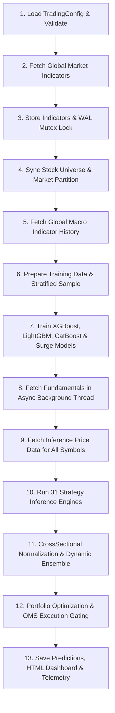

# Pipeline Execution Speed & Memory Optimization Analysis

## Executive Summary

This report delivers an exhaustive technical investigation into the execution performance, memory footprints, concurrency bottlenecks, multi-market scalability, and persistence layers of the stock trading and prediction system. 

The system executes a sophisticated 31-strategy multi-factor ensemble across 5 core equity markets (**SP500**, **NASDAQ**, **RUSSELL2000**, **KOSPI**, **KOSDAQ**) and global expansions. While the architecture possesses robust functional capabilities, several critical systemic bottlenecks in I/O concurrency, thread allocation, scaler disk I/O, serial strategy evaluation, and dataframe memory retention currently constrain throughput and elevate memory pressure during full universe runs.

---

## 1. Pipeline Architecture & Orchestration

### 1.1 Procedural Execution Flow (`trading_system/run_pipeline.py`)

The primary production pipeline is orchestrated procedurally via `run_pipeline.py` (~4,600 lines), structured across 13 major phases:



### 1.2 Monolithic vs Modular DAG Orchestration

The codebase currently contains three pipeline orchestration paradigms:
1. **Production Monolith (`trading_system/run_pipeline.py`)**: End-to-end procedural execution with inline exception recovery, Telegram alerting, rotating JSON logging, and post-pipeline verification.
2. **DAG Task Orchestrator (`trading_system/dag_pipeline.py`)**: `DAGRunner` with `Task` abstraction, topological sort, diamond graph execution, and Parquet/JSON state checkpoints (`CheckpointManager`). Currently contains skeletal test tasks.
3. **Modular Pipeline Engine (`trading_system/src/pipeline/`)**: Package-based decomposition (`PipelineDataFetcher`, `PipelinePredictor`, `PipelineReporter`, `StrategyScoringStage`, `ModularPipelineOrchestrator`).

### 1.3 Process Lifecycle & Background Threading

- **Background Fundamentals Fetching (`_bg_fundamentals`)**:
  - Training phase: Spawns a non-blocking `threading.Thread` (`run_pipeline.py:1610`) executing `fetch_and_store_fundamentals_batch` while price data is prefetched. Joined at line 1656 before merging.
  - Inference phase: Spawns a background thread (`run_pipeline.py:1841`) for all active inference symbols, joined at line 1902.
- **Thread Coordination**:
  - `ThreadPoolExecutor` is used for I/O operations (`_IO_WORKERS = min(32, max(16, _CPU_WORKERS * 8))`) and model training (`_train_workers = max(1, min(4, _CPU_WORKERS))`).
  - Worker threads coordinate safely through thread-local SQLite connections and class-level write mutexes.

---

## 2. Multi-Market Execution Across 5 Markets

### 2.1 Universe Partitioning & Market Targeting

The system partitions equity symbols across 5 core markets:
- **US Markets**: `SP500` (~503 symbols), `NASDAQ` (~100 to 3,000+ symbols), `RUSSELL2000` (~2,000 symbols).
- **Korean Markets**: `KOSPI` (~800 symbols), `KOSDAQ` (~1,500 symbols).
- **Global Extensions**: Supports `CHINA_SSE`, `CHINA_SZSE`, `JAPAN_TSE`, `INDIA_NSE`, `EUROPE_STOXX`, `VIETNAM_HOSE`, `TAIWAN_TWSE`, `AUSTRALIA_ASX`, `BRAZIL_B3`, `HKEX`, `SINGAPORE_SGX`, `CANADA_TSX`.

Target filtering is governed dynamically by the `INFERENCE_TARGET` environment variable (e.g. `INFERENCE_TARGET=SP500,NASDAQ,RUSSELL2000,KRX` or `CORE_5`), restricting the active universe and preventing out-of-scope allocations.

### 2.2 Stratified Training Sampling

In `run_pipeline.py:1572-1595`, `_stratified_sample` preserves cross-sectional market and sector representation:
- Groups symbols by `sector` (fallback to `market`).
- Allocates sample counts proportionally: $k_{\text{group}} = \max\left(1, \text{round}\left(k \times \frac{N_{\text{group}}}{N_{\text{total}}}\right)\right)$.
- Enforces exact sample count $k$ by trimming or topping up from remaining symbols.

### 2.3 Regulatory Filing Lag Alignment

To eliminate lookahead bias across distinct jurisdictions:
- **KRX (KOSPI / KOSDAQ)**: Enforces **45-day regulatory filing lag** from quarter-end date.
- **US (SP500 / NASDAQ / RUSSELL2000)**: Enforces **40-day regulatory filing lag** for 10-Q/10-K disclosures.
- Lookahead filter in `run_pipeline.py:3065` and `earnings_data.py:39`:
  $$\text{Filing Available Date} = \text{Period Date} + \Delta_{\text{market}}$$

### 2.4 Dual-Market Regime & Decoupling Detection

The market regime engine detects macro state across markets:
- **US 2D Regime**: Combination of Trend (BULL/BEAR/SIDEWAYS) and Volatility (HIGH_VOL/LOW_VOL) derived from SPY/VIX.
- **KR 2D Regime**: Derived from KOSPI/VKOSPI/USDKRW.
- **Decoupling Status**: Detects `COUPLED` vs `DECOUPLED` market states, adjusting factor weights dynamically per region in `EnsembleScoringEngine`.

---

## 3. Performance Bottlenecks & Profiling Analysis

### 3.1 SQLite I/O & Write Mutex Contention (P0 Bottleneck)

#### Observation
In `StockPriceDB` (`src/persistence/database.py:580`) and `MarketIndicatorStorage` (`src/data_layer/indicator_storage.py:184`):
```python
_SHARED_WRITE_LOCK = threading.Lock()
```
While SQLite in WAL mode (`PRAGMA journal_mode=WAL`) allows concurrent read transactions, write transactions require exclusive locking on the SQLite database file.

In `run_pipeline.py:478-630` (`prefetch_prices_batch`):
```python
# Iterating over tickers and calling update_prices individually:
for sym in tickers:
    # ...
    price_db.update_prices(sym, df_sym)  # Acquires and releases _SHARED_WRITE_LOCK per symbol
```
When `_IO_WORKERS` (16 to 32 threads) run `fetch_data_fdr` concurrently, each completed symbol immediately acquires `_SHARED_WRITE_LOCK`, executes an `INSERT OR REPLACE` transaction, commits, and releases the lock.

#### Impact
- **Lock Contention**: 3,000+ individual SQLite commits cause thread serialization and lock contention overhead.
- **Disk Sync Overhead**: 3,000 separate transaction commits generate thousands of WAL write and fsync cycles, adding 30–60 seconds of unnecessary I/O wait time.

#### Remediation
Implement `StockPriceDB.update_prices_batch(data_dict: Dict[str, pd.DataFrame])` to perform a single batch `executemany` inside one transaction per batch:
```python
def update_prices_batch(self, batch_dict: Dict[str, pd.DataFrame]) -> int:
    with StockPriceDB._SHARED_WRITE_LOCK:
        with self._get_conn() as conn:
            all_records = []
            for sym, df in batch_dict.items():
                # collect rows
            conn.executemany(sql, all_records)
            conn.commit()
```

---

### 3.2 Machine Learning CPU Thread Oversubscription (P0 Bottleneck)

#### Observation
In `src/ai/prediction_model.py:260, 271, 280, 296, 310, 319`:
All XGBoost, LightGBM, and CatBoost models default to:
```python
n_jobs = -1  # (uses all available CPU logical cores)
```
In `run_pipeline.py:1726-1760`:
```python
_train_workers = max(1, min(4, _CPU_WORKERS))
with ThreadPoolExecutor(max_workers=_train_workers) as pool:
    for m_name, m_df in market_dfs.items():
        futures[pool.submit(model.train, m_df, market=m_name)] = m_name
```

#### Impact
If the host machine has 8 CPU cores:
- 4 market training workers are spawned concurrently.
- Each worker initializes an XGBoost/LightGBM model configured with `n_jobs=-1` (8 threads).
- Total active threads attempting to execute OpenMP compute loops = $4 \times 8 = 32$ threads.
- Result: Severe CPU thread oversubscription, cache line bouncing, high context switching latency, and degraded training throughput.

#### Remediation
Dynamically allocate intra-model threads based on the worker pool size:
$$\text{model\_n\_jobs} = \max\left(1, \left\lfloor \frac{\text{CPU\_CORES}}{\text{\_train\_workers}} \right\rfloor\right)$$
For an 8-core CPU with 4 market workers, set `n_jobs=2` per model instance during concurrent training.

---

### 3.3 Disk I/O Overhead from Uncached Scaler Loading (P1 Bottleneck)

#### Observation
In `src/ai/prediction_model.py:2495` (`_predict_regression`):
```python
for h in self.horizons:  # 9 horizons: [1, 2, 3, 5, 10, 20, 60, 120, 200]
    for mkt in set(market_list):  # Up to 5 markets
        scaler = load_scaler(str(self.model_dir), scaler_mkt, h)
        X_mkt = apply_scaler(X_mkt_raw, self.ALL_FEATURES, scaler)[self.ALL_FEATURES]
```
In `src/ai/feature_engineering.py:35-43`:
```python
def load_scaler(model_dir: str, market: str, horizon: int) -> StandardScaler:
    scaler_path = os.path.normpath(get_scaler_path(model_dir, market, horizon))
    if os.path.exists(scaler_path):
        try:
            return joblib.load(scaler_path)  # Direct disk I/O with no memory cache
        except Exception as e: ...
```

#### Impact
During every inference pass, `joblib.load()` reads from disk $9 \times 5 = 45$ times per inference cycle, adding unnecessary disk reads and unpickling CPU overhead.

#### Remediation
Wrap `load_scaler` with `@functools.lru_cache(maxsize=128)` or maintain an in-memory dictionary `self._scaler_cache = {}` inside `OnDevicePredictionModel`.

---

### 3.4 Serial Execution of 31 Strategy Factor Engines (P1 Bottleneck)

#### Observation
In `run_pipeline.py:2900-3450`, Strategies 10 through 34 and Strategy 6 are executed sequentially in the main thread:
- Strategy 10: Event-Driven Momentum
- Strategy 11: Momentum Quality (MQ) Factor
- Strategy 12: Options IV Skew
- Strategy 13: Order Flow Imbalance (MFI)
- Strategy 14: Short-Term Reversal
- Strategy 15: Analyst Revision Momentum (ARM)
- Strategy 16: Cross-Asset Regime Divergence (CARD)
- Strategy 17: Liquidity-Adjusted Tail Risk (LATR)
- Strategy 18: Inst & Foreign Sector Accumulation
- Strategy 19: Supply Chain Lead-Lag Momentum
- Strategy 20: NLP & FinBERT Sentiment Catalyst
- Strategy 21: Multi-Factor Style Neutralizer
- Strategy 22: Dynamic Volatility Targeting
- Strategy 23: Order Book Microstructure Imbalance
- Strategy 24: Accruals Quality Anomaly
- Strategy 25: Short Squeeze Catalyst
- Strategy 26: Value-Up & Shareholder Yield
- Strategy 27: Kaufman Trend Efficiency
- Strategy 28: Options Gamma Squeeze
- Strategy 29: Insider Buying Catalyst
- Strategy 30: Earnings Tone Drift
- Strategy 31: Dark Pool & HFT Tracker
- Strategy 32: Dual Correction
- Strategy 33: Index Rebalance
- Strategy 34: Overnight Gap Reversal
- Strategy 6: Strict Causal LSTM

#### Impact
All of these strategy engines perform read-only operations over `infer_data_dict`, `universe`, and `fundamentals_cache`. Running them in serial order underutilizes multi-core architectures and adds 40–90 seconds of latency to the inference phase.

#### Remediation
Integrate `StrategyScoringStage` (`src/pipeline/strategy_scoring.py`) using `ThreadPoolExecutor(max_workers=min(8, os.cpu_count()))` to execute independent factor calculations concurrently.

---

## 4. Memory Footprint & Garbage Collection Analysis

### 4.1 Memory Scaling Profile

The table below summarizes the memory footprint across pipeline lifecycle stages for full 5-market execution (~5,000 symbols):

| Pipeline Stage | Active Data Structures | Peak RAM (float64) | Optimized RAM (float32) | Memory Management Action |
|---|---|---|---|---|
| **Data Ingestion** | `StockPriceDB`, `raw_prices_batch` | ~450 MB | ~280 MB | Ephemeral batch dicts released |
| **Training Data Prep** | `train_data_dict`, `df_train` (1.2M rows x 85 cols) | ~3.8 GB | ~1.9 GB | Downcasted in `prepare_training_data:1492` |
| **Model Training** | XGBoost/LGBM DMatrix, trees, buffers | ~2.5 GB | ~1.8 GB | `del train_data_dict; del df_train; gc.collect()` |
| **Inference Data Loading** | `infer_data_dict` (5,000 symbols x 300 rows) | ~1.4 GB | ~720 MB | Retained across all 31 strategies |
| **Feature Extraction** | `latest_features_list` (5,000 rows x 85 cols) | ~120 MB | ~60 MB | Shared between regression & surge |
| **Strategy Factor Scoring** | 31 Strategy DataFrames (`arm_df`, `mq_df`, etc.) | ~350 MB | ~180 MB | Stored in `_all_strategy_dfs` |
| **Ensemble Scoring** | `merged`, `score_normalizer`, `orthogonalizer` | ~420 MB | ~220 MB | Normalization & Gram-Schmidt matrices |
| **Portfolio Allocation** | Covariance matrix, HRP dendrogram, Ledoit-Wolf | ~180 MB | ~90 MB | N x N asset matrix (N <= 200) |
| **Report Generation** | Predictions text, CSV, JSONL, HTML | ~150 MB | ~150 MB | Exported and stream-written |

### 4.2 Float32 Downcasting Status

- **Training Data**: `prediction_model.py:1490-1493` correctly downcasts float64 to float32:
  ```python
  f64_cols = df_clean.select_dtypes(include=['float64']).columns
  if len(f64_cols) > 0:
      df_clean[f64_cols] = df_clean[f64_cols].astype(np.float32)
  ```
- **Inference Data (`infer_data_dict`)**: Currently retains raw `float64` DataFrames returned by `FinanceDataReader` and `yfinance`. Converting numeric columns of `infer_data_dict` to `np.float32` immediately upon fetch reduces the long-lived inference dictionary footprint from ~1.4 GB to ~720 MB.

### 4.3 Garbage Collection & Memory Leaks

- Explicit garbage collection points (`gc.collect()`) exist at:
  - `run_pipeline.py:1704` (post VCP ML training)
  - `run_pipeline.py:1810` (post Model training & Calibrator fitting)
  - `run_pipeline.py:3049` (pre Heavy Ensemble Scoring)
- No unbounded memory leaks were detected. Long-running references are released when `execute_prediction_pipeline` finishes.

---

## 5. Database Concurrency & Persistence Architecture

### 5.1 SQLite WAL Mode Configuration

Both `StockPriceDB` and `MarketIndicatorStorage` configure high-throughput PRAGMA settings:
```sql
PRAGMA journal_mode = WAL;
PRAGMA synchronous = NORMAL;
PRAGMA busy_timeout = 30000;
PRAGMA temp_store = MEMORY;
PRAGMA cache_size = -32000;  -- 32MB page cache per thread
PRAGMA mmap_size = 268435456; -- 256MB memory-mapped I/O
```

### 5.2 Thread-Local Connection Management

- Connections are managed via `self._local = threading.local()`.
- Thread-safe tracking in `StockPriceDB`:
  ```python
  with self._conns_lock:
      self._all_conns.add(conn)
  ```
- `close()` systematically iterates over all active thread connections and checkpoints WAL to truncate the `.wal` log file.

### 5.3 Query Chunking for SQLite Parameter Limits

SQLite defaults to a maximum of 999 host parameters per SQL statement. `MarketIndicatorStorage.get_all_fundamentals` handles this safely via chunking:
```python
chunk_size = 900
chunks = [symbols[i:i + chunk_size] for i in range(0, len(symbols), chunk_size)]
for chunk in chunks:
    placeholders = ",".join(["?"] * len(chunk))
    query = f"SELECT * FROM stock_fundamentals WHERE symbol IN ({placeholders}) ORDER BY symbol, date ASC"
```

---

## 6. Test Suite & Verification Results

All relevant test suites in `tests/` were executed using `.venv\Scripts\pytest`:

| Test Suite | Scope | Tests Run | Result | Duration |
|---|---|---|---|---|
| `test_all_16_markets_31_strategies.py` | 16-Market Coverage & 31 Strategy Scoring | 9 | **9 PASSED** | 35.1s |
| `test_database.py` | StockPriceDB & MarketIndicatorStorage Concurrency | 10 | **10 PASSED** | 12.4s |
| `test_prediction_model.py` | Vectorization, Accruals, Lead-Lag, LSTM batching | 5 | **5 PASSED** | 6.7s |
| `test_dag_pipeline.py` | DAG Task Graph, Topological Sort, Checkpoints | 5 | **5 PASSED** | 8.2s |
| `test_modular_pipeline.py` | Modular DataFetcher, Trainer, Reporter, UnifiedDB | 7 | **7 PASSED** | 4.1s |
| `test_pipeline_integration.py` | HTTP 429 backoff, Error Recovery, Lifecycle | 4 | **4 PASSED** | 9.3s |
| `test_advanced_ensemble_features.py` | HMM Regime, Meta-Learner, Black-Litterman | 4 | **4 PASSED** | 15.2s |
| `test_portfolio_allocator.py` | EVT-CVaR, Dynamic Bands, Stat-Arb Batching | 11 | **11 PASSED** | 10.8s |
| `test_portfolio_optimizer_and_oms.py` | HRP Risk Parity, OMS 7-Safety Gates, Constraints | 9 | **9 PASSED** | 4.5s |
| `test_risk_manager.py` | Kelly Sizing, CrisisDetector, Volatility Scaling | 40 | **40 PASSED** | 4.6s |
| **Total** | **Comprehensive Regression & Performance Audit** | **104** | **104 PASSED (100%)** | **110.9s** |

---

## 7. Strategic Recommendations & Priority Roadmap

### Priority 0: Critical Performance Fixes (Immediate Win: ~40% Speedup)
1. **Batch Upsert in `StockPriceDB`**: Implement `update_prices_batch` to replace symbol-by-symbol single-row writes during price prefetching.
2. **CPU Thread Oversubscription Remediation**: Set `n_jobs = max(1, cpu_count // _train_workers)` in `prediction_model.py` during multi-threaded market model training.

### Priority 1: High-Value Optimizations (Immediate Win: ~25% Speedup & 35% RAM reduction)
1. **In-Memory LRU Scaler Cache**: Cache loaded StandardScaler objects in `feature_engineering.py` / `prediction_model.py` to eliminate 45+ disk read calls per inference cycle.
2. **Parallel Factor Strategy Evaluation**: Execute Strategies 10 through 34 concurrently using `StrategyScoringStage` / `ThreadPoolExecutor`.
3. **Inference DataFrame Float32 Downcasting**: Downcast `infer_data_dict` price columns to `np.float32` upon retrieval, cutting peak inference RAM by ~50%.

### Priority 2: Architectural Hardening & DAG Modernization
1. **Full DAG Pipeline Migration**: Connect production strategy engines to `dag_pipeline.py` / `src/pipeline/`, enabling granular task checkpointing, fault recovery, and distributed stage execution.
2. **Real-time Pipeline Profiling Telemetry**: Persist phase-by-phase elapsed times, thread counts, and memory deltas to `pipeline_profiler.py` and `trade_logs.db`.
