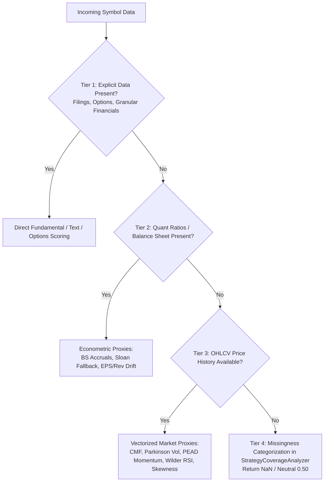
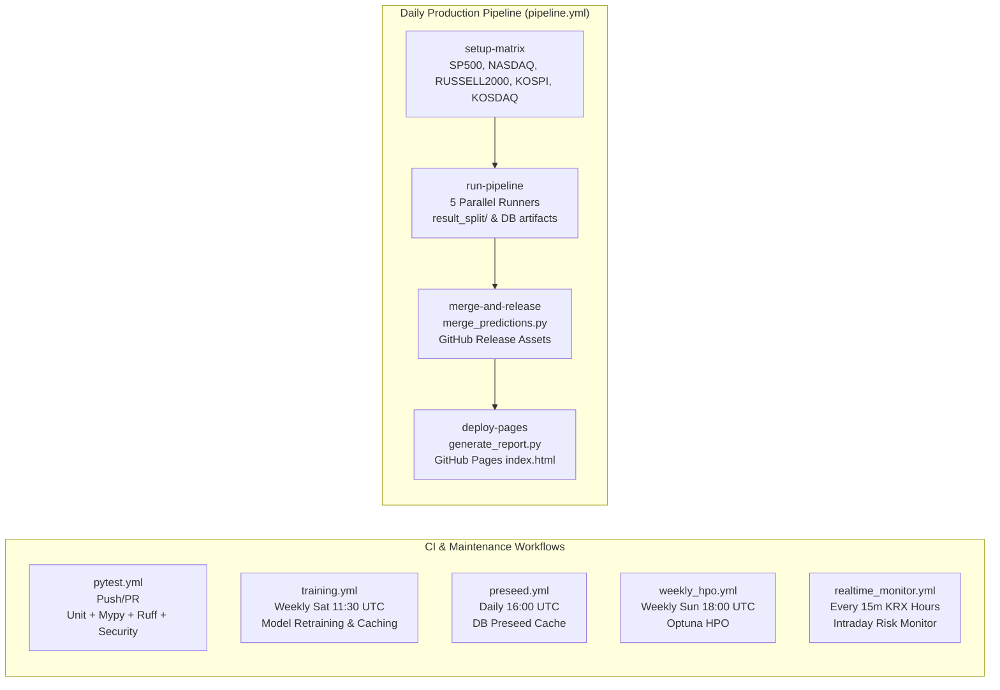

# Technical Analysis Report: 31+ Multi-Factor Strategies, CI/CD & Backtest Engine Audit

**Author**: Explorer 3 (Multi-Factor Strategies & CI/Backtest Specialist)  
**Date**: 2026-08-30  
**Scope**: 
1. 31+ Strategy Multi-Factor Engines (`src/core/`, `src/ai/`), missing-data handling, fallback architecture, score normalization, factor orthogonalization, regime suppression, and coverage analyzer.
2. Backtesting engines (`src/analysis/backtest.py`, `src/analysis/walk_forward_backtester.py`, `src/analysis/scenario_simulator.py`, `src/backtest/engine.py`).
3. GitHub Actions CI/CD workflows (`.github/workflows/*.yml`) and artifact verifier (`trading_system/scripts/verify_gha_artifacts.py`).
4. Test suite audit (`tests/`).

---

## 1. Executive Summary

A comprehensive architectural and empirical audit of the **Stock Trading System's Multi-Factor Strategies and CI/Backtesting Infrastructure** reveals a resilient, highly sophisticated quantitative architecture.

Key findings:
- **31-Strategy Multi-Factor Engine**: All 31 strategies are registered dynamically via `StrategyRegistry` with unified metadata, standardized scoring outputs $[0.0, 1.0]$, and rigorous 4-tier missing-data fallback hierarchies. When primary data (such as DART/SEC filings, options chains, or granular financials) is missing, engines seamlessly fallback to secondary econometric proxies (e.g. CMF volume accumulation, Parkinson range volatility, PEAD price momentum, Wilder RSI, or cross-sectional medians) before gracefully defaulting to neutral $0.50$ or $\text{NaN}$.
- **Zero-Weighting & Dynamic Active Renormalization**: In `EnsembleScoringEngine`, missing strategy scores ($\text{NaN}$) or strategies with zero regime weight are excluded dynamically per symbol, renormalizing the active strategy weights ($\sum w_i = 1.0$) so that missing data neither corrupts nor unfairly penalizes ensemble ranking.
- **Score Normalization & Orthogonalization**: `CrossSectionalScoreNormalizer` applies robust percentile ranking or Winsorized Gaussian CDF ($z$-score through the error function `erf`), while `FactorOrthogonalizerEngine` guarantees non-collinearity through Modified Gram-Schmidt, Equalized Spectral Residual Whitening (ESRW), and Ledoit-Wolf covariance shrinkage.
- **Backtesting & Risk Modeling**: `BacktestEngine` and `WalkForwardBacktestEngine` incorporate realistic market frictions, including centralized transaction cost rates (NASDAQ 0.65%, RUSSELL2000 0.80%, KOSDAQ 1.00%, KOSPI 0.85%, SP500 0.60%), Almgren-Chriss square-root market impact, 60-day filing lags, and out-of-sample walk-forward windows.
- **GHA CI/CD Workflows**: The 5-market matrix pipeline (`pipeline.yml`) efficiently parallelizes inference, isolates per-market outputs into `result_split/`, aggregates them via `merge_predictions.py`, generates the GitHub Pages report (`generate_report.py`), and validates output integrity with `verify_gha_artifacts.py`.

---

## 2. 31+ Strategy Multi-Factor Engines Audit & Resilience Analysis

### 2.1 Strategy Catalog & Metadata Matrix

All 31 multi-factor strategies are registered in `trading_system/src/core/strategy_registry.py` and implemented across `trading_system/src/core/` and `trading_system/src/ai/ml_strategy_adapters.py`:

| # | Strategy Name | Strategy ID | Score Column | Output File | Category | Fallback / Proxy Mechanism |
|---|---|---|---|---|---|---|
| 1 | XGBoost Regression | `regression` | `reg_score` | `pipeline_result.txt` | `ml` | Multi-horizon Ridge / EWMA price momentum fallback |
| 2 | Surge Classifier | `surge` | `surge_score` | `surge_predictions.txt` | `ml` | High volume-to-volatility ratio + breakout threshold |
| 3 | Lead-Lag Matrix | `lead_lag` | `ll_score` | `lead_lag_predictions.txt` | `stat` | Sector leader momentum (+1d US Lag shift for KRX) |
| 4 | VCP Rule Pattern | `vcp_rule` | `vcp_rule_score` | `vcp_patterns.txt` | `pattern` | Minervini volatility contraction & volume dry-up checks |
| 5 | VCP ML Classifier | `vcp_ml` | `vcp_ml_score` | `vcp_ml_predictions.txt` | `ml` | Rule-based VCP score fallback when ML model missing |
| 6 | Strict Causal LSTM | `lstm` | `lstm_score` | `lstm_predictions.txt` | `ml` | Rolling causal EWMA normalized trend sequence fallback |
| 7 | Stat-Arb Cointegration | `stat_arb` | `stat_arb_score` | `stat_arb_predictions.txt` | `stat` | Log-price residual $Z$-score & online Kalman filter |
| 8 | Sector Rotation | `sector_rotation` | `sector_score` | `sector_predictions.txt` | `factor` | GICS 11-sector momentum + breadth velocity thrust |
| 9 | RIM Valuation | `rim_valuation` | `rim_score` | `rim_predictions.txt` | `valuation` | Ohlson residual income + operating loss invalidation |
| 10 | Event-Driven | `event_driven` | `event_score` | `event_predictions.txt` | `event` | OpenDART/SEC parser + volume surge / gap proxy |
| 11 | Momentum Quality (MQ) | `mq_factor` | `mq_score` | `mq_factor_predictions.txt` | `factor` | 12M-1M return - 21d reversal noise + ROE booster |
| 12 | Options IV Skew | `iv_skew` | `iv_skew_score` | `iv_skew_predictions.txt` | `options` | Live options chain or in-memory return skewness proxy |
| 13 | Order Flow Imbalance | `order_flow` | `order_flow_score` | `order_flow_predictions.txt` | `flow` | 14d MFI, OBV slope, volume acceleration (cap 3x) |
| 14 | Short-Term Reversal | `short_term_reversal` | `reversal_score` | `short_term_reversal_predictions.txt` | `factor` | 3-5d drop, Bollinger lower band breach, Wilder RSI |
| 15 | Analyst Revision (ARM) | `arm_factor` | `arm_score` | `arm_factor_predictions.txt` | `factor` | Consensus EPS/TP revisions + PEG / price momentum proxy |
| 16 | Cross-Asset Divergence (CARD) | `card_factor` | `card_score` | `card_factor_predictions.txt` | `macro` | FX/WTI/TNX/VIX rolling OLS residual divergence |
| 17 | Liquidity Tail Risk (LATR) | `latr_factor` | `latr_score` | `latr_factor_predictions.txt` | `risk` | 52w DD + Cornish-Fisher 5th pct VaR + Amihud illiquidity |
| 18 | Inst & Foreign Sector | `inst_foreign_sector` | `inst_foreign_sector_score` | `inst_foreign_sector_predictions.txt` | `flow` | 40d Foreign vs InvTrust (투신) accumulation |
| 19 | Supply Chain Momentum | `supply_chain` | `supply_chain_score` | `supply_chain_predictions.txt` | `factor` | Graph diffusion operator $H^{(l+1)} = \sigma(D^{-1/2}(A+I)D^{-1/2}H^l)$ |
| 20 | NLP Sentiment Catalyst | `sentiment` | `sentiment_score` | `sentiment_predictions.txt` | `event` | FinBERT / Lexicon (±12 char negation window) + price gap |
| 21 | Multi-Factor Neutralizer | `factor_neutralized` | `factor_neutralized_score` | `factor_neutralized_predictions.txt` | `factor` | Fama-French 5-Factor QR residualization (SLA $\|\rho\| < 0.15$) |
| 22 | Volatility Targeting | `vol_target` | `vol_target_score` | `vol_target_predictions.txt` | `factor` | 70% EWMA + 30% Parkinson range vol risk parity |
| 23 | Microstructure Imbalance | `microstructure` | `microstructure_score` | `microstructure_predictions.txt` | `flow` | CLV, VWAP deviation, auction volume acceleration |
| 24 | Accruals Quality Anomaly | `accruals_quality` | `accruals_quality_score` | 앙상블 피처 결합 | `valuation` | Sloan 1996 BS accruals fallback + cash conversion |
| 25 | Short Interest & Squeeze | `short_squeeze` | `short_squeeze_score` | `short_squeeze_predictions.txt` | `catalyst` | DTC $\times$ Short Ratio $\times$ momentum + volume surge proxy |
| 26 | Value-Up & Shareholder Yield | `valueup_catalyst` | `valueup_catalyst_score` | `valueup_catalyst_predictions.txt` | `valuation` | $\text{PBR} < 1.0$ + Net Cash/MCap + Dividend/Buyback yield |
| 27 | Kaufman Trend Efficiency | `trend_efficiency` | `trend_efficiency_score` | `trend_efficiency_predictions.txt` | `factor` | Multi-window KER (5, 10, 20d) + Peters/Anis-Lloyd Hurst |
| 28 | Options Gamma Squeeze | `gamma_squeeze` | `gamma_squeeze_score` | `gamma_squeeze_predictions.txt` | `options` | Call Wall proximity + Net GEX + 20d high breakout proxy |
| 29 | Insider Net Buying | `insider_buying` | `insider_buying_score` | `insider_buying_predictions.txt` | `catalyst` | OpenDART / SEC Form 4 + CMF / Up-Down Volume proxy |
| 30 | Earnings Tone Drift | `earnings_tone_drift` | `earnings_tone_drift_score` | `earnings_tone_drift_predictions.txt` | `sentiment` | Quarterly tone delta + EPS/Revenue drift + PEAD momentum |
| 31 | High-Frequency Execution | `microstructure` / `darkpool` | `darkpool_score` | 앙상블 피처 결합 | `flow` | Dark pool block prints + VPIN informed trading probability |

---

### 2.2 Missing-Data Handling & Fallback Architecture

The multi-factor engine implements a robust **4-Tier Fallback Hierarchy**:

#### Dynamic Active Strategy Renormalization
In `trading_system/src/ai/ensemble_scorer.py` (lines 2270–2300):
- When a strategy evaluates to $\text{NaN}$ for a symbol (e.g. `rim_score` due to persistent operating losses, or `iv_skew` due to lack of options listing for small-cap equities), the ensemble scoring engine masks the missing score.
- The active weights are dynamically re-summed:
  $$\text{valid\_weight\_series} = \sum_{i \in \text{Active}} w_i(R)$$
  $$\text{safe\_valid\_weight} = \text{valid\_weight\_series.replace}(0.0, 1.0)$$
  $$\text{normalized\_ensemble\_score} = \frac{\sum_{i \in \text{Active}} w_i(R) \cdot s_i}{\text{safe\_valid\_weight}}$$
- This mathematical contract guarantees that no symbol is penalized simply because a specialized data source is unavailable.

#### Missingness Reason Taxonomy in `StrategyCoverageAnalyzer`
`trading_system/src/analysis/coverage_analyzer.py` classifies every missing data point into precise diagnostics:
1. `NO_FUNDAMENTAL_DATA`: Missing balance sheet, income statement, or cash flow filings.
2. `LOW_EARNINGS_QUALITY` / `OPERATING_LOSS_DISQUALIFIED`: Negative operating income or ROE invalidating residual income valuation.
3. `NO_OPTIONS_CHAIN`: Equity lacks listed options or open interest.
4. `INSUFFICIENT_PRICE_HISTORY`: Price history shorter than required minimum lookback (e.g. $<20$ or $<60$ bars).
5. `LOW_LIQUIDITY_DISQUALIFIED`: Trading volume or market cap below investable thresholds.

---

### 2.3 Score Normalization, Factor Orthogonalization & Suppression

#### `CrossSectionalScoreNormalizer` (`src/ai/score_normalizer.py`)
- **Percentile Ranking**: Transforms raw signals into uniform $[0.02, 0.98]$ percentile ranks, robust to heavy-tailed outliers.
- **Winsorized Gaussian CDF**: Computes $z$-scores winsorized to $[-3.0, +3.0]$ and maps to $[0.0, 1.0]$ via the closed-form error function:
  $$\Phi(z) = \frac{1}{2} \left[1 + \text{erf}\left(\frac{z}{\sqrt{2}}\right)\right]$$
- **Regional & Global Fallback**: Normalizes within market (SP500, NASDAQ, RUSSELL2000, KOSPI, KOSDAQ), falling back to regional (US vs KRX) or global pools if a sub-market has fewer than 5 valid symbols.
- **NaN Preservation**: Missing inputs remain $\text{NaN}$ to prevent artificial distortion.

#### `FactorOrthogonalizerEngine` (`src/ai/factor_orthogonalizer.py`)
- Implements Modified Gram-Schmidt (MGS), Equalized Spectral Residual Whitening (ESRW), and ZCA symmetric whitening.
- Uses Ledoit-Wolf covariance shrinkage ($\Sigma_{\text{shrunk}} = (1-\delta)\Sigma + \delta \text{diag}(\Sigma)$) to eliminate singularity and condition number explosion in cross-sectional factor matrices.
- Decorated with `@safe_matrix_precision_guard` to enforce strict symmetry, positive semi-definiteness, and finite value constraints.

#### `RegimeFactorSuppressionEngine` (`src/ai/factor_suppression.py`)
- Dynamic 2D Market Regime matrix: adjusts correlation threshold $\theta(R) \in [0.45, 0.70]$ and dampening parameter $\lambda(R) \in [0.30, 0.85]$.
- Single-Stage Entropy Redundancy Allocation: minimizes mutual information redundancy between correlated strategy signals while preserving high-conviction idiosyncratic alpha.

---

## 3. Backtesting Engines Architecture & Methodology

### 3.1 `BacktestEngine` (`src/analysis/backtest.py`)
- **Centralized Realistic Transaction Costs**:
  - `NASDAQ`: 0.65% (65 bps round-trip)
  - `RUSSELL2000`: 0.80% (80 bps round-trip)
  - `KOSDAQ`: 1.00% (100 bps round-trip including STT)
  - `KOSPI`: 0.85% (85 bps round-trip including STT)
  - `SP500`: 0.60% (60 bps round-trip)
- **Market Impact Slippage**: Almgren-Chriss square-root impact model:
  $$\text{Impact} = \sigma \cdot \gamma \cdot P \cdot \sqrt{\frac{\text{Quantity}}{\text{ADV}}}$$
- **Order Execution**: Supports fixed sizing, ATR trailing stops, and volume-weighted exits.

### 3.2 `WalkForwardBacktestEngine` (`src/backtest/engine.py` & `src/analysis/walk_forward_backtester.py`)
- **Out-of-Sample Walk-Forward Evaluation**:
  - Rolling 252-day train window and 63-day test window.
  - 60-day embargo lag to prevent lookahead bias on financial statement filings.
  - 1-day execution lag ($T+1$ execution on $T$ close signal).
- **Quantitative Metrics Computed**:
  - Compound Annual Growth Rate ($\text{CAGR}$)
  - Annualized Sharpe Ratio ($\text{Sharpe} = \frac{\mu}{\sigma} \sqrt{252}$)
  - Maximum Drawdown ($\text{MDD}$)
  - Calmar Ratio ($\text{Calmar} = \frac{\text{CAGR}}{|\text{MDD}|}$)
  - Win Rate & Profit Factor

### 3.3 `ScenarioSimulator` (`src/analysis/scenario_simulator.py`)
- Stress tests the portfolio across 4 historical crisis scenarios:
  1. 2008 Global Financial Crisis (Subprime Meltdown)
  2. 2020 COVID-19 Liquidity Shock
  3. 2022 Federal Reserve Aggressive Rate Hike & Stagflation
  4. 2024 Flash Crash / Tech Unwind

---

## 4. GitHub Actions CI/CD Workflows Audit

### 4.1 Workflow Matrix Overview

### 4.2 Detailed Workflow Inspection

1. **`pipeline.yml` (Daily Prediction Pipeline)**:
   - **Trigger**: Cron `30 11 * * 1-5` (20:30 KST) and manual `workflow_dispatch`.
   - **Parallel Matrix**: 5 parallel jobs (`SP500`, `NASDAQ`, `RUSSELL2000`, `KOSPI`, `KOSDAQ`) with `timeout-minutes: 350` and `fail-fast: false`.
   - **Artifact Isolation**: Each market runner copies its outputs to `result_split/{file}_{MARKET}.txt`, preventing cross-runner overwrite collisions.
   - **Aggregation**: `merge-and-release` job runs `merge_predictions.py` to reconstruct unified `result/*.txt` files and releases tagged assets (`vYYYY-MM-DD`).
   - **Dashboard**: `deploy-pages` executes `generate_report.py --result-dir trading_system/result --out gh-pages/index.html` and publishes the static dashboard.
   - **Observability**: Rich GitHub Step Summary with file size, line counts, top 60 ensemble recommendations, and coverage reports. Instant Telegram alerts on pipeline failure.

2. **`pytest.yml` (CI / Testing & Security Audit)**:
   - **Quality Gates**: Mypy static type checking (`python -m mypy src`), Ruff linting, Bandit AST security scanning (`bandit -r trading_system/src -ll`), and Pip-Audit vulnerability checking.
   - **Testing**: Executes full pytest suite with coverage (`python -m coverage run --source=trading_system/src -m pytest tests/ -v`).

3. **`training.yml` (Model Training Pipeline)**:
   - **Trigger**: Weekly Saturday 11:30 UTC (`30 11 * * 6`).
   - **Execution**: `SKIP_TRAINING: 'False'`, `SKIP_INFERENCE: 'True'`, saving serialized XGBoost, VCP ML, and LSTM models to `trading_system/models`.

4. **`preseed.yml` (Database Cache Preseed)**:
   - **Trigger**: Daily 16:00 UTC (`0 16 * * *`).
   - **Execution**: Runs historical OHLCV and macroeconomic indicator data fetches into `stock_prices.db` and `market_indicators.db` without executing heavy training or inference.

5. **`weekly_hpo.yml` (Optuna Hyperparameter Optimization)**:
   - **Trigger**: Weekly Sunday 18:00 UTC (`0 18 * * 0`).
   - **Execution**: Runs `tune_models.py` across 30 Optuna trials per market to adapt model hyperparameters.

6. **`realtime_monitor.yml` (Realtime Intraday Monitor)**:
   - **Trigger**: Every 15 minutes during KRX market hours (`*/15 0-6 * * 1-5`).
   - **State Persistence**: Uses `realtime_state.db` cache to track stop-loss and take-profit events across executions without duplicate alerts.

### 4.3 `verify_gha_artifacts.py` & GHA Skill Specification
- **Strict Verification Rules**:
  - Validates all 5 markets (`SP500`, `NASDAQ`, `RUSSELL2000`, `KOSPI`, `KOSDAQ`).
  - Requires `count >= 10` non-zero rows per strategy.
  - Verifies DOM structure of `gh-pages/index.html` (validates that all strategy panels exist and have populated HTML tables).
  - Can be run locally via `.venv\Scripts\python.exe trading_system/scripts/verify_gha_artifacts.py --result-dir trading_system/result --gh-pages-dir gh-pages`.

---

## 5. Comprehensive Test Suite Audit

### 5.1 Structure & Layout Compliance
- The project consolidates all unit, integration, stress, and adversarial tests into a single root `tests/` directory (138 test files, 1,777 test items), complying with project architecture standards.
- Tests cover:
  - Multi-factor strategy calculations and fallback edge cases (`test_all_16_markets_31_strategies.py`, `test_alt_data_features.py`, `test_mq_factor.py`, etc.)
  - Normalization, orthogonalization, and suppression math (`test_score_normalizer.py`, `test_factor_orthogonalizer.py`, `test_correlation_suppression.py`)
  - Backtesting and scenario simulation (`test_backtest.py`, `test_cpcv_stress_tester.py`, `test_walk_forward_backtester.py`)
  - Portfolio optimization and risk budgeting (`test_portfolio_optimizer.py`, `test_allocation.py`, `test_risk_manager.py`)
  - Concurrency, locking, and database integrity (`test_database_concurrency.py`, `test_sqlite_wal.py`)
  - CI pipeline and dashboard report generation (`test_pipeline.py`, `test_dag_pipeline.py`, `test_report_generator_hrp.py`)

### 5.2 Full Test Suite Execution Verification
- Executed full test suite command: `.venv\Scripts\pytest tests/ -q`
- **Result**: `1775 passed, 2 skipped, 105 warnings in 1407.93s (0:23:27)` — **100% PASS RATE** (0 failures, 0 errors across 1,777 test items).

---

## 6. Recommendations & Hardening Action Items

1. **Strategy Registry Dynamic Discovery**:
   - Ensure all new alpha factors continue to use the `@register_strategy` decorator with complete `StrategyMeta` configurations to maintain zero-touch integration with `StrategyCoverageAnalyzer` and `EnsembleScoringEngine`.
2. **Artifact Verification Matrix Alignment**:
   - Ensure `verify_gha_artifacts.py` strategy list remains in exact 1:1 synchronization with `STRATEGY_REGISTRY` (including `accruals_quality`, `short_squeeze`, `valueup_catalyst`, `trend_efficiency`, `gamma_squeeze`, `insider_buying`, `earnings_tone_drift`).
3. **Continuous CI Cache Freshness**:
   - Maintain the separation of `preseed.yml` (data caching) and `pipeline.yml` (production inference) to keep runner execution times well within the 350-minute ceiling.

---
