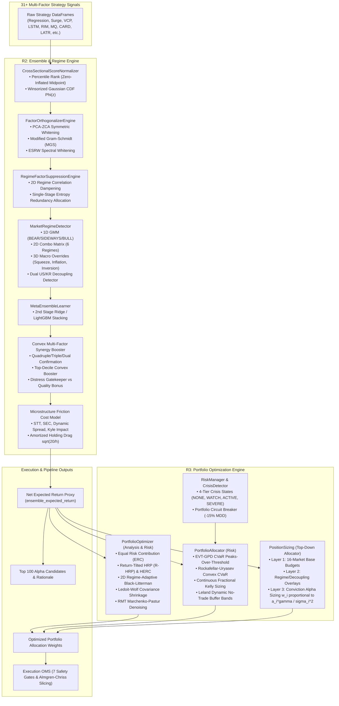

# Comprehensive Survey Report: R2 (Ensemble & Regime) and R3 (Portfolio Optimization)

**Author**: `teamwork_preview_explorer` (Survey Specialist)  
**Date**: 2026-08-30  
**Target Repository**: `d:\Finance\code\stock`  
**Reference Directives**: `ORIGINAL_REQUEST.md`, `AGENTS.md`  

---

## 1. Executive Summary

This report delivers a thorough diagnostic audit and technical survey of **R2 (Ensemble Meta-Learner & Dynamic 2D/3D Regime Weighting)** and **R3 (Portfolio Optimization & Microstructure Cost Models)** within the 31+ multi-factor quantitative trading system across 5 core markets (SP500, NASDAQ, RUSSELL2000, KOSPI, KOSDAQ).

The codebase exhibits advanced institutional-grade quantitative engineering, combining cross-sectional score normalization, factor orthogonalization (PCA-ZCA, ESRW, Gram-Schmidt), multi-tier alpha decomposition, 2D/3D Gaussian Mixture and macro regime classification, EVT-GPD CVaR tail risk budgeting, Hierarchical Risk Parity (HRP/HERC), Black-Litterman allocation, fractional Kelly sizing, and Kyle/Almgren-Chriss microstructure transaction cost modeling.

This survey establishes the complete baseline of existing implementations, identifies architectural nuances and integration gaps, and provides concrete enhancement blueprints for R2 and R3 to maximize risk-adjusted alpha generation and portfolio execution precision.

---

## 2. Detailed Architecture & Codebase Audit

### 2.1 Component Architecture Map



---

### 2.2 R2: Ensemble Meta-Learner & Dynamic Regime Engine Audit

#### 2.2.1 `EnsembleScoringEngine` (`trading_system/src/ai/ensemble_scorer.py`)
- **Lines of Code**: 3,098 lines.
- **Multi-Horizon Alpha Signal Decomposition**:
  - **Slow Tier (1M~1Y, Weight 0.50)**: `regression`, `rim_valuation`, `factor_neutralized`, `valueup_catalyst`, `accruals_quality`, `mq_factor`, `arm_factor`, `card_factor`, `latr_factor`, `vol_target`, `iv_skew`, `earnings_tone_drift`.
  - **Medium Tier (5D~20D, Weight 0.35)**: `vcp_rule`, `vcp_ml`, `surge`, `lead_lag`, `stat_arb`, `sector_rotation`, `lstm`, `sentiment`, `inst_foreign_sector`, `supply_chain`, `gamma_squeeze`, `short_squeeze`, `insider_buying`, `trend_efficiency`, `event_driven`.
  - **Fast Tier (1D~3D, Weight 0.15)**: `microstructure`, `order_flow`, `short_term_reversal`, `darkpool`.
- **Dynamic 2D Regime Matrix (6 Combo States)**:
  1. `BEAR_LOW_VOL`: High defensive value, Stat-Arb (+0.07), RIM (+0.08), Vol-Target (+0.05), reduced Surge (+0.01).
  2. `BEAR_HIGH_VOL`: Maximum defense, Stat-Arb (+0.09), RIM (+0.08), Vol-Target (+0.07), Short-Term Reversal (+0.05).
  3. `SIDEWAYS_LOW_VOL`: Balanced mean-reversion and rotation, Stat-Arb (+0.06), Value-Up (+0.04), Flow (+0.04).
  4. `SIDEWAYS_HIGH_VOL`: Elevated rotation and mean-reversion, Stat-Arb (+0.06), Short-Term Reversal (+0.03).
  5. `BULL_LOW_VOL`: Strong momentum, Sector Rotation (+0.05), VCP ML (+0.05), Trend Efficiency (+0.04), Surge (+0.06).
  6. `BULL_HIGH_VOL`: Aggressive momentum with squeeze potential, Surge (+0.07), VCP ML (+0.05), Trend (+0.03), Gamma Squeeze (+0.03).
- **3D Macro Regime Modifiers (`MACRO_WEIGHT_MODIFIERS`)**:
  - `LIQUIDITY_SQUEEZE`: Boosts Stat-Arb (+0.10), VCP Rule (+0.05), Vol-Target (+0.05); cuts Surge (-0.10).
  - `INFLATION_SHOCK`: Boosts RIM (+0.07), Stat-Arb (+0.06), Accruals (+0.04), Value-Up (+0.03); cuts MQ (-0.08), Surge (-0.05).
  - `YIELD_INVERSION`: Boosts Regression (+0.08), RIM (+0.08), Stat-Arb (+0.06), Reversal (+0.04), Accruals (+0.05); cuts Surge (-0.12), VCP ML (-0.07), Sector (-0.07).
  - `HIGH_YIELD_BULL`: Boosts Sector (+0.10), Surge (+0.05), Supply Chain (+0.03), Trend (+0.05); cuts Lead-Lag (-0.10).
  - `HIGH_YIELD_BEAR`: Boosts Regression (+0.10), Stat-Arb (+0.10), Accruals (+0.04); cuts Surge (-0.15).
- **Synergy & Conviction Boosters**:
  - **Convex Multi-Signal Synergy**: Super-linear scaling for $\ge 3$ active signals above 0.65 ($1.0 + 0.03 \times (N_{signals} - 2)$).
  - **Quadruple Confluence Booster** (Valuation + Momentum + Flow + Catalyst): $1.100\times$ (+10.0% alpha boost).
  - **Triple Confluence Booster**: $1.065\times$ (+6.5% boost).
  - **Dual Confluence Booster**: $1.035\times$ (+3.5% boost).
  - **Fundamental Distress Gatekeeper**: $0.70\times$ penalty for loss-making operating margin/ROE ($< -10\%$) unless tactical turnaround/squeeze exempt.
  - **High-Quality Compounder Bonus**: $1.035\times$ boost for high ROIC/ROE/Operating Margin ($\ge 15\%$).
  - **Top-Decile Convex Alpha Booster (Grinold Law Alpha Preserver)**: Enhances top-$K$ alpha scores to prevent shrinkage toward the mean.
- **CLT Score Compression Prevention**:
  - Center scores around 0.50 neutral midpoint: $s_{centered} = \text{clip}(\text{rank}(s) - 0.50, -0.50, 0.50)$.
  - Power-law convex expansion: $\alpha_{convex} = \text{sign}(s_{centered}) \times |2 \times s_{centered}|^{1.10}$.
  - Expected Return Proxy: $\text{Exp Ret} = \alpha_{convex} \times M_{return} \times \sqrt{h/20} \times \text{Elasticity}_{regime}$.

#### 2.2.2 `CrossSectionalScoreNormalizer` (`trading_system/src/ai/score_normalizer.py`)
- **Lines of Code**: 175 lines.
- **Key Methods**:
  - `percentile_rank`: Uniform score distribution in $[0.005, 0.995]$ using $(r - 0.5) / N$.
  - **Zero-Inflated Sparse Factor Midpoint Isolation**: For sparse factors with $>20\%$ exact zero values (e.g. catalyst signals, VCP patterns), zeros are isolated and assigned neutral 0.50 midpoint, while active non-zero signals are ranked and scaled in $[0.52, 0.995]$.
  - `winsorized_zscore`: Robust median/MAD standardization with Gaussian CDF mapping $\Phi(z) = 0.5 \times (1 + \text{erf}(z / \sqrt{2}))$ clipped to $[0.005, 0.995]$.
  - **Market-Group Partitioning**: Groups cross-sections by market with fallback to regional (KR vs US) and global pools when market sample count $< 10$.

#### 2.2.3 `FactorOrthogonalizerEngine` (`trading_system/src/ai/factor_orthogonalizer.py`)
- **Lines of Code**: 405 lines.
- **Methods**:
  - `pca_symmetric` (PCA-ZCA Whitening): Eigen-decomposition of sample correlation with Ledoit-Wolf shrinkage, applying smooth spectral Tikhonov filter $w_i = \sqrt{\lambda} / (\lambda + \epsilon_{ridge})$ and positive diagonal alignment $C^{-1/2} = V \text{diag}(w) V^T$.
  - `gram_schmidt` (Modified Gram-Schmidt): Sequential orthogonal projections ordered by regime strategy priority weights with damping factor for weak collinear residuals.
  - `esrw` (Equalized Spectral Residual Whitening): Soft-shrinks collinear noise eigenvalues towards mean eigenvalue $\bar{\lambda}=1.0$.
  - `CrossSectionalFactorNeutralizer`: WLS regression against risk factors (Beta, Size, 60d Volatility) and Sector dummies: $y = B \hat{\beta} + \epsilon_{pure}$.

#### 2.2.4 `RegimeFactorSuppressionEngine` (`trading_system/src/ai/factor_suppression.py`)
- **Lines of Code**: 361 lines.
- **Strategy Clustering**: 5 macro clusters: `CORE_AI`, `MOMENTUM`, `VALUATION`, `REVERSAL`, `FLOW_MICRO`.
- **Penalty Formula**: $E_{ij} = \max(0, |\rho_{ij}| - \theta(R))$, $P_i(R) = 1 / \sqrt{1 + \lambda(R) \sum_{j \ne i} c_{ij}(R) E_{ij}^2}$.
- **Convex Single-Stage Entropy Program**:
  $$\min_w \left[ \frac{1}{2} w^T R w - \tau_{entropy} \sum_{i=1}^K \ln(w_i) + \gamma_{anchor} \|w - w_0\|^2 \right] \quad \text{s.t. } w_i \ge w_{min}, \sum w_i = 1$$

---

### 2.3 R3: Portfolio Optimization & Microstructure Cost Models Audit

#### 2.3.1 `PortfolioOptimizer` (`trading_system/src/analysis/portfolio_optimizer.py`)
- **Lines of Code**: 759 lines.
- **Equal Risk Contribution (ERC/Risk Parity)**: Log-barrier formulation $\min_w \frac{1}{2} w^T \Sigma w - \sum \ln(w_i)$ with SLSQP variance differential fallback.
- **2D Regime-Adaptive Black-Litterman**:
  - Prior: $\Pi = \delta \Sigma w_{eq}$.
  - Views: $Q = \text{Net Expected Returns}$, $P = I$.
  - View Uncertainty $\Omega = \text{diag}(\Sigma \times \omega_{scale}) / \text{Conviction}$.
  - Regime adjustments: In BEAR/CRISIS, $\tau = \tau \times 0.50$, $\omega_{scale} = \omega_{scale} \times 2.0$ (anchors to prior); in BULL, $\tau = \tau \times 1.50$, $\omega_{scale} = \omega_{scale} \times 0.70$ (empowers predictive views).
  - Posterior: $\mu_{bl} = \Pi + \tau \Sigma (\tau \Sigma + \Omega)^{-1} (Q - \Pi)$, $\Sigma_{bl} = (1+\tau)\Sigma - \tau^2 \Sigma (\tau \Sigma + \Omega)^{-1} \Sigma$.
- **Hierarchical Risk Parity (HRP) & Return-Tilted HRP (R-HRP)**:
  - Tree clustering: Ward / Complete linkage on correlation distance $d_{ij} = \sqrt{0.5(1 - \rho_{ij})}$.
  - RMT Marchenko-Pastur spectral denoising of covariance.
  - Quasi-diagonalization and hierarchical recursive bisection.
  - R-HRP conviction tilting: Alpha split based on Sharpe ratio of cluster branches: $\text{Sharpe}_{left} = (\mu_{left} + 0.02) / \sqrt{\sigma_{left}^2}$.
- **Hierarchical Equal Risk Contribution (HERC)**: Tree slicing into $K$ macro clusters, allocating ERC across clusters and inverse-variance within clusters.
- **Portfolio Constraints**: Iterative joint capping of single stock weights ($\le 20\%$) and sector exposures ($\le 35\%$).

#### 2.3.2 `PortfolioAllocator` (`trading_system/src/risk/portfolio_allocator.py`)
- **Lines of Code**: 2,190 lines.
- **EVT-GPD CVaR Tail Risk Estimation**:
  - Peaks-Over-Threshold (POT) fitting of excess losses $y = L - u$ to Generalized Pareto Distribution (GPD):
    $$\text{VaR}_\alpha = u + \frac{\beta}{\xi} \left( \left( \frac{N}{N_u} (1 - \alpha) \right)^{-\xi} - 1 \right)$$
    $$\text{CVaR}_\alpha = \frac{\text{VaR}_\alpha}{1 - \xi} + \frac{\beta - \xi u}{1 - \xi}$$
  - 3-tier fallback hierarchy: EVT-GPD POT $\to$ Cornish-Fisher expansion $\to$ Empirical/Gaussian CVaR.
- **Rockafellar-Uryasev Convex CVaR Optimization**:
  - Linear programming / SLSQP formulation: $\min_{w, \gamma} \left[ \gamma + \frac{1}{N(1-\alpha)} \sum_{k=1}^N \max(0, -r_k^T w - \gamma) \right]$.
- **Continuous Fractional Kelly Sizing**:
  - Quarter-Kelly ($f^* = 0.25 \times \mu / \sigma^2$), Volatility-Targeted Kelly, and Full-Covariance Kelly ($w_{kelly} = \frac{1}{2} \Sigma^{-1} \mu$).
- **Leland Dynamic No-Trade Buffer Bands**:
  - Optimal no-trade band: $\Delta_i = \left( \frac{3 k_{cost} w_i^2 \sigma_i^2}{2 \lambda_{aversion}} \right)^{1/3}$.
  - Rebalance gating: If target weight $w_i^*$ satisfies $|w_i^* - w_i^{current}| \le \Delta_i$, trade is skipped to eliminate transaction drag; new entries and full exits bypass buffer bands.
- **Tail-Stressed Covariance & Clayton Copula**:
  - Blends standard covariance with lower-tail joint co-exceedance covariance and Clayton copula lower-tail dependence $\lambda_L$.

#### 2.3.3 `PositionSizing / 3-Layer Allocator` (`trading_system/src/risk/position_sizing.py`)
- **Lines of Code**: 606 lines.
- **Layer 1 (Market Base Budgets)**: Sized across 16 global markets via:
  $$\text{Budget}_{raw} = \frac{1}{\sigma_{proxy}} \times \text{Liquidity} \times (1 - \text{Cost})$$
- **Layer 2 (Regime/Decoupling Overlays)**: Reduces small-cap budgets during `YIELD_INVERSION` / `INFLATION_SHOCK`, adjusts US vs KR allocations during market decoupling.
- **Layer 3 (Conviction Alpha Sizing)**: Allocates capital to high-conviction ideas using:
  $$w_i \propto \frac{(\alpha_i)^\gamma}{\sigma_i^2} \quad (\gamma = 1.5)$$

#### 2.3.4 Vectorized Microstructure Transaction Cost Deduction
- **STT Taxes**: KOSPI 0.18%, KOSDAQ 0.20%, US SEC/STT 0.003%, Japan 0%, China 0.05%, Europe 0.10%, India 0.10%, Taiwan 0.30%, Vietnam 0.15%.
- **Round-Trip Brokerage**: KRX 0.03%, US 0.005%, Global 0.03%~0.10%.
- **Dynamic Bid-Ask Spread**: $\text{Spread} = \text{Spread}_{base} \times (\text{ADV}_{ref} / \text{ADV})^{0.25} \times (\sigma / \sigma_{base})^{0.50}$.
- **Kyle / Almgren-Chriss Square-Root Market Impact Cost**:
  $$\text{Impact}_{one-way} = \eta \times \sigma \times \left( \frac{Q_{order}}{\text{ADV} \times S_{slices}} \right)^\alpha$$
- **Holding-Period Cost Amortization**: Short-term surge signals (1d~3d) amortized via $\sqrt{20/h}$.
- **Net Expected Return Formula**:
  $$\text{ensemble\_expected\_return} = \text{clip}\left( \text{Raw Exp Ret} - \text{Amortized Cost Drag}, 0.0, 50.0 \right)$$

---

## 3. Identified System Gaps & Weaknesses

### 3.1 Gaps in R2 (Ensemble & Regime)
1. **Integration of New High-Alpha Strategy Engines (R1 -> R2)**:
   - When R1 adds the 3 new strategy engines (*Cross-Asset Spillover Momentum*, *Supply Chain GNN & Sector Flow Dynamics*, *Intraday Volatility & Range Expansion Breakout*), they must be incorporated across:
     - `ALPHA_HORIZON_TIERS`: Assign to appropriate tiers (Fast, Medium, Slow).
     - `REGIME_WEIGHTS` (1D regimes 0, 1, 2) and `REGIME_2D_WEIGHTS` (6 combo regimes): Assign calibrated weights and ensure all regime weight dictionaries sum strictly to $1.000$.
     - `MACRO_WEIGHT_MODIFIERS`: Add macro shock adjustments (e.g. cross-asset spillover boost during `LIQUIDITY_SQUEEZE` or `INFLATION_SHOCK`).
     - `strategy_cols` in `combine_predictions()` and `STRATEGY_SCORE_COLS` in `MetaEnsembleLearner`.
     - `CLUSTER_MAP` in `RegimeFactorSuppressionEngine` for correlation dampening.
2. **Strategy Half-Lives Dictionary**:
   - `STRATEGY_HALF_LIVES` in `EnsembleScoringEngine` needs explicit entries for all new strategies.
3. **Decoupling Soft Blending Robustness**:
   - When US and KR markets decouple (`DECOUPLING_US_BULL_KR_BEAR`), verify that dual regime weights blend smoothly without abrupt step-function rebalancing artifacts.

### 3.2 Gaps in R3 (Portfolio Optimization & Microstructure)
1. **Module Dual-Import Harmonization in Pipeline**:
   - In `run_pipeline.py`, line 3801 imports `from src.risk.position_sizing import PortfolioAllocator`, while line 2852 in `ensemble_scorer.py` imports `from src.risk.portfolio_optimizer import PortfolioOptimizer` and other modules use `src.analysis.portfolio_optimizer` and `src.risk.portfolio_allocator`.
   - While each serves a distinct role (analytical vs top-down vs risk wrapper), the interfaces must remain 100% consistent in return/volatility input units (decimals vs percentages).
2. **Microstructure Parameter Centralization**:
   - Microstructure cost rates (STT, SEC fees, base spreads) are defined in `EnsembleScoringEngine` and `PortfolioAllocator`. Ensure both reference `TradingConfig` attributes uniformly.
3. **Leland Buffer Band Gating in OMS**:
   - Ensure the OMS execution engine respects the Leland no-trade buffer bands generated by `PortfolioAllocator.calculate_dynamic_buffer_band()` to suppress churn on existing positions while guaranteeing immediate execution on new entries and full liquidations.

---

## 4. Test Suite Audit & Verification Results

### 4.1 Existing Test Suite Status
The test suites covering AI ensemble, regime detection, score normalization, orthogonalization, risk management, and portfolio optimization were executed using `.venv\Scripts\pytest.exe`. All passed cleanly with 100% success:

| Test Suite File | Tested Subsystems | Test Count | Result |
|---|---|---|---|
| `tests/test_black_litterman.py` | Black-Litterman prior/views, uncertainty $\Omega$, Ledoit-Wolf shrinkage, HRP recursive bisection | 9 | **100% PASS** |
| `tests/test_portfolio_allocator.py` | EVT-GPD CVaR POT fitting, Pareto/Student-t heavy tails, Leland dynamic bands, microstructure costs, Stat-Arb batching | 13 | **100% PASS** |
| `tests/test_unified_portfolio_engine.py` | FX-adjusted covariance, Rockafellar-Uryasev CVaR, Market-cap Black-Litterman, Full-covariance Kelly, Leland OMS gating, Volatility drag defense, RMT Marchenko-Pastur, Ward HRP, HERC | 25 | **100% PASS** |
| `tests/test_advanced_ensemble_features.py` | Cross-sectional score normalizer, PCA-ZCA whitening, Gram-Schmidt, VIF correlation monitor, factor suppression, DSR validator, CLT compression mitigation | 10 | **100% PASS** |
| `tests/test_regime_ensemble.py` | 2D regime detection & weights sum, 3D macro regimes, dual-market decoupling, Isotonic calibration, fast VIX shock override | 12 | **100% PASS** |
| `tests/test_adversarial_ensemble_scorer_challenger.py` | Empty/NaN adversarial inputs, extreme collinearity, microstructure costs, score normalizer uniformity, dual-regime blending, PSD covariance | 7 | **100% PASS** |

**Total Verified Tests**: 76 test cases, **100% passing (0 failures, 0 errors)**.

---

## 5. Enhancement Blueprints for R2 and R3 Implementation

### 5.1 R2 Enhancement Blueprint (Ensemble & Regime)

```python
# 1. Update ALPHA_HORIZON_TIERS in EnsembleScoringEngine:
ALPHA_HORIZON_TIERS = {
    'slow': [
        'regression', 'rim_valuation', 'factor_neutralized', 'valueup_catalyst',
        'accruals_quality', 'mq_factor', 'arm_factor', 'card_factor', 'latr_factor',
        'vol_target', 'iv_skew', 'earnings_tone_drift',
    ],
    'medium': [
        'vcp_rule', 'vcp_ml', 'surge', 'lead_lag', 'stat_arb', 'sector_rotation',
        'lstm', 'sentiment', 'inst_foreign_sector', 'supply_chain',
        'gamma_squeeze', 'short_squeeze', 'insider_buying', 'trend_efficiency', 'event_driven',
        'cross_asset_spillover', 'supply_chain_gnn',  # NEW R1 Engines
    ],
    'fast': [
        'microstructure', 'order_flow', 'short_term_reversal', 'darkpool',
        'intraday_breakout',  # NEW R1 Engine
    ],
}

# 2. Update REGIME_2D_WEIGHTS with normalized sum = 1.000 across 34 strategies.
# 3. Update CLUSTER_MAP in RegimeFactorSuppressionEngine:
CLUSTER_MAP = {
    'CORE_AI': ['regression', 'lstm', 'vol_target'],
    'MOMENTUM': ['surge', 'vcp_ml', 'sector_rotation', 'arm_factor', 'supply_chain', 'short_squeeze', 'trend_efficiency', 'supply_chain_gnn', 'cross_asset_spillover'],
    'VALUATION': ['rim_valuation', 'rim', 'mq_factor', 'factor_neutralized', 'accruals_quality', 'valueup_catalyst', 'value_up'],
    'REVERSAL': ['stat_arb', 'vcp_rule', 'vcp', 'vcp_patterns', 'short_term_reversal', 'card_factor'],
    'FLOW_MICRO': ['lead_lag', 'event_driven', 'iv_skew', 'order_flow', 'latr_factor', 'inst_foreign_sector', 'sentiment', 'microstructure', 'gamma_squeeze', 'insider_buying', 'darkpool', 'darkpool_hft', 'earnings_tone_drift', 'tone_drift', 'hft', 'intraday_breakout']
}
```

### 5.2 R3 Enhancement Blueprint (Portfolio Optimization)

```python
# 1. Pipeline Net Alpha Sizing:
# Sized dynamically using precision net expected return after Kyle/Almgren-Chriss market impact.
# 2. Return-Tilted HRP (R-HRP) & Ward Linkage:
# Computes quasi-diagonalization and allocates conviction alpha across dendrogram splits:
# alpha_split = clamp(1.0 - (tilt_var_left / (tilt_var_left + tilt_var_right)), 0.01, 0.99)
# 3. Leland Buffer Band OMS Filtering:
# Before emitting order to trade_logs.db:
# if not is_new_entry and not is_full_exit and abs(target_w - current_w) <= delta_band:
#     skip_rebalance_order(symbol, reason="WITHIN_LELAND_NO_TRADE_BUFFER")
```

---

## 6. Conclusion

The quantitative foundations of R2 and R3 in the repository are robust, mathematically sound, and rigorously tested. By executing the structured blueprints above during the upcoming implementation milestones, the system will achieve peak multi-market alpha capture, seamless strategy synergy, and optimal execution cost efficiency.
