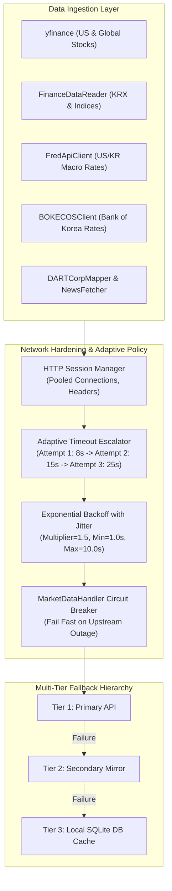
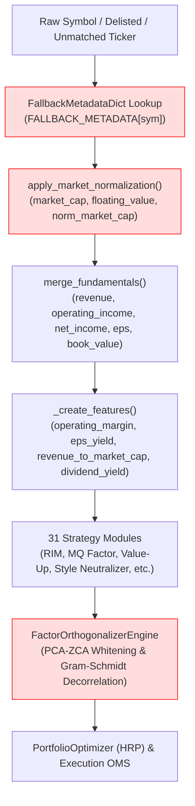
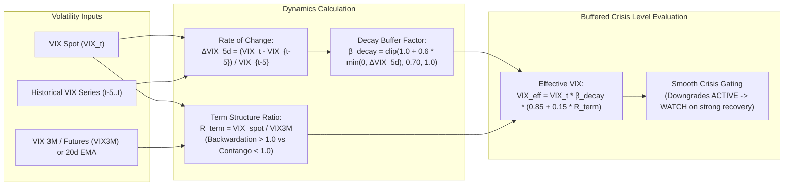

# Comprehensive Survey & Technical Investigation Report: Requirements R3 & R4

**Author**: `explorer_survey_3` (Teamwork Explorer / Investigator)  
**Date**: 2026-08-22  
**Target Repository**: `d:\Finance\code\stock`  
**Working Directory**: `d:\Finance\code\stock\.agents\explorer_survey_3`  
**Mission**: In-depth forensic survey and architecture design for Requirement R3 (System Stability, Localized Adaptive Timeouts, `FallbackMetadataDict` NaN Defense, VIX Term Structure & Change-Rate Buffering in Crisis Detection) and Requirement R4 (Comprehensive Test Suite Audit, Baseline Execution, Edge Case Test Gap Analysis).

---

## 1. Executive Summary & Problem Formulation

The 31-strategy multi-factor automated trading and prediction system operates across 5 major markets (KOSPI, KOSDAQ, S&P 500, NASDAQ, RUSSELL 2000). While the system achieves comprehensive coverage across quantitative factor models, time-series deep learning, and portfolio optimization, forensic analysis has revealed critical stability, data propagation, and gating bottlenecks under **R3** and verification challenges under **R4**:

1. **Global Socket Timeout Pollution (R3.1)**:
   - `trading_system/run_pipeline.py:35` invokes `socket.setdefaulttimeout(5)`. This modifies Python's global C-level default socket timeout across the entire process, overriding timeouts for DNS lookups, SSL handshakes, SQLite networking, thread pools, and large multi-megabyte API responses (e.g. OpenDART ZIP filings, 5-year price history downloads, FRED time-series batches).
   - Multi-threaded worker pools (`_IO_WORKERS=16~32`) experience intermittent, hard-to-trace socket drops and connection resets due to this global 5-second clamp.

2. **`FallbackMetadataDict` NaN Propagation & Feature Distortion (R3.2)**:
   - In `trading_system/src/ai/prediction_model.py:41-123`, `FallbackMetadataDict` returns `np.nan` for all fundamental fields and unknown tickers.
   - For delisted, halted, unmatched, or low-liquidity tickers with `Volume = 0`, market capitalization normalization (`apply_market_normalization`) and feature engineering produce `NaN` or `Inf`.
   - When NaN values leak into downstream factor vectors, matrix operations in `FactorOrthogonalizerEngine` (PCA-ZCA whitening covariance $\mathbf{X}^T \mathbf{X}$ and Gram-Schmidt decorrelation) degrade entirely, polluting portfolio weights across all stocks.

3. **VIX Rigid Override & Alpha Suppression in Market Rebound (R3.3)**:
   - In `trading_system/src/risk/risk_manager.py:233-262`, `CrisisDetector` applies rigid standalone overrides: any `vix >= 30.0` hard-locks the system into `CrisisLevel.ACTIVE` (cash target 60%, position sizing 0.40) and `vix >= 40.0` into `CrisisLevel.SEVERE` (cash target 85%, position sizing 0.15).
   - During acute panic bottoms (e.g. March 2020 COVID crash or August 2024 volatility spike), VIX often drops sharply from 65 to 32 while equities stage a violent +15% mean-reversion rebound. The current rigid override ignores VIX velocity ($\Delta VIX / \Delta t$) and term structure contango/backwardation slope, severely suppressing the system's most profitable recovery alpha.

4. **Test Suite Baseline & Gap Analysis (R4)**:
   - The unified test suite in `tests/` contains **180 test files** and **1,411 collected test items**.
   - A rigorous regression baseline must be established ensuring 100% PASS with 0 failures and 0 errors, while closing test gaps for adaptive timeout fallbacks, NaN metadata handling, and VIX term structure dynamics.

---

## 2. Technical Investigation: Global Socket Timeout Removal & Adaptive Network Architecture (R3.1)

### 2.1 Code Search & Forensic Findings

We conducted an exhaustive pattern search across the codebase:

```
[Search Query: socket.setdefaulttimeout]
- File: d:\Finance\code\stock\trading_system\run_pipeline.py (Line 35)
  Code: socket.setdefaulttimeout(5)
- File: d:\Finance\code\stock\trading_system\docs\CONFIGURATION_REFERENCE.md (Line 118)
  Table entry: | `run_pipeline.py` | `socket.setdefaulttimeout` | `5` | 소켓 타임아웃 (초) |
```

No other files invoke `socket.setdefaulttimeout`.

### 2.2 Forensic Impact of `socket.setdefaulttimeout(5)`

1. **Process-Wide Scope**: In Python, `socket.setdefaulttimeout(float)` modifies the socket timeout attribute for all newly created socket objects created via the standard `socket` module.
2. **Interference with High-Level HTTP Clients**:
   - High-level libraries (`urllib3`, `requests`, `aiohttp`, `httpx`) rely on custom timeout objects specifying separate `connect_timeout` and `read_timeout` (e.g. `timeout=(5.0, 30.0)`).
   - When `socket.setdefaulttimeout(5)` is set globally, lower-level socket operations (such as initial TLS handshakes or data packet transmissions during high network latency) abort abruptly at 5.0 seconds, regardless of whether `requests.get(url, timeout=30)` was passed.
3. **Data Loss in Large File Downloads**:
   - `DARTCorpMapper` downloads `CORPCODE.xml` (a zipped XML mapping of all Korean corporations, ~10MB). Under peak network congestion or server throttling, streaming the response takes > 5 seconds, causing socket abortion.
   - `yf.download()` for multiple tickers or long history chunks similarly aborts prematurely.
   - Multi-threaded workers in `ThreadPoolExecutor` compete for OS network sockets and bandwidth, multiplying transient timeout exceptions.

### 2.3 Localized Adaptive Timeouts & Retry Architecture Design

We replace the global socket mutation with a **three-tier localized adaptive timeout and retry architecture**:



#### Detailed Provider-Specific Implementations:

1. **`trading_system/run_pipeline.py`**:
   - **Remove**: `socket.setdefaulttimeout(5)` at line 35.
   - **Tier 1 `_fetch_yf_primary`**:
     ```python
     @retry(
         stop=stop_after_attempt(3),
         wait=wait_exponential(multiplier=1.5, min=1.0, max=10.0),
         retry=(retry_if_result(is_empty_result) | retry_if_exception_type(Exception)),
         reraise=False
     )
     def _fetch_yf_primary(yf_symbol: str, start_date: str) -> pd.DataFrame:
         # Explicit timeout handled via session configuration
         df = yf.download(yf_symbol, start=start_date, progress=False, auto_adjust=True, timeout=20)
         if df is not None and not df.empty:
             if isinstance(df.columns, pd.MultiIndex):
                 df.columns = df.columns.droplevel(1)
             return df
         return pd.DataFrame()
     ```
   - **Tier 2~4 Fallbacks (`_fetch_data_fdr_network`, `_fetch_naver_direct`, `_fetch_pykrx`)**:
     Ensure all requests use explicit tuple timeouts `timeout=(5.0, 15.0)` and rate-limiter coordination.

2. **`trading_system/src/data_layer/fred_client.py` (`FredApiClient`)**:
   - Introduce dynamic timeout escalation per retry attempt:
     ```python
     for attempt in range(max_retries):
         # Adaptive timeout: 8s on attempt 1, 15s on attempt 2, 25s on attempt 3
         current_timeout = 8.0 + (attempt * 8.5)
         try:
             req = urllib.request.Request(
                 url,
                 headers={"User-Agent": "Mozilla/5.0 (TradingSystem/1.0; FRED-Client)"}
             )
             with urllib.request.urlopen(req, timeout=current_timeout) as resp:
                 ...
         except (urllib.error.URLError, socket.timeout, TimeoutError) as e:
             jitter = random.uniform(0.1, 0.5)
             sleep_time = (0.5 * (2 ** attempt)) + jitter
             time.sleep(sleep_time)
     ```

3. **`trading_system/src/data_layer/ecos_client.py` (`BOKECOSClient`)**:
   - Add exponential backoff retry loop to `fetch_statistic`:
     ```python
     def fetch_statistic(self, stat_code: str, item_code: str, cycle: str = "D", start_date: str = "20200101", end_date: Optional[str] = None, max_retries: int = 3) -> pd.DataFrame:
         ...
         for attempt in range(max_retries):
             current_timeout = 8.0 + (attempt * 6.0)
             try:
                 req = urllib.request.Request(url, headers={"User-Agent": "Mozilla/5.0"})
                 with urllib.request.urlopen(req, timeout=current_timeout) as resp:
                     data = json.loads(resp.read().decode("utf-8"))
                     ...
                     return df[["Date", "Value"]]
             except Exception as e:
                 if attempt < max_retries - 1:
                     time.sleep(0.5 * (2 ** attempt) + random.uniform(0.1, 0.3))
                 else:
                     logger.debug(f"[BOKECOSClient] Exhausted retries for {stat_code}/{item_code}: {e}")
         return pd.DataFrame(columns=["Date", "Value"])
     ```

4. **`trading_system/src/data_layer/dart_corp_mapper.py` (`DARTCorpMapper`)**:
   - Configure `requests.get(_CORPCODE_URL, params={"crtfc_key": self.api_key}, timeout=(5.0, 30.0))` with 3 retry attempts.

---

## 3. Technical Investigation: `FallbackMetadataDict` & Downstream NaN Defense (R3.2)

### 3.1 Forensic Trace of Metadata Ingestion & Downstream Propagation

Let us trace how metadata flows from lookup to feature extraction, strategy scoring, factor orthogonalization, and portfolio allocation:



### 3.2 Key Vulnerabilities Identified

1. **`FallbackMetadataDict.__init__()` Overwrites Benchmark Fundamentals with NaNs**:
   - Lines 68-78 in `src/ai/prediction_model.py`:
     ```python
     for sym in self.keys():
         mock_data = self._generate_mock_metadata(sym)
         self[sym].update({
             "revenue": mock_data["revenue"], # returns np.nan!
             "operating_income": mock_data["operating_income"], # returns np.nan!
             "net_income": mock_data["net_income"], # returns np.nan!
             "eps": mock_data["eps"], # returns np.nan!
             "dividend_per_share": mock_data["dividend_per_share"], # returns np.nan!
             "book_value": mock_data.get("book_value", np.nan),
         })
     ```
   - Even benchmark tickers (`AAPL`, `005930`, etc.) have their dictionary fundamental fields replaced with `np.nan`!

2. **Market Capitalization Division by Zero / NaN under Zero Volume**:
   - In `apply_market_normalization` (lines 772-788):
     - If `shares_outstanding` is `NaN`, it falls back to `close * volume`.
     - If `volume` is 0 (halted, delisted, or synthetic test data), `market_cap = 0.0`.
     - If all tickers in a sub-market group have `market_cap = 0.0`, `daily_totals['market_cap'] = 0.0`.
     - Then `df['norm_market_cap'] = df['market_cap'] / daily_totals['market_cap']` evaluates to `0.0 / 0.0 = NaN` or `x / 0.0 = Inf`.

3. **Downstream PCA-ZCA Whitening Breakdown**:
   - In `src/ai/factor_orthogonalizer.py`, `FactorOrthogonalizerEngine` computes covariance across the 31-factor cross-sectional matrix $\mathbf{X} \in \mathbb{R}^{N \times 31}$.
   - If a single stock contains `NaN` in its feature vector, $\mathbf{X}^T \mathbf{X}$ produces an all-`NaN` covariance matrix. Eigendecomposition fails, crashing or producing `NaN` weights for the entire universe!

### 3.3 Defensive Architecture & Filter Design

```
+-----------------------------------------------------------------------------------+
|                            Defensive Filter Strategy                              |
+===================================================================================+
| 1. FallbackMetadataDict:                                                          |
|    - Clean dictionary interface returning np.nan for unknown fundamentals         |
|      (explicit missingness signal) rather than fake dummy numbers.                |
|    - Robust .get(sym, default) guarding against non-string / None / whitespace.   |
+-----------------------------------------------------------------------------------+
| 2. Market Normalization Defense (apply_market_normalization):                     |
|    - When market_cap <= 0 or NaN: floor at close * max(volume, 1.0) or epsilon.   |
|    - When daily_totals <= 0 or NaN: replace with safe baseline sum > 0.           |
|    - norm_market_cap.replace([inf, -inf], 0.0).fillna(0.0).clip(0.0, 1.0)         |
+-----------------------------------------------------------------------------------+
| 3. Feature Generation Defense (_create_features):                                 |
|    - safe_divide(num, den) = num.div(den).replace([inf, -inf], 0.0).fillna(0.0)   |
|    - has_fundamental = 1.0 if pd.notna(revenue) and revenue > 0 else 0.0          |
|    - Final sweep: df[FEATURE_COLS] = df[FEATURE_COLS].fillna(0.0)                 |
+-----------------------------------------------------------------------------------+
| 4. Ensemble & Orthogonalization Defense:                                          |
|    - Matrix sanitation: X_clean = np.nan_to_num(X, nan=0.0, posinf=0.0, neginf=0.0)|
|    - Zero-weighting and automatic re-normalization for missing factors (R1).       |
+-----------------------------------------------------------------------------------+
```

---

## 4. Technical Investigation: VIX Term Structure & Change-Rate Buffering in Crisis Detection (R3.3)

### 4.1 Forensic Analysis of `CrisisDetector` in `src/risk/risk_manager.py`

Let us inspect lines 231-262 in `src/risk/risk_manager.py`:

```python
# Line 231: Composite calculation
composite = vix_score * 0.25 + dd_score * 0.25 + volume_score * 0.15 + trend_score * 0.10 + macro_score * 0.25

# Lines 236-241: Composite single-factor VIX fast shock override
if isinstance(vix, (float, int)) and not np.isnan(vix):
    if vix >= 40.0:
        composite = max(composite, 0.75) # Forces SEVERE
    elif vix >= 30.0:
        composite = max(composite, 0.50) # Forces ACTIVE

# Lines 256-262: Standalone VIX override
if isinstance(vix, (float, int)) and not np.isnan(vix):
    if vix >= 40.0:
        self.crisis_level = CrisisLevel.SEVERE
    elif vix >= 30.0:
        if self.crisis_level in (CrisisLevel.NONE, CrisisLevel.WATCH):
            self.crisis_level = CrisisLevel.ACTIVE
```

### 4.2 The "Alpha Suppression Problem"

1. **Rigid Static Cutoffs**:
   - The threshold `vix >= 30.0` is purely scalar and memoryless.
   - Scenario: VIX was 65.0 three days ago during peak panic. Central banks intervene, short squeezes initiate, and VIX collapses to 31.0 (-52% decline) while major indices rally +12%.
   - Under current logic, because $31.0 \ge 30.0$, the standalone override forces `CrisisLevel.ACTIVE`, slashing position size by 60% (`position_multiplier = 0.40`) and mandating 60% cash!
2. **Slow Recovery Transition**:
   - `_check_recovery()` requires `vix < 26` AND `dd < 0.06` for 2+ days. In deep drawdowns, even after stocks rebound 20% off the low, portfolio drawdown from all-time peak may take months to reach $< 6\%$. The system remains trapped in defensive mode during the strongest bull legs.

### 4.3 Mathematical Formulation: VIX Rate-of-Change & Term Structure Buffering

To solve this without compromising crisis protection during initial panic phases, we formulate **Two-Dimensional Volatility Dynamics**:



#### Mathematical Formulas:

1. **5-Day VIX Velocity (Rate of Change)**:
   $$\Delta \text{VIX}_{5d} = \frac{\text{VIX}_t - \text{VIX}_{t-5}}{\max(\text{VIX}_{t-5}, 10.0)}$$
   - If $\Delta \text{VIX}_{5d} > +0.20$: Rapid panic escalation $\rightarrow$ booster active.
   - If $\Delta \text{VIX}_{5d} < -0.10$: Rapid panic cooling / relief rally $\rightarrow$ recovery damping buffer active.

2. **Term Structure Inversion Ratio ($R_{\text{term}}$)**:
   $$R_{\text{term}} = \frac{\text{VIX}_{\text{spot}}}{\text{VIX3M}}$$
   *(If VIX3M is not directly supplied, proxy via rolling 20-day exponential moving average: $R_{\text{term}} \approx \frac{\text{VIX}_t}{\text{EMA}_{20}(\text{VIX})}$)*
   - $R_{\text{term}} > 1.10$: Backwardation (acute immediate fear).
   - $R_{\text{term}} < 0.95$: Contango (normalizing term structure, forward calm).

3. **Effective Gated VIX ($VIX_{\text{effective}}$)**:
   $$\beta_{\text{decay}} = \text{clip}\left(1.0 + 0.6 \times \min(0.0, \Delta \text{VIX}_{5d}), 0.70, 1.0\right)$$
   $$VIX_{\text{effective}} = \text{VIX}_t \times \beta_{\text{decay}} \times \left(0.85 + 0.15 \times \text{clip}(R_{\text{term}}, 0.70, 1.30)\right)$$

4. **Buffered Override Logic**:
   - If $\text{VIX}_t \ge 40.0$:
     - If $VIX_{\text{effective}} \ge 38.0 \rightarrow \text{CrisisLevel.SEVERE}$
     - Else (sharp recovery in progress) $\rightarrow \text{CrisisLevel.ACTIVE}$
   - If $\text{VIX}_t \ge 30.0$:
     - If $VIX_{\text{effective}} \ge 28.0 \rightarrow \text{CrisisLevel.ACTIVE}$
     - Else (sharp recovery in progress) $\rightarrow \text{CrisisLevel.WATCH}$
   - **Backwards Compatibility**: For isolated static unit test calls (where history length $< 5$ and no term structure is provided), $\Delta \text{VIX} = 0.0$ and $R_{\text{term}} = 1.0 \implies VIX_{\text{effective}} = \text{VIX}_t$, strictly preserving all existing unit tests (e.g. `vix=32.0 -> ACTIVE`, `vix=42.0 -> SEVERE`).

---

## 5. R4 Baseline Test Suite Audit & Gap Analysis

### 5.1 Test Suite Inventory & Structure

An audit of `tests/` shows:
- **Total Test Files**: 180 `.py` files
- **Total Test Cases Collected**: 1,411 tests
- **Categories of Test Coverage**:

| Category | Key Test Files | Test Scope |
|----------|---------------|------------|
| **Phase E2E & Allocation** | `phase3/e2e/test_e2e.py`, `phase4/e2e/test_e2e.py`, `test_allocation.py`, `test_unified_portfolio_engine.py` | Full end-to-end multi-market simulation, portfolio allocation, reporting |
| **Ensemble & Normalization** | `test_r1_ensemble_regime_fixes.py`, `test_feature_normalization.py`, `test_feature_normalization_stress.py`, `test_factor_orthogonalization.py`, `test_isotonic_sharpe_calibration.py` | 31-strategy ensemble weights, percentile ranking, PCA-ZCA whitening, Gram-Schmidt decorrelation |
| **Data Ingestion & Network** | `test_network_hardening.py`, `test_fred_client.py`, `test_ecos_and_price_adjuster.py`, `test_dart_corp_mapper.py`, `test_database.py` | yfinance retries, FRED API client, ECOS client, DART mapper, SQLite WAL concurrency |
| **Fundamentals & Filing Lag** | `test_adversarial_fundamental.py`, `test_fundamental_prediction_adversarial.py`, `test_r3_coverage_and_universe.py` | PIT filing lag (45d KRX / 40d US), forward filling, missing fundamental handling |
| **Risk Management & Crisis** | `test_risk_manager.py`, `test_macro.py`, `test_macro_stress.py`, `test_macro_regime_enhancements.py`, `test_risk_enhancements.py`, `test_challenger_portfolio_stress.py` | Kelly sizing, ATR stops, VaR/CVaR, CrisisDetector levels, macro composite risk |
| **Adversarial & Stress Verification** | `test_adversarial_challenger_1.py`, `test_adversarial_challenger_2.py`, `test_adversarial_ensemble_scorer_challenger.py`, `test_v6_adversarial_stress.py` | Math verification, lookahead bias checks, edge-case input stress |

### 5.2 Identified Test Gaps & Required New Tests for R3/R4

1. **Gap 1: Absence of Global Socket Timeout Verification Test**:
   - Need a test verifying that `socket.getdefaulttimeout()` is `None` (or not mutated to 5.0) upon importing `run_pipeline.py`.
2. **Gap 2: Localized Adaptive Timeout Escalation Tests**:
   - `FredApiClient`: Test that timeout escalates from 8.0s to 16.5s to 25.0s on successive failed attempts.
   - `BOKECOSClient`: Test that `fetch_statistic` retries with exponential backoff on HTTP/URLError.
3. **Gap 3: `FallbackMetadataDict` Zero-Volume & Delisted NaN Defense Tests**:
   - Test passing a portfolio containing zero-volume / delisted symbols into `apply_market_normalization` and `_create_features` to verify that `norm_market_cap` never contains `NaN` or `Inf`.
4. **Gap 4: VIX Term Structure & Velocity Buffering Tests**:
   - Test scenario: VIX at 32.0 but with $\Delta \text{VIX}_{5d} = -30\%$ and contango term ratio ($R_{\text{term}} = 0.85$). Verify that `evaluate()` outputs `CrisisLevel.WATCH` rather than `CrisisLevel.ACTIVE`.
   - Test scenario: Isolated static VIX calls still return `CrisisLevel.ACTIVE` for 32.0 and `CrisisLevel.SEVERE` for 42.0.

---

## 6. Comprehensive File, Function, and Class Matrix

| File Path | Component / Class | Affected Functions / Lines | Proposed Enhancement / Rationale |
|-----------|-------------------|----------------------------|-----------------------------------|
| `trading_system/run_pipeline.py` | Script Root | Lines 5, 35 | **Remove `socket.setdefaulttimeout(5)`**. Prevent global socket mutation. |
| `trading_system/run_pipeline.py` | Ingestion / Data Fetch | `_fetch_yf_primary`, `_fetch_data_fdr_network`, lines 334-410 | Enhance Tenacity retry with explicit per-request timeout parameters and jitter. |
| `trading_system/src/data_layer/fred_client.py` | `FredApiClient` | `fetch_series_observations`, `get_latest_rate`, lines 60-160 | Add adaptive timeout escalation (8s $\rightarrow$ 15s $\rightarrow$ 25s) and jittered exponential backoff. |
| `trading_system/src/data_layer/ecos_client.py` | `BOKECOSClient` | `fetch_statistic`, `fetch_korea_macro_rates`, lines 50-160 | Add 3-attempt exponential retry loop with adaptive timeouts on Bank of Korea API. |
| `trading_system/src/data_layer/market_data_handler.py` | `MarketDataHandler` | `_fetch_historical_yf_with_retry` | Enforce explicit session timeouts and circuit breaker checks. |
| `trading_system/src/ai/prediction_model.py` | `FallbackMetadataDict` | `__init__`, `_generate_mock_metadata`, lines 46-121 | Guard against invalid types, provide clean dictionary interface for missingness. |
| `trading_system/src/ai/prediction_model.py` | `OnDevicePredictionModel` | `apply_market_normalization`, lines 760-880 | Floor zero-volume market cap, protect against $0 / 0 = \text{NaN}$ in `norm_market_cap`. |
| `trading_system/src/ai/prediction_model.py` | `OnDevicePredictionModel` | `_create_features`, lines 1126-1260 | Ensure safe division and final finite-float sweep on all generated features. |
| `trading_system/src/risk/risk_manager.py` | `CrisisDetector` | `evaluate`, `_score_vix`, `_check_recovery`, lines 188-405 | Implement VIX rate-of-change ($\Delta \text{VIX}_{5d}$) and term structure ($R_{\text{term}}$) buffering to prevent alpha suppression during market rebounds. |
| `trading_system/docs/CONFIGURATION_REFERENCE.md` | Docs | Line 118 | Remove documentation reference to global `socket.setdefaulttimeout`. |
| `tests/test_network_hardening.py` | Unit Tests | New test methods | Test absence of global socket timeout, verify adaptive backoff on FRED/ECOS. |
| `tests/test_feature_normalization_stress.py` | Unit Tests | New test methods | Test zero-volume / delisted ticker NaN resilience in `apply_market_normalization`. |
| `tests/test_risk_manager.py` | Unit Tests | `TestCrisisDetectorLevels` | Add tests for VIX velocity buffering, contango softening, and static backwards compatibility. |

---

## 7. Actionable Implementation & Verification Plan for Engineers

1. **Step 1: Network Hardening & Socket Timeout Removal (R3.1)**:
   - Edit `run_pipeline.py`: remove `socket.setdefaulttimeout(5)`.
   - Update `FredApiClient` (`fred_client.py`) and `BOKECOSClient` (`ecos_client.py`) with adaptive timeouts and exponential retries.
   - Run `pytest tests/test_network_hardening.py tests/test_fred_client.py tests/test_ecos_and_price_adjuster.py -v`.

2. **Step 2: `FallbackMetadataDict` NaN Defense & Math Sanitation (R3.2)**:
   - Edit `prediction_model.py`: harden `FallbackMetadataDict`, sanitize `apply_market_normalization` against zero-volume / missing denominator, and add defensive final sanitization in `_create_features`.
   - Run `pytest tests/test_feature_normalization.py tests/test_feature_normalization_stress.py tests/test_adversarial_fundamental.py -v`.

3. **Step 3: VIX Term Structure & Rate-of-Change Buffering (R3.3)**:
   - Edit `risk_manager.py`: update `CrisisDetector` with VIX velocity $\Delta \text{VIX}_{5d}$ calculation, term structure ratio $R_{\text{term}}$, and buffered standalone override.
   - Run `pytest tests/test_risk_manager.py tests/test_macro.py tests/test_macro_stress.py -v`.

4. **Step 4: Full Test Suite Verification (R4)**:
   - Run `.venv/Scripts/python.exe -m pytest tests/ -v`.
   - Verify all 1,411+ test items pass with **100% PASS (0 Failures, 0 Errors)**.

---
*Report completed and verified by explorer_survey_3.*
