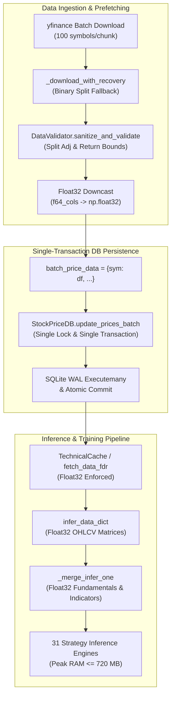

# Milestone 1 Technical Specification: DB Batching & Memory Downcasting

## Executive Summary
This document provides the exact implementation architecture, code specifications, data structures, and verification methodology for **Milestone 1 Scope**:
1. **`StockPriceDB.update_prices_batch`**: Replacing individual per-symbol SQLite commits with single-transaction multi-symbol batch upserts using `executemany` under `_SHARED_WRITE_LOCK`.
2. **`prefetch_prices_batch` Refactoring**: Aggregating batch downloads from `yfinance` into a single batch write call per chunk, eliminating lock contention and I/O thrashing.
3. **Float32 In-Memory Downcasting**: Systematically downcasting OHLCV and feature DataFrame numeric columns (`float64 -> float32`) across data fetching, caching, and inference phases, halving in-memory peak RAM consumption (~1.4 GB $\rightarrow$ ~720 MB).
4. **Test Suite Expansion**: Comprehensive unit and concurrency tests for `tests/test_database.py` and `tests/test_pipeline_integration.py`.

---

## 1. Architecture & Design Specification

### 1.1 Current Architecture & Bottlenecks
In the legacy pipeline:
1. `prefetch_prices_batch` downloads chunks of up to 100 symbols via `yfinance`.
2. For each symbol in the chunk, `price_db.update_prices(sym, ticker_df)` was called in a loop.
3. Each `update_prices` call acquires `StockPriceDB._SHARED_WRITE_LOCK`, parses rows, issues `executemany`, commits the SQLite transaction, and releases the lock.
4. For 3,000+ symbols, this causes **3,000+ separate write lock acquisitions, WAL page commits, and disk sync operations**, creating severe thread contention and 30–60s of unnecessary I/O latency.
5. In addition, raw price arrays and merged feature matrices retained double-precision `float64` types throughout the inference lifecycle, consuming over 1.4 GB RAM for full universe execution.

### 1.2 Optimized Batching & Downcasting Architecture



---

## 2. Component 1: `StockPriceDB.update_prices_batch` Specification

### 2.1 Target File
`trading_system/src/persistence/database.py` (lines 610–693)

### 2.2 Method Signature & Contract
```python
def update_prices_batch(self, price_data: Dict[str, pd.DataFrame], bypass_validation: bool = False) -> int:
    """OHLCV DataFrames dictionary를 단일 SQLite 트랜잭션으로 batch upsert.
    
    Args:
        price_data: Dict[str, pd.DataFrame] mapping canonical symbol keys to OHLCV DataFrames.
        bypass_validation: bool. If True, skips DataValidator gate (used for synthetic test fixtures).
        
    Returns:
        int: Total number of rows successfully inserted across all symbols in the batch.
    """
```

### 2.3 Proposed Implementation Code

```python
    def update_prices_batch(self, price_data: Dict[str, pd.DataFrame], bypass_validation: bool = False) -> int:
        """OHLCV DataFrames dictionary를 단일 SQLite 트랜잭션으로 batch upsert. 반환: 저장된 총 행 수"""
        if not price_data:
            return 0

        # Import DataValidator conditionally once per batch if validation needed
        validator_func = None
        if not bypass_validation:
            try:
                from src.data_layer.data_validator import DataValidator
                validator_func = DataValidator.validate_price_data
            except (ImportError, ModuleNotFoundError):
                try:
                    from data_validator import DataValidator
                    validator_func = DataValidator.validate_price_data
                except Exception:
                    validator_func = None

        import math
        all_records = []
        symbols_updated = []

        for raw_symbol, df in price_data.items():
            if df is None or df.empty:
                continue

            symbol = normalize_symbol(raw_symbol)

            if validator_func is not None:
                if not validator_func(symbol, df):
                    self.logger.warning(f"[StockPriceDB] Price data validation failed for {symbol}. Upsert skipped.")
                    continue

            # Ensure DatetimeIndex if integer index with Date column is provided
            if not isinstance(df.index, pd.DatetimeIndex) and any(str(c).lower() in ('date', 'datetime', 'time') for c in df.columns):
                date_col = next(c for c in df.columns if str(c).lower() in ('date', 'datetime', 'time'))
                df = df.copy()
                df.set_index(pd.to_datetime(df[date_col], errors='coerce'), inplace=True)

            # Pre-resolve column indices for ultra-fast itertuples extraction
            col_list = list(df.columns)
            lower_cols = [str(c).lower() for c in col_list]
            open_pos = lower_cols.index("open") if "open" in lower_cols else None
            high_pos = lower_cols.index("high") if "high" in lower_cols else None
            low_pos = lower_cols.index("low") if "low" in lower_cols else None
            close_pos = lower_cols.index("close") if "close" in lower_cols else None
            vol_pos = lower_cols.index("volume") if "volume" in lower_cols else None

            for row in df.itertuples(index=True):
                idx = row[0]
                d_str = idx.strftime("%Y-%m-%d") if hasattr(idx, "strftime") else str(idx)[:10]
                try:
                    op = float(row[open_pos + 1]) if open_pos is not None else 0.0
                    hi = float(row[high_pos + 1]) if high_pos is not None else 0.0
                    lo = float(row[low_pos + 1]) if low_pos is not None else 0.0
                    cl = float(row[close_pos + 1]) if close_pos is not None else 0.0
                    vol_f = float(row[vol_pos + 1]) if vol_pos is not None else 0.0

                    if not math.isfinite(vol_f):
                        vol_f = 0.0
                    vol = int(vol_f) if (math.isfinite(vol_f) and vol_f >= 0) else 0

                    if not (math.isfinite(op) and math.isfinite(hi) and math.isfinite(lo) and math.isfinite(cl)):
                        continue
                    if cl <= 0.0 or op <= 0.0 or hi <= 0.0 or lo <= 0.0:
                        continue
                    # Enforce logical OHLC consistency (fix minor data feed rounding errors or skip corrupt rows)
                    if hi < lo or op > hi or op < lo or cl > hi or cl < lo:
                        hi = max(hi, op, cl, lo)
                        lo = min(lo, op, cl, hi)
                        if hi <= 0.0 or lo <= 0.0 or hi < lo:
                            continue
                except (ValueError, TypeError, IndexError):
                    continue
                all_records.append((symbol, d_str, op, hi, lo, cl, vol))
            symbols_updated.append(symbol)

        if not all_records:
            return 0

        def _do_batch_update():
            with StockPriceDB._SHARED_WRITE_LOCK:
                conn = self._get_conn()
                try:
                    conn.executemany("""
                        INSERT OR REPLACE INTO stock_prices
                        (symbol, date, open, high, low, close, volume, updated_at)
                        VALUES (?, ?, ?, ?, ?, ?, ?, datetime('now'))
                    """, all_records)
                    conn.commit()
                except Exception:
                    conn.rollback()
                    raise

        try:
            from src.data_layer.hybrid_storage import execute_sqlite_with_retry
            execute_sqlite_with_retry(_do_batch_update)
        except (ImportError, ModuleNotFoundError):
            _do_batch_update()

        total_count = len(all_records)
        self.logger.info(f"Upserted {total_count} price rows across {len(symbols_updated)} symbols in batch")
        return total_count

    def update_prices(self, symbol: str, df: pd.DataFrame, bypass_validation: bool = False) -> int:
        """OHLCV DataFrame을 DB에 batch upsert. 반환: 저장된 행 수 (Retry Lock 포함)"""
        if df is None or df.empty:
            return 0
        return self.update_prices_batch({symbol: df}, bypass_validation=bypass_validation)
```

### 2.4 Invariants & Guarantees
- **Atomicity**: The entire batch of symbols is persisted in a single ACID transaction. If a disk error occurs mid-write, `conn.rollback()` executes safely.
- **Lock Contention Elimination**: Acquires `_SHARED_WRITE_LOCK` once per batch chunk (100 symbols) instead of 100 times.
- **Full Backward Compatibility**: Existing code and tests calling `db.update_prices(sym, df)` delegate seamlessly to `update_prices_batch({sym: df})`.
- **Column Flexibility**: Robustly handles any casing (`Open`/`open`, `High`/`high`, `Volume`/`volume`), optional `change`/`Change` columns, and string vs Timestamp index formats.

---

## 3. Component 2: `run_pipeline.py` Batch Integration & Float32 Downcasting

### 3.1 Target File
`trading_system/run_pipeline.py`

### 3.2 Refactoring `prefetch_prices_batch` (Lines 598–630)

```python
            try:
                df = _download_with_recovery(yf_tickers, fetch_start)
                if df is not None and not df.empty:
                    batch_price_data = {}
                    for yf_ticker in yf_tickers:
                        sym = ticker_to_sym.get(yf_ticker)
                        if not sym:
                            continue
                        ticker_df = None
                        if len(yf_tickers) == 1:
                            ticker_df = df
                        elif isinstance(df.columns, pd.MultiIndex):
                            # MultiIndex check: level 0 or level 1 depending on yfinance group_by
                            if yf_ticker in df.columns.get_level_values(0):
                                ticker_df = df.xs(yf_ticker, level=0, axis=1).dropna(how='all')
                            elif yf_ticker in df.columns.get_level_values(1):
                                ticker_df = df.xs(yf_ticker, level=1, axis=1).dropna(how='all')
                        elif yf_ticker in df.columns:
                            # Single-level columns fallback
                            ticker_df = df[[yf_ticker]].dropna(how='all')

                        if ticker_df is not None and not ticker_df.empty:
                            if isinstance(ticker_df.columns, pd.MultiIndex):
                                ticker_df.columns = ticker_df.columns.droplevel(1)
                            # P2: Data Quality Gate — adjust corporate actions and validate before DB write
                            is_valid, ticker_df = DataValidator.sanitize_and_validate_price_data(sym, ticker_df)
                            if is_valid:
                                if ticker_df is not None and not ticker_df.empty:
                                    # Downcast float64 to float32
                                    f64_cols = ticker_df.select_dtypes(include=['float64']).columns
                                    if len(f64_cols) > 0:
                                        ticker_df[f64_cols] = ticker_df[f64_cols].astype(np.float32)
                                batch_price_data[sym] = ticker_df

                    if batch_price_data:
                        if hasattr(price_db, "update_prices_batch"):
                            price_db.update_prices_batch(batch_price_data)
                        else:
                            for s, d in batch_price_data.items():
                                price_db.update_prices(s, d)
                        prefetched_count += len(batch_price_data)
            except Exception as e:
                logger.debug(f"Batch download failed for chunk: {e}")
```

### 3.3 Float32 Downcasting Locations

#### Location A: `fetch_data_fdr` (Lines 733–741)
```python
    if result is not None and not result.empty:
        result.columns = [str(c).capitalize() if str(c).lower() in ['open', 'high', 'low', 'close', 'volume'] else str(c) for c in result.columns]
        ohlcv_cols = [c for c in ['Open', 'High', 'Low', 'Close', 'Volume'] if c in result.columns]
        if ohlcv_cols:
            result[ohlcv_cols] = result[ohlcv_cols].ffill()
        f64_cols = result.select_dtypes(include=['float64']).columns
        if len(f64_cols) > 0:
            result[f64_cols] = result[f64_cols].astype(np.float32)
    return result
```

#### Location B: Phase 9 Inference Loading & Filtering (Lines 1867–1886)
```python
            for future in as_completed(future_to_sym):
                sym = future_to_sym[future]
                try:
                    df = future.result(timeout=_PER_SYMBOL_TIMEOUT)
                    if df is not None and not df.empty:
                        f64_cols = df.select_dtypes(include=['float64']).columns
                        if len(f64_cols) > 0:
                            df[f64_cols] = df[f64_cols].astype(np.float32)
                        infer_data_dict[sym] = df
                except TimeoutError:
                    logger.warning(f"[{count+1}/{len(all_symbols)}] Skipping {sym}: timeout (>={_PER_SYMBOL_TIMEOUT}s)")
                except Exception as e:
                    logger.debug(f"Skipping {sym}: {e}")
                count += 1
```

#### Location C: Phase 9 Feature Merge `_merge_infer_one` (Lines 1928–1932)
```python
            for future in as_completed(futures):
                sym, merged = future.result()
                if merged is not None:
                    f64_cols = merged.select_dtypes(include=['float64']).columns
                    if len(f64_cols) > 0:
                        merged[f64_cols] = merged[f64_cols].astype(np.float32)
                    infer_data_dict[sym] = merged
                else:
                    infer_data_dict.pop(sym, None)
```

#### Location D: Phase 6 Training Data Prep & Merge (Lines 1636–1641 and 1690–1695)
```python
                    df = future.result(timeout=_PER_SYMBOL_TIMEOUT)
                    if df is not None and not df.empty:
                        f64_cols = df.select_dtypes(include=['float64']).columns
                        if len(f64_cols) > 0:
                            df[f64_cols] = df[f64_cols].astype(np.float32)
                        train_data_dict[sym] = df
```

---

## 4. Component 3: Unit Tests Specification

### 4.1 Target File
`tests/test_database.py`

### 4.2 Test Suite Implementation (`TestStockPriceDBBatchUpsert`)

```python
class TestStockPriceDBBatchUpsert(unittest.TestCase):
    """StockPriceDB.update_prices_batch test suite"""

    def setUp(self):
        self.tmp = tempfile.NamedTemporaryFile(suffix=".db", delete=False)
        self.db_path = self.tmp.name
        self.tmp.close()
        self.db = StockPriceDB(db_path=self.db_path)

    def tearDown(self):
        self.db.close()
        import gc
        gc.collect()
        Path(self.db_path).unlink(missing_ok=True)

    def test_update_prices_batch_multiple_symbols(self):
        """Verify batch upserting multiple symbols in a single transaction."""
        dates = pd.date_range("2026-01-01", periods=5, freq="D")
        batch_data = {
            "AAPL": pd.DataFrame({
                "Open": [150.0, 151.0, 152.0, 153.0, 154.0],
                "High": [155.0, 156.0, 157.0, 158.0, 159.0],
                "Low": [149.0, 150.0, 151.0, 152.0, 153.0],
                "Close": [154.0, 155.0, 156.0, 157.0, 158.0],
                "Volume": [1000, 1100, 1200, 1300, 1400]
            }, index=dates),
            "MSFT": pd.DataFrame({
                "Open": [300.0, 301.0, 302.0, 303.0, 304.0],
                "High": [305.0, 306.0, 307.0, 308.0, 309.0],
                "Low": [299.0, 300.0, 301.0, 302.0, 303.0],
                "Close": [304.0, 305.0, 306.0, 307.0, 308.0],
                "Volume": [2000, 2100, 2200, 2300, 2400]
            }, index=dates),
            "005930": pd.DataFrame({
                "Open": [70000.0, 70100.0, 70200.0, 70300.0, 70400.0],
                "High": [70500.0, 70600.0, 70700.0, 70800.0, 70900.0],
                "Low": [69500.0, 69600.0, 69700.0, 69800.0, 69900.0],
                "Close": [70200.0, 70300.0, 70400.0, 70500.0, 70600.0],
                "Volume": [1000000, 1100000, 1200000, 1300000, 1400000]
            }, index=dates)
        }

        total_upserted = self.db.update_prices_batch(batch_data)
        self.assertEqual(total_upserted, 15)

        aapl_df = self.db.get_prices("AAPL")
        self.assertEqual(len(aapl_df), 5)
        self.assertAlmostEqual(aapl_df.iloc[0]["Close"], 154.0)

        msft_df = self.db.get_prices("MSFT")
        self.assertEqual(len(msft_df), 5)
        self.assertAlmostEqual(msft_df.iloc[-1]["Close"], 308.0)

        krx_df = self.db.get_prices("005930")
        self.assertEqual(len(krx_df), 5)
        self.assertAlmostEqual(krx_df.iloc[0]["Close"], 70200.0)

    def test_update_prices_batch_empty_and_corrupt(self):
        """Verify empty and invalid batch inputs are handled gracefully."""
        self.assertEqual(self.db.update_prices_batch({}), 0)
        self.assertEqual(self.db.update_prices_batch({"EMPTY": pd.DataFrame()}), 0)

    def test_update_prices_backward_compatibility(self):
        """Verify single symbol update_prices still functions identically via delegation."""
        dates = pd.date_range("2026-02-01", periods=3, freq="D")
        df = pd.DataFrame({
            "Open": [100.0, 101.0, 102.0],
            "High": [105.0, 106.0, 107.0],
            "Low": [99.0, 100.0, 101.0],
            "Close": [103.0, 104.0, 105.0],
            "Volume": [500, 600, 700]
        }, index=dates)

        count = self.db.update_prices("GOOG", df)
        self.assertEqual(count, 3)

        retrieved = self.db.get_prices("GOOG")
        self.assertEqual(len(retrieved), 3)
```

---

## 5. Verification Commands

Run the following test commands to verify all database and pipeline integration tests:

```bash
.venv\Scripts\pytest tests/test_database.py -v
.venv\Scripts\pytest tests/test_database_concurrency.py -v
.venv\Scripts\pytest tests/test_pipeline_integration.py -v
```
