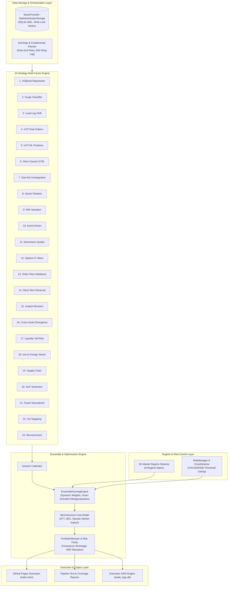

# Stock Trading System

## Project Overview

통합 주식 자동매매 및 예측 시스템. 3,379개 종목(한국 KOSPI/KOSDAQ/KONEX + 미국 SP500/NASDAQ/RUSSELL2000)을 대상으로 **31대 다변화 전략(Multi-Factor & Multi-Model)**을 병행 운영 및 2D 시장 레짐 기반 앙상블:

| # | 전략 | 방식 | 출력 |
|---|------|------|------|
| **1** | XGBoost 회귀 | 8개 horizon(1~200d) 예상수익률 | `pipeline_result.txt` |
| **2** | Surge 분류기 | 4개 horizon(1/3/5/20d) 급등 확률 (scale_pos_weight ≤ 20.0) | `surge_predictions.txt` |
| **3** | Lead-Lag | 2-Tier 업종 지수/대형주 시차 상관성 기반 후행 종목 | `lead_lag_predictions.txt` |
| **4** | VCP 패턴 | 변동성 수축 + 거래량 감소 + 고점 근접 규칙 | `vcp_patterns.txt` |
| **5** | VCP ML | 시장별 XGBClassifier | `vcp_ml_predictions.txt` |
| **6** | Strict Causal LSTM | 시점 분리 롤링 정규화 기반 시계열 딥러닝 | 앙상블 피처 결합 |
| **7** | Stat-Arb Cointegration | 잔차 평균회귀 Z-score 기반 횡보장 차익거래 | `stat_arb_predictions.txt` |
| **8** | Sector Rotation | KRX/GICS 업종 1M/3M 상대모멘텀 & 순환매 수급 | 앙상블 피처 결합 |
| **9** | RIM Valuation | 잔여이익 모델 기반 정밀 가치평가 | 앙상블 피처 결합 |
| **10** | Event-Driven | DART 공시, 실적 서프라이즈, 자사주, 거래량 3배 | 앙상블 피처 결합 |
| **11** | Momentum Quality (MQ) | 12M-1M 모멘텀 - 1M 반전 노이즈 제거 + 영업이익률/ROE | 앙상블 피처 결합 |
| **12** | Options IV Skew | yfinance 풋/콜 IV Skew 및 공포 역발상 매수 점수 | 앙상블 피처 결합 |
| **13** | Order Flow Imbalance | 외인/기관 순매수 수급 가속도 (MFI) | 앙상블 피처 결합 |
| **14** | Short-Term Reversal | 3~5일 연속 과매도/볼린저 하단 이탈 평균회귀 | 앙상블 피처 결합 |
| **15** | Analyst Revision Momentum (ARM) | 컨센서스 EPS/목표주가 추정치 상향 조정 및 실적 서프라이즈 | 앙상블 피처 결합 |
| **16** | Cross-Asset Regime Divergence (CARD) | 주식-원자재-환율 이탈 괴리율 역발상 매수 스코어링 | 앙상블 피처 결합 |
| **17** | Liquidity-Adjusted Tail Risk (LATR) | 52주 고점 낙폭(DD) + 유동성 서지 + 하방 꼬리위험 프리미엄 | 앙상블 피처 결합 |
| **18** | Inst & Foreign Sector | 외인/투신 2개월 수급 누적 & 업종 주도주 상관성 | `inst_foreign_sector_predictions.txt` |
| **19** | Supply Chain Momentum | 전방 대표기업 1D/3D 수익률 ➔ 부품/장비 공급망 시차 온기 전이 | `supply_chain_predictions.txt` |
| **20** | NLP Sentiment Catalyst | DART/SEC 공시 요약, 기업 뉴스, 실적 텍스트 FinBERT 감성 스코어 | `sentiment_predictions.txt` |
| **21** | Multi-Factor Style Neutralizer | Fama-French 5-Factor(시총/가치/수익성/투자) 노출 제거 순수 알파 | `factor_neutralized_predictions.txt` |
| **22** | Dynamic Volatility Targeting | 실산출 변동성 및 목표 변동성(연 12%) 리스크 파리티 비중 스코어링 | `vol_target_predictions.txt` |
| **23** | Microstructure Imbalance | 호가창 매수/매도 잔량 불균형 & 종가 동시호가 수급 오버나이트 갭 | `microstructure_predictions.txt` |
| **24** | Accruals Quality Anomaly | 당기순이익 대비 영업현금흐름(OCF) 괴리율 회계적 품질 점수 | 앙상블 피처 결합 |
| **25** | Short Interest & Squeeze | 공매도 잔고 비율 + Days-to-Cover + 5D 상승 모멘텀 숏스퀴즈 촉매 | 앙상블 피처 결합 |
| **26** | Value-Up & Shareholder Yield | PBR 1배 미만 + 순현금/시총 + 총주주환원율(배당+자사주 소각) | 앙상블 피처 결합 |
| **27** | Kaufman Trend Efficiency | 5D/10D/20D KER(트렌드 효율성) + Hurst Exponent 고순도 추세 필터 | 앙상블 피처 결합 |
| **28** | Gamma Squeeze | 옵션 미결제약정 및 콜 옵션 델타 가속도 기반 숏/델타 스퀴즈 | 앙상블 피처 결합 |
| **29** | Insider Buying | 임원/대주주 내부자 매수 공시 및 수급 수치화 | 앙상블 피처 결합 |
| **30** | Earnings Tone Drift | 실적 발표 콘퍼런스콜 텍스트 톤 변화 감성 퀀트 | 앙상블 피처 결합 |
| **31** | High-Frequency Execution | 호가 불균형 & 마이크로스프레드 고빈도 모멘텀 | 앙상블 피처 결합 |

## Pipeline

`run_pipeline.py` 실행 순서:

```
1. Load config (TradingConfig)
2. Fetch global indicators (VIX, TNX, USDKRW, etc.)
3. Store market indicators
4. Load/update stock universe (3379 symbols: KOSPI, KOSDAQ, KONEX, SP500; GHA adds NASDAQ, RUSSELL2000)
5. Fetch indicator history (train + inference)
6. Prepare training data (ThreadPoolExecutor + fundamental fetch + float32 memory downcast)
7. Train:
   a. Regression (per market: sp500/nasdaq/russell2000/kospi/kosdaq)
   b. Surge classifier (per market, capped scale weight)
   c. Lead-Lag 2-tier matrix
   d. VCP ML (per market)
   e. Isotonic Regression Calibrators fitting
8. Fetch inference fundamentals (background)
9. Fetch inference price data (ALL symbols)
10. Predict:
    a. Regression + Surge (shared feature computation)
    b. VCP rule-based pattern detection
    c. Lead-Lag 2-tier inference
    d. Stat-Arb pair cointegration scanning
    e. Sector Rotation relative momentum scoring
    f. RIM Valuation / Event-Driven / MQ / IV Skew / Order Flow / Reversal / ARM / CARD / LATR / Inst & Foreign / Supply Chain / NLP Sentiment / Factor Neutralized / Vol Target / Microstructure scoring
    g. 23-Strategy Dynamic Weighted Ensemble Scoring (Microstructure costs & RiskManager Crisis Gating)
11. Save predictions to DB & 23-Strategy Ensemble Output + Strategy Data Coverage Report
12. Save output files & Update GitHub Pages HTML Report (KST Timezone)
```

## Architecture

### Overall Block Diagram



### Key Files

| Path | 목적 |
|------|------|
| `trading_system/run_pipeline.py` | 통합 파이프라인 오케스트레이션 |
| `src/ai/prediction_model.py` | OnDevicePredictionModel: 회귀 + surge + lead-lag + 60d filing lag + memory optimization |
| `src/ai/ensemble_scorer.py` | EnsembleScoringEngine: 23대 전략 앙상블 + 2D 레짐 + Decision Rationale + 순예상수익률 정렬 + 미시구조 거래비용 |
| `src/analysis/coverage_analyzer.py` | StrategyCoverageAnalyzer: 23대 전략 커버리지 및 데이터 결측(Missingness) 정밀 분석 |
| `src/core/event_driven.py` | EventDrivenEngine: 공시/실적 깜짝실적/자사주 촉매 수치화 |
| `src/core/mq_factor.py` | MQFactorEngine: 12M-1M 모멘텀 - 1M 반전 노이즈 제거 + 펀더멘탈 퀄리티 |
| `src/core/iv_skew.py` | IVSkewEngine: 옵션 풋/콜 IV Skew & 비율 역발상 점수 |
| `src/core/order_flow.py` | OrderFlowEngine: 외인/기관 순매수 수급 가속도 (MFI) |
| `src/core/short_term_reversal.py` | ShortTermReversalEngine: 3~5일 연속 과매도/볼린저 하단 이탈 반등 |
| `src/core/arm_factor.py` | ARMFactorEngine: 컨센서스 EPS/목표주가 수정 모멘텀 |
| `src/core/card_factor.py` | CARDFactorEngine: 크로스에셋(주식-환율-유가-금리) 괴리율 매수 점수 |
| `src/core/latr_factor.py` | LATRFactorEngine: 52주 낙폭 + 유동성 서지 - 꼬리위험 |
| `src/core/supply_chain.py` | SupplyChainEngine: 전방 대표기업 수익률 기반 부품/장비 공급망 시차 온기 전이 |
| `src/core/sentiment.py` | FinBERTSentimentEngine: DART/SEC 공시 및 기업 뉴스 텍스트 감성 분석 |
| `src/core/factor_neutralized.py` | StyleNeutralizerEngine: Fama-French 5-Factor 노출 제거 순수 알파 |
| `src/core/vol_target.py` | VolatilityTargetingEngine: 실산출 변동성 및 목표 변동성 리스크 파리티 비중 스코어링 |
| `src/core/microstructure.py` | MicrostructureEngine: 호가창 매수/매도 잔량 불균형 & 종가 동시호가 수급 오버나이트 갭 |
| `src/risk/risk_manager.py` | RiskManager & CrisisDetector: 거시 위기 단계 판정 및 앙상블 점수 자동 제어 |
| `src/core/sector_rotation.py` | SectorRotationEngine: 업종 모멘텀 및 순환매 스코어링 |
| `src/core/stat_arb.py` | StatisticalArbitrageEngine: Log 가격 공적분 잔차 평균회귀 |
| `src/ai/vcp_detector.py` | 규칙 기반 VCP 패턴 검출 |
| `src/ai/vcp_ml_predictor.py` | 시장별 VCP XGBoost surge 분류기 |
| `src/ai/optuna_tuner.py` | OptunaStrategyTuner: 5일 전방 수익률 기반 HPO 최적화 |
| `src/data_layer/indicator_storage.py` | MarketIndicatorStorage: SQLite WAL 매니저 & 지표/펀더멘탈 DB |
| `src/data_layer/earnings_data.py` | Rate-limit retry + progress logging fundamental fetch |
| `src/persistence/database.py` | StockPriceDB: OHLCV 캐시 + 쓰기 뮤텍스 lock |
| `src/config.py` | TradingConfig (.env 기반 설정, 거래비용/유동성 파라미터) |

### Markets

market 컬럼 값: `SP500`, `NASDAQ`, `RUSSELL2000`, `KOSPI`, `KOSDAQ`, `KONEX` (FinanceDataReader 원본 그대로 저장)

### Pipeline 출력 파일

`trading_system/` 하위에 생성:

| 파일 | 전략 | 내용 |
|------|------|------|
| `ensemble_predictions.txt` | 23대 앙상블 | 23대 전략 동적 앙상블 TOP 20 및 Decision Rationale (KST) |
| `strategy_data_coverage_report.txt` | 결측 분석 | 23대 전략별 데이터 커버리지 및 결측 사유 비율 |
| `pipeline_result.txt` | 회귀 | 종목별 horizon별 예상수익률 |
| `surge_predictions.txt` | Surge | Horizon별 20%↑ 확률 TOP20 (scale_pos_weight 캡 적용) |
| `lead_lag_predictions.txt` | Lead-Lag | 업종 지수/대형주 Leader 움직임 기반 follower 점수 |
| `vcp_patterns.txt` | VCP 규칙 | 변동성 수축 패턴 발견 종목 |
| `vcp_ml_predictions.txt` | VCP ML | 시장별 VCP 기반 surge 확률 TOP10 |
| `stat_arb_predictions.txt` | Stat-Arb | Log 가격 공적분 잔차 Z-score 차익거래 페어 및 신호 |
| `inst_foreign_sector_predictions.txt` | Inst & Foreign | 외인/투신 2개월 누적 수급 & 업종 상관성 스코어 |

---

## Python Env

모든 Python 작업은 반드시 `.venv/bin/python` (Windows는 `.venv\Scripts\python.exe`) 사용:

```bash
# Always use .venv
.venv/bin/python trading_system/run_pipeline.py
.venv/bin/pytest tests/ -v
.venv/bin/pip install <package>
```

## Original Requirements History

| 요청 | 날짜 | 설명 |
|------|------|------|
| R1 | 2025-06-12 | Post-market scoring + dashboard |
| R2 | 2025-06-12 | 시가총액/거래량/유동주식 feature engineering |
| R3 | 2025-06-12 | 펀더멘탈(매출/영업이익/배당) + 12-feature 모델 |
| R4 | 2025-06-13 | Orchestrator daemon + Telegram alert |
| R5 | 2025-06-13 | Risk management 고도화 + backtest report |
| R6 | 2026-07-25 | 통합 파이프라인 + 4전략 + VCP ML |
| R7 | 2026-07-26 | 금융전문가 리뷰 기반 8대 다변화 앙상블 (Strict Causal LSTM + Stat-Arb + Sector Rotation + 거래비용 차감 + Isotonic Calibration) |
| R8 | 2026-07-26 | 14대 다변화 앙상블 시스템 구축 (Event-Driven + MQ Factor + IV Skew + Order Flow + Short-Term Reversal) + KST 표준화 + Decision Rationale + 데이터 결측 정밀 분석 |
| R9 | 2026-07-30 | 금융전문가 집단 종합 진단 (Phase 1-4): 17대 전략 앙상블 완결 (ARM, CARD, LATR 추가), 재무 60일 Filing Lag, Lead-Lag US Lag Shift, Stat-Arb Log 공적분, RIM/LATR/Optuna 수식 보정, STT/Spread/Market Impact 비용 모델, RiskManager 파이프라인 연동 |
| R10 | 2026-07-30 | 고도화 로드맵 구현 완결: Risk Parity & Covariance Shrinkage 포트폴리오 최적화, 업종/팩터 중립화 제약 조건, Execution OMS 엔진 & trade_logs.db 실시간 슬리피지/Tracking Error 모니터링 연동 |

