# 📈 Stock Trading System — 통합 주식 자동매매 및 예측 파이프라인

> **Version**: 9.0 (Institutional Production Standard)  
> **Status**: Production Ready (2,182+ tests 100% PASS)  
> **Coverage**: 한국(KOSPI, KOSDAQ, KONEX) 및 미국(S&P 500, NASDAQ, RUSSELL 2000) 5대 시장 3,379개 종목  

한국 및 미국 시장을 대상으로 **37대 다변화 팩터 전략(Multi-Factor & Multi-Model Engine)**을 병행 운영하고, 2D 시장 레짐 기반 동적 앙상블, 30일 롤링 RankIC 알파 스케일링, EWMA 공분산, `UnifiedPortfolioAllocator`(4-Model Blending & 3/2승 시장충격 페널티), **초저지연 L3 LOB / FIX 4.4 DMA / IBKR / 글로벌 SOR / 강화학습(RL) 주문 슬라이싱 에이전트**를 구동하는 기관급 통합 정량적(Quantitative) 예측 및 자율 매매 시스템입니다.

자동 업데이트되는 라이브 웹 대시보드: **[https://kthur.github.io/stock/](https://kthur.github.io/stock/)**

---

## 🏗️ 전체 시스템 블록 아키텍처 (System Architecture)

```mermaid
flowchart TD
    subgraph DataLayer ["1. 데이터 레이어 (Data & Feature Layer)"]
        FDR["FinanceDataReader\n(KOSPI, KOSDAQ, KONEX, S&P 500, NASDAQ, RUSSELL 2000)"]
        YF["yfinance / FRED / ECOS\n(VIX, TNX, USDKRW, Oil, Gold, DXY, SOX / 적응형 지수 백오프)"]
        DART["DART / SEC / Consensus / Options\n(시장별 동적 Filing Lag: KRX 45d, US 40d / 풋콜 IV)"]
        GraphDB["글로벌 가치사슬 관계 그래프\n(2-Hop Supply Chain Knowledge Graph)"]
        
        DB[("StockPriceDB & MarketIndicatorStorage\n(SQLite WAL Engine, Thread-safe Write Lock Mutex)")]
        
        FDR --> DB
        YF --> DB
        DART --> DB
        GraphDB --> DB
    end

    subgraph AlphaEngine ["2. 37대 다변화 알파 엔진 (37-Strategy Multi-Factor Engine)"]
        direction TB
        S1["1. XGBoost 회귀 (1~200d)"]
        S2["2. Surge 분류기 (20%↑)"]
        S3["3. Lead-Lag 2-Tier Shift (+1d US)"]
        S4["4. VCP 패턴 (Minervini 규칙)"]
        S5["5. VCP ML (시장별 XGBoost)"]
        S6["6. Strict Causal LSTM (무누출 시계열 DL)"]
        S7["7. Stat-Arb Log 공적분 (잔차 Z-score)"]
        S8["8. Sector Rotation 모멘텀 & 수급"]
        S9["9. RIM Valuation 잔여이익 가치평가"]
        S10["10. Event-Driven 공시/실적 촉매"]
        S11["11. Momentum Quality (MQ)"]
        S12["12. Options IV Skew 역발상"]
        S13["13. Order Flow Imbalance (MFI)"]
        S14["14. Short-Term Reversal 과매도 반등"]
        S15["15. Analyst Revision Momentum (ARM)"]
        S16["16. Cross-Asset Regime Divergence (CARD)"]
        S17["17. Liquidity Tail Risk (LATR)"]
        S18["18. Inst & Foreign Sector 수급"]
        S19["19. Supply Chain Momentum 가치사슬 전이"]
        S20["20. NLP FinBERT Sentiment 촉매"]
        S21["21. Multi-Factor Style Neutralizer (FF5)"]
        S22["22. Dynamic Volatility Targeting (RP 12%)"]
        S23["23. Microstructure Imbalance 호가/오버나이트"]
        S24["24. Accruals Quality 회계품질 이상치"]
        S25["25. Short Interest & Squeeze 촉매"]
        S26["26. Value-Up & Shareholder Yield"]
        S27["27. Kaufman Trend Efficiency (KER/Hurst)"]
        S28["28. Gamma Squeeze 옵션 미결제약정"]
        S29["29. Insider Buying 대주주/임원 매수"]
        S30["30. Darkpool & HFT Flow 마이크로스프레드"]
        S31["31. Earnings Tone Drift 어닝콜 감성"]
        S32["32. Cross-Asset Spillover 거시 파급"]
        S33["33. Supply Chain GNN & 불위그 증폭"]
        S34["34. Range Expansion Breakout (REF/NR7)"]
        S35["35. Dual Correction (피보나치/AVWAP)"]
        S36["36. Index Rebalance 패시브 구조적 수급"]
        S37["37. Overnight Gap Reversal (ATR Gap)"]
    end

    subgraph NormalizationRegime ["3. 횡단면 정규화 & 시장 레짐 (Normalization & Regime Layer)"]
        Norm["CrossSectionalScoreNormalizer\n(Percentile Rank & Winsorized Gaussian CDF [0, 1])"]
        RankIC["30일 롤링 RankIC 엔진\n(전략별 실시간 예측력 추적 & 동적 가중치 스케일링)"]
        Regime["2D Market Regime Detector\n(수익률 & 변동성 6대 레짐: Bull/Sideways/Bear x Low/High Vol)"]
        Ortho["Factor Decorrelation & Whitening\n(PCA-ZCA Whitening & Gram-Schmidt Decorrelation)"]
        Risk["RiskManager & CrisisDetector\n(거시 위기 4단계 / VIX 기간구조 & 소프트 감쇄 게이팅)"]
    end

    subgraph EnsembleOpt ["4. 동적 앙상블 & 포트폴리오 최적화 (Ensemble & Portfolio Allocation)"]
        Calib["Isotonic & Platt Calibration\n(확률 단조 보정 & Winsorization)"]
        Ensemble["EnsembleScoringEngine\n(37대 전략 동적 가중치 + 결측 적응형 제로가중 재정규화)"]
        Cost["미시구조 거래비용 모델\n(KRX 0.15% STT, SEC Fee, 동적 스프레드, Kyle/Almgren 시장충격)"]
        Alloc["UnifiedPortfolioAllocator\n(BL + HERC + Risk Parity + EVT-CVaR 4-Model Blending, 3/2승 충격 페널티, EWMA Cov, Leland Bands)"]
        
        Calib --> Ensemble
        Norm --> RankIC
        RankIC --> Ensemble
        Regime --> Ensemble
        Ortho --> Ensemble
        Risk --> Ensemble
        Ensemble --> Cost
        Cost --> Alloc
    end

    subgraph ExecutionLayer ["5. 기관급 초저지연 실행 & OMS (Institutional Execution Layer)"]
        OMS["Execution OMSEngine & 8 Safety Gates\n(Gate 8 합성 인버스 헤지, Alpha Half-Life 라우팅, trade_logs.db)"]
        SOR["SmartOrderRouter & MultiBrokerManager\n(KRX / US / JP / HK / EU / CA 다중 거래소 자동 라우팅)"]
        RL["RL Execution Agent\n(강화학습 기반 동적 최적 주문 슬라이싱)"]
        LOB["Fast LOB Engine\n(마이크로초 제로카피 링버퍼, L3 매칭, Hawkes 도착 강도)"]
        DMA["FIX 4.4 DMA & IBKR / KIS / Kiwoom Connectors\n(기관 직결 세션 및 증권사 연동)"]
        
        Alloc --> OMS
        OMS --> SOR
        SOR --> RL
        RL --> LOB
        SOR --> DMA
    end

    subgraph ReportingLayer ["6. 리포팅 & 대시보드 (Reporting & Visual Center)"]
        Files["TXT/CSV 예측 리포트 (KST)\n(ensemble_predictions.txt 외 37개 전략 리포트)"]
        Dash["GitHub Pages 라이브 웹 대시보드\n(3대 통합 메가 카드, 37-Alpha 레이더, 컬럼 프리셋)"]
        
        Alloc --> Files
        Alloc --> Dash
    end

    DB --> AlphaEngine
    AlphaEngine --> Calib
    AlphaEngine --> Norm
```



---

## 🎯 37대 다변화 전략 완전 명세

| # | 전략명 | 방식 | 주요 수학적 특징 및 출력 파일 |
|---|--------|------|-------------------------------|
| **1** | **XGBoost 회귀** | GBDT 앙상블 | 8개 horizon(1~200d) 예상수익률 예측, 펀더멘탈+매크로 23개 피처 (`pipeline_result.txt`) |
| **2** | **Surge 분류기** | XGBClassifier | 4개 horizon(1/3/5/20d) 20%↑ 급등 확률, Class Weight 캡 $\le 20.0$ (`surge_predictions.txt`) |
| **3** | **Lead-Lag 분석** | 시차 상관행렬 | 2-Tier 업종 지수/대형주 리더-팔로워, US ETF 1일 Lag Shift 반영 (`lead_lag_predictions.txt`) |
| **4** | **VCP 패턴 (규칙)** | Mark Minervini 규칙 | 3~4단계 변동성 수축 + 거래량 급감($<50\%$) + 피봇 고점 근접 (`vcp_patterns.txt`) |
| **5** | **VCP ML 분류기** | XGBClassifier | 시장별 12개 VCP 패턴 벡터 피처 기반 급등 확률 (`vcp_ml_predictions.txt`) |
| **6** | **Strict Causal LSTM** | 시계열 딥러닝 | 롤링 z-score 정규화 기반 룩어헤드 방지 순차 시계열 예측 (`lstm_predictions.txt`) |
| **7** | **Stat-Arb Cointegration** | Engle-Granger 2단계 | Log 가격 공적분 잔차 Z-score 차익거래 페어 스캐닝 ($Z < -2.0$) (`stat_arb_predictions.txt`) |
| **8** | **Sector Rotation** | 상대 모멘텀 | KRX/GICS 업종 1M/3M 상대강도 + 기관/외인 수급 가속도 결합 (`sector_predictions.txt`) |
| **9** | **RIM Valuation** | 잔여이익 모델 | 자기자본비용($k_e$) 및 영구성장률 반영 적정주가 안전마진 평가 (`rim_predictions.txt`) |
| **10** | **Event-Driven** | 공시/실적 촉매 | DART 공시, 실적 서프라이즈($>15\%$), 자사주 취득, $3\times$ 거래량 촉매 (`event_driven_predictions.txt`) |
| **11** | **Momentum Quality (MQ)** | 퀄리티 모멘텀 | 12M-1M 모멘텀 - 1M 단기 반전 노이즈 제거 + 영업이익률/ROE 퀄리티 (`mq_factor_predictions.txt`) |
| **12** | **Options IV Skew** | 내재변동성 스큐 | 풋/콜 옵션 IV Skew ($\text{IV}_{\text{put}} - \text{IV}_{\text{call}}$) 공포 역발상 매수 (`iv_skew_predictions.txt`) |
| **13** | **Order Flow Imbalance** | MFI 수급 흐름 | 외인/기관 순매수 가속도 및 자금 흐름 불균형 스코어 (`order_flow_predictions.txt`) |
| **14** | **Short-Term Reversal** | 단기 평균회귀 | 3~5일 연속 과매도 ($RSI_{14} < 30$, 볼린저 하단 이탈 $z < -2.0$) 반등 (`short_term_reversal_predictions.txt`) |
| **15** | **Analyst Revision (ARM)** | 컨센서스 수정 | 컨센서스 EPS/목표주가 1M/3M 상향 조정 속도 측정 (`arm_factor_predictions.txt`) |
| **16** | **Cross-Asset Divergence (CARD)** | 크로스에셋 괴리 | 주식-환율(USDKRW)-유가(WTI)-금리(US10Y) 매크로 괴리율 역발상 매수 (`card_factor_predictions.txt`) |
| **17** | **Liquidity Tail Risk (LATR)** | 꼬리위험 보정 | 52주 고점 낙폭($DD_{52w}$) + 유동성 서지 - EVT $\text{CVaR}_{95\%}$ 하방위험 (`latr_factor_predictions.txt`) |
| **18** | **Inst & Foreign Sector** | 수급 상관성 | 기관/외인 60일 누적 수급 가속도 & 업종 주도주 상관성 (`inst_foreign_sector_predictions.txt`) |
| **19** | **Supply Chain Momentum** | 공급망 온기 전이 | 전방 대표기업(삼성전자/애플 등) 수익률 ➔ 협력업체 공급망 시차 온기 전이 (`supply_chain_predictions.txt`) |
| **20** | **NLP Sentiment Catalyst** | FinBERT 텍스트 감성 | DART/SEC 공시 요약, 기업 뉴스, 어닝콜 FinBERT 감성 퀀트 스코어링 (`sentiment_predictions.txt`) |
| **21** | **Multi-Factor Style Neutralizer** | Fama-French 5-Factor | 시총/가치/수익성/투자 팩터 노출 제거 순수 알파($\|\rho\| < 0.15$) (`factor_neutralized_predictions.txt`) |
| **22** | **Dynamic Volatility Targeting** | 리스크 파리티 | 실산출 변동성 vs 목표 변동성(연 12%) 스코어링 (`vol_target_predictions.txt`) |
| **23** | **Microstructure Imbalance** | 오더북 불균형 | 호가창 매수/매도 잔량 불균형 & 종가 동시호가 수급 오버나이트 갭 (`microstructure_predictions.txt`) |
| **24** | **Accruals Quality Anomaly** | 발생액 퀄리티 | 순이익 대비 영업현금흐름(OCF) 괴리율 회계적 품질 점수 (`accruals_quality_predictions.txt`) |
| **25** | **Short Interest & Squeeze** | 숏스퀴즈 촉매 | 공매도 잔고 비율 + Days-to-Cover + 5D 상승 모멘텀 숏스퀴즈 (`short_squeeze_predictions.txt`) |
| **26** | **Value-Up & Shareholder Yield** | 주주환원 밸류업 | PBR 1배 미만 + 순현금/시총 + 총주주환원율(배당+자사주 소각) (`valueup_catalyst_predictions.txt`) |
| **27** | **Kaufman Trend Efficiency** | 추세 효율성 | 5D/10D/20D KER(Kaufman Efficiency Ratio) + Hurst Exponent 고순도 추세 (`trend_efficiency_predictions.txt`) |
| **28** | **Gamma Squeeze** | 감마 스퀴즈 | 옵션 미결제약정(OI) 및 콜옵션 델타 가속도 기반 숏/델타 스퀴즈 (`gamma_squeeze_predictions.txt`) |
| **29** | **Insider Buying** | 내부자 매수 | 임원/대주주 내부자 장내 매수 공시 수치화 및 자금 유입 감지 (`insider_buying_predictions.txt`) |
| **30** | **Darkpool & HFT Flow** | 다크풀 마이크로 | 다크풀 블록체결 & 틱 스프레드 마이크로구조 고빈도 모멘텀 (`darkpool_predictions.txt`) |
| **31** | **Earnings Tone Drift** | 어닝콜 톤 분석 | 실적 발표 콘퍼런스콜 텍스트 톤 변화 감성 퀀트 (`earnings_tone_drift_predictions.txt`) |
| **32** | **Cross-Asset Spillover** | 거시 파급 모멘텀 | 글로벌 8대 매크로 임펄스 $\sum \beta_{s,k} \Delta M_k$ 미가격 시차 파급 선취 (`cross_asset_spillover_predictions.txt`) |
| **33** | **Supply Chain GNN** | 밸류체인 GNN | 2-Hop 관계형 그래프 메시지 패싱 + 채찍효과 비선형 증폭 (`supply_chain_gnn_predictions.txt`) |
| **34** | **Range Expansion Breakout** | 레인지 돌파 | NR7/볼린저 스퀴즈 후 REF $\ge 1.5$ + RVOL $\ge 1.8$ + CLV $\ge 0.65$ (`range_expansion_predictions.txt`) |
| **35** | **Dual Correction** | 기술적 눌림목 | 피보나치(38.2%/50%/61.8%) 및 AVWAP 지지 + VDI 거래량 고갈 반등 (`dual_correction_predictions.txt`) |
| **36** | **Index Rebalance Structural** | 패시브 리밸런싱 | 40조 KOSPI200/MSCI 패시브 ETF 정기변경 15~30일 선반영 차익 (`index_rebalance_predictions.txt`) |
| **37** | **Overnight Gap Reversal** | 갭 평균회귀 | ATR 정규화 오버나이트 갭 $\frac{\text{Open}_t - \text{Close}_{t-1}}{\text{ATR}_{14}}$ 통계적 갭필 (`overnight_gap_predictions.txt`) |

---

## 🛡️ 시스템 아키텍처 및 퀀트 엔지니어링 핵심

### 1. 횡단면 점수 정규화 & RankIC 동적 가중치
- **`CrossSectionalScoreNormalizer`**: 37개 전략의 상이한 출력 스케일을 Percentile Rank 및 Winsorized Gaussian CDF 정규화를 통해 $[0.0, 1.0]$ 스케일로 투영합니다.
- **30일 롤링 RankIC 동적 가중치**: 최근 30거래일 동안의 정보계수(RankIC)를 실시간 추적하여 예측력이 뛰어난 알파 팩터에 가중치를 동적으로 우대 배분합니다.
- **패닉 역발상 알파 (Contrarian Reversal)**: 극단적 폭락 국면에서 단기 과매도 알파 가중치를 일시적으로 상향하여 기술적 반등 수익률을 극대화합니다.
- **결측 적응형 제로 가중치 (Missing Strategy Zero-Weighting)**: 산출 불가 전략에 기본값을 채우지 않고 해당 종목에서 해당 전략 가중치를 0으로 배제 후 정확히 재정규화합니다.
- **PCA-ZCA 대칭 화이트닝 & Gram-Schmidt 직교화**: 알파 간 다중공선성을 제거하여 순수 독립 알파를 추출합니다.

### 2. 데이터 무결성 & 인과성 보장
- **동적 시장별 Filing Lag**: 일률적 60일 지연 대신 시장 규정(KRX 45일, US 40일)과 공시 확인 시점(`filing_date`)을 우선 반영하여 룩어헤드를 차단합니다.
- **역방향 편향 원천 제거**: 포트폴리오 수익률 및 팩터 시계열 계산 시 `.bfill()` 등 역방향 미래 참조를 원천 배제합니다.
- **층화 샘플링 (Stratified Sampling)**: Market × Sector × Market-Cap Quantile 다차원 층화 샘플링으로 표본 대표성을 확보합니다.

### 3. 기관급 포트폴리오 최적화 & 미시구조 거래비용
- **`UnifiedPortfolioAllocator` 4대 모델 블렌딩**: Black-Litterman (BL), HERC, Risk Parity (RP), EVT-CVaR를 6대 시장 레짐에 따라 최적 결합합니다.
- **EWMA 공분산 행렬**: RiskMetrics 표준 반감기 $\lambda=0.94$를 적용하여 급격한 시장 변동성 변화를 즉각 반영합니다.
- **3/2승 비선형 시장충격 페널티**: Gatheral & Almgren-Chriss 모델에 기반한 대규모 자금 집행 충격 비용을 목적함수에 내재화합니다.
- **연속 비례 Leland 버퍼 밴드**: 거래비용 및 변동성 비율에 비례하는 $\delta_i \in [0.5\%, 5.0\%]$ 밴드를 적용하여 불필요한 턴오버를 60% 이상 억제합니다.
- **법정 세제 개편 동기화**: KRX 증권거래세 0.15% (KOSPI & KOSDAQ 일원화) 및 미국 SEC 수수료를 실체결 단가에 엄밀히 차감합니다.

### 4. 기관급 초저지연 실행 레이어 & Execution OMS
- **Fast LOB Engine (`fast_lob_engine.py`)**: 마이크로초 단위 제로카피 링버퍼, Level 3 오더북 매칭 및 Hawkes 오더 도착 강도 모델링.
- **기관 DMA FIX 4.4 Engine (`fix_protocol_engine.py`)**: 표준 FIX 4.4 세션, 하트비트, 태그 기반 초고속 주문 전송/체결 처리.
- **Interactive Brokers Connector (`interactive_brokers.py`)**: IBKR TWS/Gateway 소켓 통신을 통한 글로벌 거래 집행.
- **Smart Order Router (`smart_order_router.py`)**: KRX, US, JP, HK, EU, CA 다중 거래소 자동 라우팅 및 1차 베뉴 잔여분 2차 베뉴 자동 페일오버.
- **강화학습 주문 슬라이싱 에이전트 (`rl_execution_agent.py`)**: Q-learning 기반 동적 최적 주문 분할로 시장충격 및 타이밍 리스크 최소화.
- **Alpha Half-Life 동적 집행 라우팅**: 알파의 반감기에 따라 Fast-VWAP(초단기), Almgren-Chriss(중기), POV(장기) 주문 분할 알고리즘으로 자동 라우팅.
- **8대 주문 안전 게이트 (Gate 8: 합성 인버스 ETF 헤지 오버레이 포함)**.

---

## 🚀 빠른 시작 (Quick Start)

### 1. 환경 구성

```powershell
# 프로젝트 루트에서 가상환경 구성
python -m venv .venv
.venv\Scripts\activate
pip install -r trading_system/requirements.txt

# 설정 템플릿 복사
copy trading_system\.env.example trading_system\.env
```

### 2. 파이프라인 실행

```powershell
# 전체 파이프라인 정규 실행 (학습 + 추론 + 횡단면 정규화 + 앙상블 + 최적화 + 리포트 생성)
.venv\Scripts\python trading_system/run_pipeline.py

# 특정 시장만 지정 실행 (예: KOSPI, SP500, KRX)
.venv\Scripts\python trading_system/run_pipeline.py --target KOSPI
.venv\Scripts\python trading_system/run_pipeline.py --target SP500

# 기존 모델 재사용 (학습 건너뛰기 — 빠른 재예측)
.venv\Scripts\python trading_system/run_pipeline.py --skip-training

# 디버그 모드 (시장별 3종목 샘플링 — 빠른 동작 검증)
.venv\Scripts\python trading_system/run_pipeline.py --debug
```

### 3. 주요 결과물 확인 (`trading_system/result/`)

| 파일 | 형식 | 설명 |
|------|------|------|
| `ensemble_predictions.txt` | 텍스트 요약 | **37대 전략 동적 앙상블 TOP 100** 및 Decision Rationale (KST) |
| `strategy_data_coverage_report.txt` | 텍스트 보고서 | **37대 전략 데이터 커버리지 & 최빈 결측 사유 분석** |
| `pipeline_result.txt` | 텍스트 요약 | XGBoost 회귀 모델 시장별/horizon별 예상수익률 TOP10 |
| `pipeline_result.csv` | CSV | 전체 종목 원본 예측 데이터 (기계 가독) |
| `surge_predictions.txt` | 텍스트 | 4개 horizon별 20%↑ 급등 확률 TOP20 |
| `lead_lag_predictions.txt` | 텍스트 | 업종 지수/선도주 움직임 기반 후행 급등 후보 TOP20 |
| `vcp_patterns.txt` | 텍스트 | 미너비니 규칙 기반 VCP 패턴 발견 종목 |
| `vcp_ml_predictions.txt` | 텍스트 | 머신러닝 기반 VCP 급등 확률 TOP10 |
| `stat_arb_predictions.txt` | 텍스트 | 통계적 차익거래 공적분 유의 페어 및 Z-score 신호 |
| `cross_asset_spillover_predictions.txt` | 텍스트 | 글로벌 거시 8대 지표 탄력도 기반 미가격 파급 종목 |
| `supply_chain_gnn_predictions.txt` | 텍스트 | 2-Hop 가치사슬 그래프 메시지 패싱 & 채찍효과 수혜 종목 |
| `range_expansion_predictions.txt` | 텍스트 | NR7/볼린저 스퀴즈 후 레인지 확장 돌파 종목 |
| `dual_correction_predictions.txt` | 텍스트 | 피보나치/AVWAP 및 거래량 고갈 정밀 눌림목 반등 종목 |
| `index_rebalance_predictions.txt` | 텍스트 | 40조 패시브 ETF 정기변경 15~30일 선반영 종목 |
| `overnight_gap_predictions.txt` | 텍스트 | ATR 정규화 오버나이트 갭 통계적 갭필 반등 종목 |
| `trading_system/gh-pages/index.html`| HTML | **37대 전략 통합 라이브 웹 대시보드 (3대 메가 카드 & 37-Alpha 레이더)** |

---

## 🧪 테스트 스위트 실행

```powershell
# 통합 단일 tests/ 디렉토리 기준 2,182+ 전체 pytest 실행 (100% PASS)
.venv\Scripts\python -m pytest tests/ -v
```
