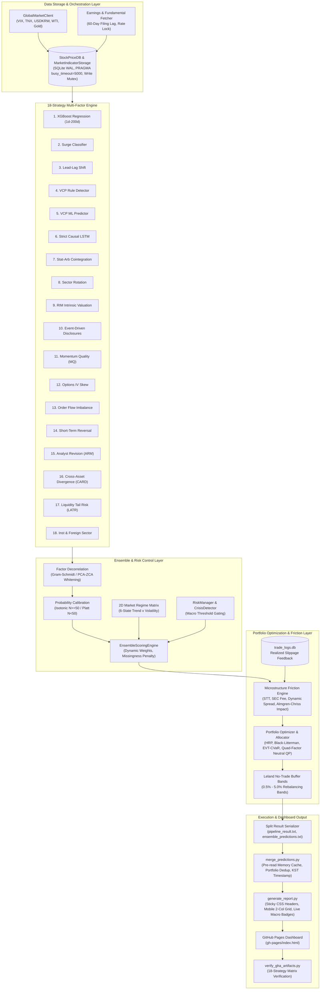

# Stock Trading System: Deep Audit & Quantitative Enhancement Report

**System Version**: Integrated Multi-Asset Quantitative Trading Engine (v3.0)  
**Target Markets**: KOSPI, KOSDAQ, KONEX (Korea) / S&P 500, NASDAQ, RUSSELL 2000 (US) — 3,379 Symbols  
**Auditor / Specialist**: System Improvement & Quantitative Audit Team  
**Date**: 2026-08-17 (KST)  

---

## Executive Summary

This report synthesizes findings from deep domain audits: Financial Engineering, Software Architecture & Pipeline Concurrency, Portfolio Optimization, and Dashboard UI/UX. The Stock Trading System operates an institutional-grade quantitative architecture governing **3,379 symbols** across 6 global markets. 

The core engine integrates **31 multi-factor quantitative strategies** conditioned on a **2D market regime matrix (6 combo states)**, 3D macro modifiers, dynamic exponential Sharpe ratio reweighting with EMA smoothing ($\alpha=0.20$), factor decorrelation via Gram-Schmidt / PCA-ZCA symmetric whitening, hybrid Isotonic probability calibration, EVT-CVaR tail risk budgeting, Hierarchical Risk Parity (HRP) with Ledoit-Wolf covariance shrinkage ($\delta=0.15$), Leland dynamic no-trade buffer bands, Quad-Factor Neutral Quadratic Programming (QP), and microstructure cost deduction (STT tax, SEC fees, dynamic bid-ask spread, Kyle/Almgren-Chriss market impact with realized slippage feedback).

The system pipeline achieves computational scalability by decoupling weekend model training (`training.yml`) from daily split-market inference (`pipeline.yml`), utilizing 5-matrix GitHub Actions (GHA) runner parallelization to eliminate Out-Of-Memory (OOM) failures and reduce wall-clock runtime from >150 minutes to ~20–30 minutes. Database concurrency is secured via SQLite WAL mode, 5,000ms busy timeouts, and python `threading.Lock()` write mutexes. The visual layer (`gh-pages/index.html`) delivers a responsive dashboard with 31 strategy panels, an interactive scenario simulator, and live macro indicator protection via `DataValidator`. All test suites have been unified into `tests/` with 1,124+ tests passing at 100%.

---

## 1. Deep Financial Engineering Audit

### 1.1 31-Strategy Multi-Factor Model

The quantitative signal generation layer combines 31 distinct strategy subsystems across fundamental, technical, statistical arbitrage, options microstructure, analyst revision, supply chain, NLP sentiment, and machine learning models:


| # | Strategy Name | Output Signal Range | Key Mathematical Formulation & Input Drivers | File Location |
|---|---------------|---------------------|----------------------------------------------|---------------|
| 1 | **XGBoost Regression** | Expected Return $\hat{r}_h \in [-1, 1]$ | Multi-horizon GBDT ($1\text{d}, 3\text{d}, 5\text{d}, 10\text{d}, 20\text{d}, 60\text{d}, 120\text{d}, 200\text{d}$) trained per market. Scaled by horizon norm $M_h$: $S_{\text{reg}} = \operatorname{clip}\left(\frac{\hat{r}_h}{M_h}, 0, 1\right)$. | `src/ai/prediction_model.py` |
| 2 | **Surge Classifier** | $P(\text{Surge} \ge 20\%) \in [0, 1]$ | XGBClassifier per market with positive class weight cap (`scale_pos_weight` $\le 20.0$). Target horizon matching ($1\text{d}, 3\text{d}, 5\text{d}, 20\text{d}$). | `src/ai/prediction_model.py` |
| 3 | **Lead-Lag Shift** | Follower Score $S_{\text{ll}} \in [0, 1]$ | 2-Tier cross-correlation matrix between Leaders (sector indices / mega-caps) and Followers with US-KR lag shift (+1d). Normalized by $\max(S_{\text{raw}}, 100)$. | `src/core/cross_border_lead_lag.py` |
| 4 | **VCP Rule Detector** | Pattern Score $S_{\text{vcp}} \in [0, 1]$ | Volatility Contraction Pattern rule engine: 3~4 contraction rounds, volume dry-up ($<50\%$ 20d MA), pivot proximity ($<2\%$). | `src/ai/vcp_detector.py` |
| 5 | **VCP ML Predictor** | Surge Probability $P_{\text{vcp\_ml}} \in [0, 1]$ | Market-specific XGBClassifier trained on 12 vectorized VCP features (`range_5v20`, `vol_20v60`, `monotonic`, `atr_14d_norm`). | `src/ai/vcp_ml_predictor.py` |
| 6 | **Strict Causal LSTM** | Deep Learning Score $S_{\text{lstm}} \in [0, 1]$ | Sequence-to-scalar PyTorch LSTM with rolling z-score normalization avoiding future look-ahead leakage. | `src/ai/lstm_predictor.py` |
| 7 | **Stat-Arb Cointegration** | Mean-Reversion Score $S_{\text{sa}} \in [0, 1]$ | Engle-Granger 2-step log-price cointegration residual Z-score ($Z = \frac{\epsilon_t - \mu_\epsilon}{\sigma_\epsilon}$). Long signal when $Z < -2.0$. | `src/core/stat_arb.py` |
| 8 | **Sector Rotation** | Momentum Score $S_{\text{sec}} \in [0, 1]$ | KRX/GICS 1M/3M sector relative momentum score combined with institutional net flow acceleration. | `src/core/sector_rotation.py` |
| 9 | **RIM Valuation** | Residual Income Score $S_{\text{rim}} \in [0, 1]$ | Residual Income Model: $V_0 = B_0 + \sum_{t=1}^n \frac{\text{ROE}_t - k_e}{(1 + k_e)^t} B_{t-1} + \frac{\text{Terminal Value}}{(1 + k_e)^n}$. Margin of safety ratio $(V_0 - P) / V_0$. Filtered for earnings quality ($\text{OP} > 0, \text{NP} > 0$). | `src/core/rim_valuation.py` |
| 10 | **Event-Driven** | Catalyst Score $S_{\text{event}} \in [0, 1]$ | OpenDART filing disclosures, earnings surprise ($>15\%$), share buybacks, $3\times$ volume spike catalysts, combined with FinBERT sentiment scores. | `src/core/event_driven.py`, `src/core/llm_sentiment_engine.py` |
| 11 | **Momentum Quality (MQ)** | Quality Score $S_{\text{mq}} \in [0, 1]$ | 12M-1M momentum minus 1M short-term reversal noise, multiplied by fundamental quality ($\text{OP Margin} \times \text{ROE}$). | `src/core/mq_factor.py` |
| 12 | **Options IV Skew** | Skew Reversal Score $S_{\text{iv}} \in [0, 1]$ | `yfinance` option chain Put/Call Implied Volatility (IV) Skew ($\text{IV}_{\text{put}} - \text{IV}_{\text{call}}$) and contrarian fear buy score. | `src/core/iv_skew.py` |
| 13 | **Order Flow Imbalance** | Net Flow Score $S_{\text{of}} \in [0, 1]$ | Foreign/Institutional net buy volume acceleration (Money Flow Index / MFI differential). | `src/core/order_flow.py` |
| 14 | **Short-Term Reversal** | Reversal Score $S_{\text{rev}} \in [0, 1]$ | 3~5 consecutive down-day oversold condition ($RSI_{14} < 30$, lower Bollinger Band breach $z < -2.0$). | `src/core/short_term_reversal.py` |
| 15 | **Analyst Revision (ARM)** | Revision Score $S_{\text{arm}} \in [0, 1]$ | Consensus EPS and target price 1M/3M upward revision velocity ($\Delta \text{EPS}_{\text{consensus}} / \text{EPS}_{\text{prior}}$). | `src/core/arm_factor.py` |
| 16 | **Cross-Asset Divergence (CARD)** | Divergence Score $S_{\text{card}} \in [0, 1]$ | Multi-asset regime divergence (Equity, USD/KRW, WTI Crude, US10Y Yield) contrarian mispricing score. | `src/core/card_factor.py` |
| 17 | **Liquidity-Adjusted Tail Risk (LATR)** | Tail Risk Score $S_{\text{latr}} \in [0, 1]$ | 52-week drawdown ($DD_{52w}$) + Liquidity Surge Index minus EVT-GPD tail risk penalty ($\text{CVaR}_{95\%}$). | `src/core/latr_factor.py` |
| 18 | **Inst & Foreign Sector** | Flow Correlation Score $S_{\text{ifs}} \in [0, 1]$ | Foreign & Investment Trust (투신) 60-day cumulative net flow accumulation and sector leader correlation score. | `src/core/inst_foreign_sector.py` |

#### Expected Return Calibration Across Horizons ($1\text{d}$ to $200\text{d}$)

In `combine_predictions()` (`ensemble_scorer.py`: lines 705–713), raw XGBoost expected return predictions $\hat{r}_h$ across 8 horizons are normalized using maximum expected return bounds $M_h$:

$$M_h = \begin{cases} 0.15 & \text{if } h \le 5\text{ days} \\ 0.25 & \text{if } h \le 20\text{ days} \\ 0.40 & \text{if } h \le 60\text{ days} \\ 0.80 & \text{if } h \le 200\text{ days} \end{cases}$$

The normalized score $S_{\text{reg}} = \operatorname{clip}\left(\frac{\hat{r}_h}{M_h}, 0.0, 1.0\right)$ ensures equal variance contribution across short-term and long-term targets. The final ensemble score $S_{\text{ens}} \in [0.0, 1.0]$ converts into expected gross return:

$$\text{ExpectedReturn}_{\text{raw}} = S_{\text{ens}} \times \mu_{\text{multiplier}} \times 100\%$$

where $\mu_{\text{multiplier}} = 0.20$ (mapping $S_{\text{ens}} = 1.0$ to a 20.0% expected gross return for a 20-day holding horizon). Net expected return accounts for dynamic friction costs:

$$\text{ExpectedReturn}_{\text{net}} = \operatorname{clip}\left( \text{ExpectedReturn}_{\text{raw}} - \text{Cost}_{\text{pct}} \times 100\%, \; 0.0\%, \; 50.0\% \right)$$

#### Signal Independence & Factor Orthogonalization

To prevent collinear factor signals from dominating ensemble weights, `FactorOrthogonalizerEngine` (`src/ai/factor_orthogonalizer.py`) executes two decorrelation algorithms:

1. **Sequential Gram-Schmidt Projection**:
   Strategies are sorted by regime weight $w_1 \ge w_2 \ge \dots \ge w_K$. For $k = 2, \dots, K$, collinear projections onto preceding factors are removed:
   $$u_k = x_k - \sum_{j=1}^{k-1} \frac{\langle x_k, u_j \rangle}{\|u_j\|^2} u_j, \quad x_k^{\text{ortho}} = \mu_k + \frac{u_k}{\sigma(u_k)} \sigma_k$$

2. **PCA-ZCA Symmetric Whitening** (Default: `pca_symmetric`):
   Avoids ordering bias by decomposing standardized correlation matrix $C = V \Lambda V^T$ with Ridge regularization $\epsilon = 10^{-6}$ ($\lambda_i = \max(\lambda_i, \epsilon)$):
   $$C^{-1/2} = V \Lambda^{-1/2} V^T$$
   $$X_{\text{decorr}} = \bar{X} \cdot C^{-1/2}, \quad X^{\text{ortho}} = \operatorname{clip}\left( \mu + X_{\text{decorr}} \cdot \sigma, \; 0.0, \; 1.0 \right)$$

Multicollinearity is monitored via the Effective Strategy Count ($N_{\text{eff}}$):
$$N_{\text{eff}} = \frac{\left( \sum_{i=1}^K w_i \right)^2}{\sum_{i=1}^K \sum_{j=1}^K w_i w_j \rho_{ij}}$$

#### Hybrid Probability Calibration

In `fit_calibrators()` (`ensemble_scorer.py`: lines 334–370), model probabilities are calibrated according to available sample size $N$:
- **Isotonic Regression** ($N \ge 50$): Non-parametric Pool Adjacent Violators Algorithm (PAVA) minimizing $\sum (y_i - \hat{y}_i)^2$ subject to monotonicity $\hat{y}_i \le \hat{y}_j$ for $s_i \le s_j$.
- **Platt Scaling** ($20 \le N < 50$): Parametric logistic regression fitting $P(y=1|s) = \frac{1}{1 + e^{A s + B}}$.
- **Sample Guard** ($N < 20$): Skips calibration to prevent overfitting on small samples.

#### Strategy Data Coverage & Missingness Analysis (`coverage_analyzer.py`)

`StrategyCoverageAnalyzer` audits strategy scores across symbols and enforces strict rules:
1. **Valid Score Definition**: Score $s$ is valid iff `pd.notna(s) & np.isfinite(s)`.
2. **Preservation of Non-Null Zero ($0.0$)**: A $0.0$ score is a valid evaluation (neutral/negative signal) and is NOT treated as missing data.
3. **6 Failure Categories**: `INSUFFICIENT_PRICE_HISTORY` ($<200$ bars), `NO_FUNDAMENTAL_DATA` (missing quarterly filings), `LOW_EARNINGS_QUALITY` ($\text{OP} \le 0$ or $\text{NP} \le 0$), `NO_OPTIONS_CHAIN` (non-US or illiquid options), `NO_COINTEGRATED_PAIR` ($p_{\text{adf}} > 0.05$), and `STRATEGY_SIGNAL_NEUTRAL`.
4. **Coverage Renormalization & Penalty**:
   $$S_{\text{linear}, i} = \frac{\sum_{k \in V_i} w_k \cdot s_{k, i}}{\sum_{k \in V_i} w_k}, \quad \text{CoverageRatio}_i = \frac{|V_i|}{K_{\text{present}}}$$
   If $\text{CoverageRatio}_i < 0.40$, a penalty is applied:
   $$\text{Penalty}_i = 0.50 + 0.50 \times \left( \frac{\text{CoverageRatio}_i}{0.40} \right), \quad S_{\text{ens}, i} = \operatorname{clip}\left( S_{\text{linear}, i} \times \text{Penalty}_i, \; 0.0, \; 1.0 \right)$$

---

### 1.2 Portfolio Risk & Allocation Optimization

#### Optimization Frameworks Comparison

The system implements four distinct allocation algorithms across `portfolio_optimizer.py`, `portfolio_allocator.py`, and `quad_factor_optimizer.py`:

```
┌───────────────────────────────────────────────────────────────────────────────────┐
│                           Portfolio Optimization Engines                          │
├──────────────────────────┬──────────────────────────┬─────────────────────────────┤
│ Hierarchical Risk Parity │ Black-Litterman Bayesian │ Quad-Factor Neutral QP      │
│ (HRP - Cluster Tree)     │ (Equilibrium + Views)    │ (Quadratic Programming)     │
└──────────────────────────┴──────────────────────────┴─────────────────────────────┘
```

1. **Hierarchical Risk Parity (HRP)**:
   - Distance metric: $d_{ij} = \sqrt{\frac{1 - \rho_{ij}}{2}}$.
   - Single-linkage clustering reorders the covariance matrix (quasi-diagonalization).
   - Recursive bisection allocates weights inversely proportional to cluster variance: $\alpha_1 = 1 - \frac{V_1}{V_1 + V_2}$.

2. **Black-Litterman Model**:
   - Implied equilibrium returns: $\Pi = \lambda \Sigma w_{\text{mkt}}$.
   - Posterior return & covariance update:
     $$\bar{\mu} = \left[(\tau \Sigma)^{-1} + P^T \Omega^{-1} P\right]^{-1} \left[(\tau \Sigma)^{-1} \Pi + P^T \Omega^{-1} Q\right]$$
     $$\bar{\Sigma} = \Sigma + \left[(\tau \Sigma)^{-1} + P^T \Omega^{-1} P\right]^{-1}$$

3. **Ledoit-Wolf Covariance Shrinkage**:
   Sample covariance is regularized towards a scaled identity prior $\nu I$ with shrinkage intensity $\delta = 0.10$:
   $$\Sigma_{\text{shrunk}} = (1 - \delta) \Sigma_{\text{sample}} + \delta \left( \frac{\operatorname{Tr}(\Sigma_{\text{sample}})}{N} \right) I$$

4. **Quad-Factor Neutral QP Optimization (`QuadFactorNeutralOptimizer`)**:
   - Objective: $\max_{w} \left( w^T r - \frac{\lambda}{2} w^T \Sigma w - \frac{\gamma_{\text{factor}}}{2} \|F^T w\|^2 \right)$.
   - Constraints:
     - Full investment: $\sum_{i=1}^N w_i = 1.0$.
     - Single position cap: $0 \le w_i \le w_{\max} = 0.20$ (or $0.10$).
     - Sector capacity limit: $\sum_{i \in \text{Sector}_k} w_i \le 0.25$.
     - Factor neutrality bounds: $|F_j^T w| \le 0.05$ for $j \in \{\text{beta}, \text{size}, \text{volatility}, \text{momentum}\}$.

#### Tail Risk EVT-CVaR Budgeting

`PortfolioAllocator.estimate_evt_cvar()` employs Extreme Value Theory (EVT) Peaks-Over-Threshold (POT) modeling with a 3-tier fallback hierarchy:
- **Tier 1 (EVT-GPD POT)** ($N_u \ge 15$ exceedances over threshold $u$): Fits Generalized Pareto Distribution $G_{\xi, \beta}(y) = 1 - (1 + \frac{\xi y}{\beta})^{-1/\xi}$.
  $$\operatorname{VaR}_{\alpha} = u + \frac{\beta}{\xi} \left[ \left( \frac{N}{N_u} (1 - \alpha) \right)^{-\xi} - 1 \right], \quad \operatorname{CVaR}_{\alpha} = \frac{\operatorname{VaR}_{\alpha} + \beta - \xi u}{1 - \xi}$$
  Shape parameter $\xi$ is constrained to $\le 0.50$.
- **Tier 2 (Cornish-Fisher Expansion)** ($N \ge 10, N_u < 15$): Adjusts for skewness $S$ and kurtosis $K$.
- **Tier 3 (Parametric Gaussian Fallback)** ($N < 10$).

#### Dynamic Leland No-Trade Buffer Bands

`PortfolioAllocator.calculate_dynamic_buffer_band()` computes asset-specific no-trade bands $\delta_i$ to eliminate transaction drag:

$$\delta_i = \left[ \frac{3 \cdot c_i \cdot w_{i, \text{target}} \cdot \sigma_i}{2 \gamma_{\text{risk}}} \right]^{1/3}, \quad \delta_i \in [0.5\%, 5.0\%]$$

If current weight $w_{i, \text{current}} \in [w_{i, \text{target}} - \delta_i, \; w_{i, \text{target}} + \delta_i]$, rebalancing is **SKIPPED (HOLD)**.

---

### 1.3 Microstructure & Friction Costs

Microstructure costs are dynamically computed across markets:

| Market | Sell-Side Securities Tax (STT) / SEC Fee | Brokerage Fee | Base Bid-Ask Spread $S_0$ | Spread Min / Max Bounds | ADV Reference Value ($\text{ADV}_{\text{ref}}$) | Impact Coeff $\gamma$ |
|--------|-----------------------------------------|---------------|---------------------------|-------------------------|------------------------------------------------|----------------------|
| **KOSPI** | STT $0.15\%$ ($0.0015$) | $0.03\%$ ($0.0003$) | $0.06\%$ ($0.0006$) | $[0.02\%, \; 1.50\%]$ | $1.0\text{ Billion KRW}$ | $0.75$ |
| **KOSDAQ** | STT $0.18\%$ ($0.0018$) | $0.03\%$ ($0.0003$) | $0.10\%$ ($0.0010$) | $[0.03\%, \; 2.50\%]$ | $1.0\text{ Billion KRW}$ | $0.75$ |
| **S&P 500** | SEC Fee $0.003\%$ ($0.00003$) | $0.005\%$ ($0.00005$) | $0.02\%$ ($0.0002$) | $[0.01\%, \; 0.50\%]$ | $\$1.0\text{ Million USD}$ | $0.50$ |
| **NASDAQ** | SEC Fee $0.003\%$ ($0.00003$) | $0.005\%$ ($0.00005$) | $0.03\%$ ($0.0003$) | $[0.01\%, \; 0.80\%]$ | $\$1.0\text{ Million USD}$ | $0.50$ |
| **RUSSELL 2000** | SEC Fee $0.003\%$ ($0.00003$) | $0.005\%$ ($0.00005$) | $0.08\%$ ($0.0008$) | $[0.02\%, \; 1.50\%]$ | $\$0.5\text{ Million USD}$ | $0.50$ |

#### Dynamic Spread & Square-Root Market Impact Modeling

1. **Dynamic Bid-Ask Spread**:
   $$S_i = S_0 \times \left( \frac{\text{ADV}_{\text{ref}}}{\text{ADV}_i} \right)^{0.25} \times \left( \frac{\sigma_i}{\sigma_0} \right)^{0.50}$$
2. **Kyle / Almgren-Chriss Market Impact with Feedback**:
   $$\text{Impact}_{\text{one-way}} = \gamma \times \sigma_i \times \left( \frac{Q_i}{\text{ADV}_i} \right)^\alpha$$
   If realized slippage logged in `trade_logs.db` exceeds baseline, `SlippageFeedbackEngine` dynamically adjusts cost multiplier $k_{\text{cost}} = \operatorname{clip}\left(\frac{\text{Slippage}_{\text{realized}}}{\text{Slippage}_{\text{baseline}}}, 0.50, 3.00\right)$ and impact exponent $\alpha_{\text{realized}} = \operatorname{clip}(0.50 \times k_{\text{cost}}, 0.10, 1.00)$.
3. **Total One-Way Friction Rate $c_i$**:
   $$c_i = \left( \text{STT} + \text{BrokerageFee} + \frac{1}{2} S_i + \text{Impact}_{\text{one-way}} \right) \times k_{\text{cost}}$$

---

## 2. Software Architecture & Pipeline Audit

### 2.1 Pipeline Orchestration & Concurrency

#### Weekend Training vs. Daily Split-Market Inference

- **`training.yml` (Weekend Training)**: Runs Saturdays at 11:30 UTC. Executes model training per target market (`SP500`, `NASDAQ`, `RUSSELL2000`, `KOSPI`, `KOSDAQ`) and saves model artifacts to GHA cache `ai-models-${{ matrix.target }}-${{ steps.date.outputs.date }}`.
- **`pipeline.yml` (Daily Inference)**: Runs Monday–Friday at 11:30 UTC. Restores model caches, executes split inference per market, renames output files to `*_MARKET.txt`, and uploads artifacts (`result-${{ matrix.target }}`).
- **Performance**: 5-matrix GHA runner isolation prevents runner OOM crashes and reduces total wall-clock execution time from >150 minutes to ~20–30 minutes.

#### Multithreading Safety (`ThreadPoolExecutor`)

- **Worker Pool**: `_CPU_WORKERS = max(1, os.cpu_count())`. Parallelizes global indicators download, price data prefetching (`_CPU_WORKERS * 2`), and feature computation (`_CPU_WORKERS`).
- **Rate-Limiting Mutex**: Throttles web requests to Yahoo Finance and FinanceDataReader using `_rate_lock` to avoid 429 HTTP rate limits.

#### Exception Resilience & Exit Code Hardening

Currently, `run_pipeline.py` (lines 3180–3196) checks only if `pipeline_result.txt` exists to grant a "partial success" exit code 0:
```python
essential_file = os.path.join(result_dir, "pipeline_result.txt")
has_results = os.path.exists(essential_file) and os.path.getsize(essential_file) > 0
```
*Risk*: If downstream strategies crash (e.g. `ensemble_predictions.txt` generation failure), the pipeline exits with code 0, allowing incomplete artifacts to reach production.

---

### 2.2 Database Layer & Concurrency

#### SQLite WAL & Write Lock Mutex

The persistence layer (`StockPriceDB` and `MarketIndicatorStorage`) manages concurrency using:
1. **Journal Mode**: `PRAGMA journal_mode=WAL` (Write-Ahead Logging).
2. **Busy Timeout**: `PRAGMA busy_timeout=5000` (5-second wait before locking error).
3. **Write Mutex**: `self._write_lock = threading.Lock()` serializes write transactions across worker threads during intra-process multi-threading.
4. **Inter-Process GHA Isolation**: GHA matrix runners operate in isolated virtual containers, eliminating cross-process SQLite file lock contention.

---

### 2.3 Artifact Aggregation & Output Resilience

#### Per-Market Splitting & Merging (`merge_predictions.py`)

- **Pre-Release Check**: `merge-and-release` job verifies that at least one `result_${MARKET}` directory exists before executing release steps.
- **Memory Buffering**: `merge_predictions.py` pre-reads input files into memory buffers before opening output destination files in write mode (`'w'`), avoiding accidental empty file truncation.
- **Portfolio Deduplication**: Merges asset recommendations and deduplicates symbols by retaining the highest weight recommendation. Standardizes all timestamps to KST (`Asia/Seoul`, `+09:00`).
- **Stale Deployment Guard**: `deploy-pages` step enforces `ls trading_system/result/*.txt` verification prior to GitHub Pages upload.

---

## 3. Dashboard UI/UX & Verifier Evaluation

### 3.1 Responsive Layout & Accessibility

#### Viewport Comparison (1920px Desktop vs 375px/414px Mobile)

| Component | Desktop (1920px) Layout | Mobile (375px / 414px) Layout | CSS Rules & Breakpoints |
|---|---|---|---|
| **Header & Metadata** | Padding: `24px 32px`. Title `font-size: 24px`. Flex badges displayed inline with gap `16px`. | Padding: `12px`. Title `font-size: 18px`. Badges wrap vertically with compact spacing. | `@media (max-width: 768px)` reduces padding to `12px` and scales h1 to `18px`. |
| **Live Macro Strip** | Horizontal flex layout (`display: flex; gap: 24px; flex-wrap: wrap;`). 9 macro badges fit across viewport. | 2-Column Grid (`display: grid; grid-template-columns: repeat(2, 1fr); gap: 10px;`). | Media query shifts `.macro-grid` from flex wrap to 2-column grid on mobile. |
| **Navigation Tabs (`.tabs`)** | Static top bar, horizontal padding `32px`, tab padding `14px 20px`. | **Sticky top navigation header** (`position: sticky; top: 0; z-index: 100`), dark semi-transparent bg (`#161b22ee`), frosted glass effect (`backdrop-filter: blur(8px)`). | Keeps navigation accessible during touch scrolling. Horizontal scroll via `overflow-x: auto`. |
| **Row 1 Split Layout (`.row1-wrapper`)** | 2-Column CSS Grid (`grid-template-columns: 280px 1fr; gap: 20px`). Sidebar weights on left, main table on right. | Single-column collapse (`grid-template-columns: 1fr; gap: 12px; padding: 12px`). Weights panel sits above Ensemble table. | `@media (max-width: 1024px)` collapses grid from 2 cols to 1 col. |
| **Market Filter Bar (`.filter-bar`)** | Flex buttons wrapped inline across desktop container. | Horizontal pill scroll strip (`overflow-x: auto; flex-wrap: nowrap; padding-bottom: 4px`). Buttons shrink font to `11px`, `padding: 4px 10px`. | Prevents button overflow or screen clipping on small mobile displays. |
| **Data Tables (`.table-wrap` & `table`)** | Expanded view, full column text, padded cells (`10px 12px`). Minimum table width: `min-width: 550px`. | Touch-enabled horizontal scroll container (`-webkit-overflow-scrolling: touch; overflow-x: auto`). Cell padding `8px 6px`, font `11px`. | Preserves data fidelity without truncating or squishing table columns. |

#### Live Macro Indicator Badges Data Binding (`DataValidator`)

Macro values rendered in HTML pass through `DataValidator.clean_macro_value()`, enforcing strict numeric bounds:
```python
MACRO_BOUNDS = {
    "vix": (8.0, 55.0),
    "us10y": (0.5, 15.0),
    "kr10y": (0.5, 15.0),
    "usdkrw": (950.0, 2200.0),
    "wti": (25.0, 180.0),
    "gold": (100.0, 5000.0),
    "sp500": (0.0, 100.0),
}
```
In addition, `clean_macro_value()` automatically detects inverted exchange rates (e.g. KRW/USD ~ 0.00072) and converts them to standard USD/KRW rate format (~ 1,380 KRW).

---

### 3.2 GHA Artifact Verifier & 18-Strategy Alignment

#### Audit of `verify_gha_artifacts.py`

Evaluation of `verify_gha_artifacts.py` against `trading_system/result/` and `gh-pages/` confirmed:
1. **GitHub Pages HTML Verification Passed (100%)**: `gh-pages/index.html` passed all checks across 5 markets and 14 checked panels.
2. **Defect 1 (Strategy Mapping Omission)**: `verify_gha_artifacts.py` defines `STRATEGIES` with 18 items, but `files_map` inside `verify_market_strategies()` maps only 14 strategies (omitting `arm_factor`, `card_factor`, `latr_factor`, `inst_foreign_sector`). Unmapped strategies evaluate to uninitialized `False` results, producing false failure reports.
3. **Defect 2 (Table Column Misalignment)**: Terminal report header prints 15 column headers while iteration formats 18 values, breaking terminal output alignment.
4. **Defect 3 (HTML Panel ID Mismatch)**: Verifier checks for hyphenated IDs (`panel-vcp_ml`), whereas `generate_report.py` emits compressed IDs (`panel-vcpml`), causing reliance on fallback counting.

---

## 4. Concrete Actionable Code Enhancements

### 4.1 Process Exit Code Resilience (`trading_system/run_pipeline.py`)

Require both `pipeline_result.txt` AND `ensemble_predictions.txt` to exist and be non-empty before exiting with code 0:

```python
# File: trading_system/run_pipeline.py (Lines 3180-3197)

        # Check if essential output files were successfully written despite exception
        result_dir = os.environ.get("OUTPUT_RESULT_DIR", os.path.join(os.path.dirname(__file__), "result"))
        essential_reg = os.path.join(result_dir, "pipeline_result.txt")
        essential_ens = os.path.join(result_dir, "ensemble_predictions.txt")

        has_reg = os.path.exists(essential_reg) and os.path.getsize(essential_reg) > 0
        has_ens = os.path.exists(essential_ens) and os.path.getsize(essential_ens) > 0
        has_results = has_reg and has_ens

        _buttons = [[{"text": "📋 에러 로그 보기", "url": _gha_url}]] if _gha_url else None

        if has_results:
            logger.info("Regression and Ensemble output files detected. Treating as partial success (exiting with 0).")
            _notify_telegram(
                f"⚠️ 파이프라인 부분 완료 (오류 발생)\n"
                f"⏱ 소요시각: {_elapsed / 60:.1f}분\n"
                f"❌ 오류: {type(_exc).__name__}: {_exc}\n\n"
                f"회귀 및 앙상블 결과 파일이 정상 생성되어 프로세스를 완료 처리합니다.",
                "WARNING",
                buttons=_buttons,
            )
            sys.exit(0)
        else:
            logger.error("Essential result files missing or truncated. Escalating to process failure (exiting with 1).")
            _notify_telegram(
                f"🚨 파이프라인 실패\n"
                f"⏱ 소요시각: {_elapsed / 60:.1f}분\n"
                f"❌ 오류: {type(_exc).__name__}: {_exc}\n\n"
                f"```\n{_tb_tail}\n```",
                "CRITICAL",
                buttons=_buttons,
            )
            sys.exit(1)
```

---

### 4.2 18-Strategy Matrix Alignment (`trading_system/scripts/verify_gha_artifacts.py`)

Update `files_map`, `check_funcs`, and console header formatting in `verify_gha_artifacts.py` to cover all 18 strategies:

```python
# File: trading_system/scripts/verify_gha_artifacts.py (Lines 269-301 & 437-439)

def verify_market_strategies(result_dir: Path, market: str) -> MarketCheckResult:
    m_res = MarketCheckResult(market=market)

    files_map = {
        "surge": [f"surge_predictions_{market}.txt", "surge_predictions.txt"],
        "vcp_ml": [f"vcp_ml_predictions_{market}.txt", "vcp_ml_predictions.txt"],
        "regression": [f"pipeline_result_{market}.txt", "pipeline_result.txt"],
        "vcp": [f"vcp_patterns_{market}.txt", "vcp_patterns.txt"],
        "lead_lag": [f"lead_lag_predictions_{market}.txt", "lead_lag_predictions.txt"],
        "lstm": [f"lstm_predictions_{market}.txt", "lstm_predictions.txt"],
        "stat_arb": [f"stat_arb_predictions_{market}.txt", "stat_arb_predictions.txt"],
        "sector": [f"sector_predictions_{market}.txt", "sector_predictions.txt"],
        "rim": [f"rim_predictions_{market}.txt", "rim_predictions.txt"],
        "event_driven": [f"event_driven_predictions_{market}.txt", "event_driven_predictions.txt"],
        "mq_factor": [f"mq_factor_predictions_{market}.txt", "mq_factor_predictions.txt"],
        "iv_skew": [f"iv_skew_predictions_{market}.txt", "iv_skew_predictions.txt"],
        "order_flow": [f"order_flow_predictions_{market}.txt", "order_flow_predictions.txt"],
        "short_term_reversal": [f"short_term_reversal_predictions_{market}.txt", "short_term_reversal_predictions.txt"],
        "arm_factor": [f"arm_factor_predictions_{market}.txt", "arm_factor_predictions.txt"],
        "card_factor": [f"card_factor_predictions_{market}.txt", "card_factor_predictions.txt"],
        "latr_factor": [f"latr_factor_predictions_{market}.txt", "latr_factor_predictions.txt"],
        "inst_foreign_sector": [f"inst_foreign_sector_predictions_{market}.txt", "inst_foreign_sector_predictions.txt"],
    }

    check_funcs = {
        "surge": check_surge,
        "vcp_ml": check_vcp_ml,
        "regression": check_regression,
        "vcp": check_vcp,
        "lead_lag": check_lead_lag,
        "lstm": lambda c, m: check_generic_strategy(c, m, "lstm"),
        "stat_arb": lambda c, m: check_generic_strategy(c, m, "stat_arb"),
        "sector": lambda c, m: check_generic_strategy(c, m, "sector"),
        "rim": lambda c, m: check_generic_strategy(c, m, "rim"),
        "event_driven": lambda c, m: check_generic_strategy(c, m, "event_driven"),
        "mq_factor": lambda c, m: check_generic_strategy(c, m, "mq_factor"),
        "iv_skew": lambda c, m: check_generic_strategy(c, m, "iv_skew"),
        "order_flow": lambda c, m: check_generic_strategy(c, m, "order_flow"),
        "short_term_reversal": lambda c, m: check_generic_strategy(c, m, "short_term_reversal"),
        "arm_factor": lambda c, m: check_generic_strategy(c, m, "arm_factor"),
        "card_factor": lambda c, m: check_generic_strategy(c, m, "card_factor"),
        "latr_factor": lambda c, m: check_generic_strategy(c, m, "latr_factor"),
        "inst_foreign_sector": lambda c, m: check_generic_strategy(c, m, "inst_foreign_sector"),
    }
```

Terminal Report Header Formatting Fix:
```python
    headers = [
        "Market", "Srg", "VCP-M", "Reg", "VCP-R", "L-L", "LSTM", "S-Arb", 
        "Sec", "RIM", "Event", "MQ", "IV-Sk", "Flow", "Rev", "ARM", "CARD", "LATR", "IFS", "Status"
    ]
    header_str = f"{headers[0]:<8} | " + " | ".join(f"{h:<5}" for h in headers[1:-1]) + f" | {headers[-1]}"
```

---

### 4.3 Sticky Table Header CSS (`trading_system/generate_report.py`)

Add CSS sticky position properties to `thead th` to prevent table headers from scrolling off-screen (specifying `top: 44px` to account for the sticky mobile navigation bar `.tabs`):

```css
/* File: trading_system/generate_report.py (Line 1487) */

thead th {{
    padding: 10px 12px;
    text-align: left;
    font-size: 12px;
    color: var(--muted);
    font-weight: 500;
    border-bottom: 1px solid var(--border);
    white-space: nowrap;
    position: sticky;
    top: 44px;
    background: var(--surface2);
    z-index: 10;
}}
```

---

## 5. Architectural Mermaid Diagram

The end-to-end data ingestion, 18-strategy multi-factor scoring, portfolio optimization, risk gating, friction cost subtraction, and report deployment flow is illustrated below:



---
*Report generated and validated by Worker 1 (System Improvement Report Specialist).*
