# 🗂️ 주식 트레이딩 시스템 전체 코드 구조 및 아키텍처 가이드

본 문서는 주식 트레이딩 시스템의 전체 폴더 트리 구조, 구성 모듈들의 세부 역할, 그리고 시스템 내의 컴포넌트 간 상호작용 아키텍처를 상세히 정의합니다.

---

## 1. 디렉토리 구조 트리 (Directory Structure)

```text
d:\Finance\code\stock\
├── PHASE5_IMPLEMENTATION.md        # 5단계 키움 ZMQ 구현 가이드
├── README.md                      # 프로젝트 메인 안내 문서 (루트)
├── TELEGRAM_BOT_GUIDE.md           # 텔레그램 봇 연동 가이드
├── code_structure.md               # 본 코드 구조 안내 문서
└── trading_system/                 # 메인 소스코드 루트
    ├── pyproject.toml              # 프로젝트 빌드 및 의존성 메타데이터
    ├── requirements.txt            # 파이썬 종속성 라이브러리 목록
    ├── trading_system.py           # 시스템 전체의 메인 오케스트레이터 클래스
    ├── run_dashboard.py            # FastAPI 웹 대시보드 기동 스크립트
    ├── telegram_bot_runner.py      # 실시간 텔레그램 API 폴링 러너
    ├── asset_history.db            # 일별 자산 추이 기록용 SQLite DB
    ├── trade_logs.db               # 거래 일지 및 로그 기록용 SQLite DB
    │
    ├── src/                        # 모듈별 소스코드 디렉토리
    │   ├── __init__.py             # 서브패키지 노출 정의
    │   ├── config.py               # 글로벌 상수 및 기본 설정 정의
    │   │
    │   ├── ai/                     # AI 분석 모듈
    │   │   ├── __init__.py
    │   │   └── llm_integration.py  # OpenAI ChatGPT 연동 및 가짜 응답 폴백 모드
    │   │
    │   ├── analysis/               # 성과 분석 및 백테스트 엔진
    │   │   ├── __init__.py
    │   │   ├── backtest.py         # 단일 종목 백테스트 시뮬레이터 및 성과 분석
    │   │   └── statistics.py       # 성과 비율(샤프 지수, CAGR, 최대 낙폭 등) 산출
    │   │
    │   ├── broker/                 # 증권사 연동 및 주문 전달 커넥터
    │   │   ├── __init__.py
    │   │   ├── daishin.py          # 대신증권 모의 커넥터
    │   │   ├── hanwha.py           # 한화투자증권 모의 커넥터
    │   │   ├── kiwoom.py           # 키움증권 ZeroMQ 클라이언트 커넥터 (실계좌용)
    │   │   ├── kiwoom_server.py    # 32비트 환경 전용 ZeroMQ 키움증권 독립 서버
    │   │   └── multi_broker_manager.py # 다중 브로커 관리자 및 라우팅 허브
    │   │
    │   ├── core/                   # 핵심 트레이딩 관리 및 도메인 모델
    │   │   ├── __init__.py
    │   │   ├── asset_management.py # 포트폴리오 관리 및 증권사 동기화 에이전트
    │   │   ├── factory.py          # 시스템 전체 컴포넌트 의존성 주입(DI) 팩토리
    │   │   ├── order_management.py # 주문 생성, 상태(체결/취소) 제어 및 OMS
    │   │   └── strategy_engine.py  # 가격 지표 및 가중 최적화 전략 엔진
    │   │
    │   ├── data_layer/             # 데이터 획득 및 외부 API 통신
    │   │   ├── __init__.py
    │   │   ├── market_data_handler.py # 실시간/과거 시세 수집 (yfinance 연동 및 캐싱)
    │   │   └── nlp_engine.py       # 뉴스 감성(Sentiment) 분석 키워드 검출기
    │   │
    │   ├── persistence/            # 데이터 영속화
    │   │   ├── __init__.py
    │   │   └── database.py         # SQLite 비동기(aiosqlite) CRUD 인터페이스
    │   │
    │   ├── risk/                   # 리스크 관리
    │   │   ├── __init__.py
    │   │   └── risk_manager.py     # 전체 자산 최대 한도 및 Stop-Loss 모니터링
    │   │
    │   ├── strategy/               # 유명 투자 대가들의 알고리즘 전략
    │   │   ├── __init__.py
    │   │   └── famous_investors.py # 버핏, 피터린치, 마크 미너비니, 배당주 복합 전략
    │   │
    │   ├── telegram_bot/           # 텔레그램 봇 응답 로직
    │   │   ├── __init__.py
    │   │   └── bot_engine.py       # 사용자 입력 커맨드 처리 핸들러
    │   │
    │   └── utils/                  # 공통 유틸리티 및 횡단 관심사
    │       ├── __init__.py
    │       ├── async_helper.py     # 동기/비동기 컨텍스트 변환 및 스레드 풀 오케스트레이터
    │       ├── error_handler.py    # 서킷 브레이커 및 복구 로직 (Windows 대응 보완)
    │       └── event_bus.py        # 내부 컴포넌트 간 비동기 발행-구독(Pub/Sub) 허브
    │
    └── tests/                      # 단위 및 통합 테스트 코드
        ├── test_system.py          # 전체 트레이딩 흐름 통합 시뮬레이션 테스트
        ├── test_api.py             # REST API 테스트
        └── test_search.py          # 종목 검색 기능 테스트
```

---

## 2. 레이어드 아키텍처 및 이벤트 흐름 (Event-Driven Architecture)

시스템은 강력한 **이벤트 기반 아키텍처(EDA)**로 작동합니다. 모든 결합은 직접 참조 방식 대신 `EventBus`의 채널을 활용해 느슨하게 유지됩니다.

### 2-1. 메인 아키텍처 다이어그램

```mermaid
graph TD
    TS["trading_system.py (통합 오케스트레이터)"]
    EB["EventBus (Pub/Sub 허브)"]
    
    subgraph "1. 데이터 입력 레이어"
        MDH["MarketDataHandler (시세 수집)"]
        NLP["NLPEngine (감성 분석)"]
    end

    subgraph "2. 의사결정 레이어"
        HSE["HybridStrategyEngine (기술+뉴스 복합전략)"]
        FIS["FamousInvestorStrategy (버핏/린치 전략)"]
        LLM["LLMEngine (GPT 투자 가이드)"]
    end

    subgraph "3. 실행 및 통제 레이어"
        OMS["OrderManagementSystem (OMS)"]
        RM["RiskManager (리스크 감시)"]
        PM["PortfolioManager (보유 자산 추적)"]
    end

    subgraph "4. 브로커 & 실거래 연결"
        MBM["MultiBrokerManager (브로커 허브)"]
        KW["KiwoomConnector (ZeroMQ client)"]
        KWS["KiwoomServer (32bit Windows 독립 실행)"]
    end

    subgraph "5. 사용자 인터페이스"
        WEB["FastAPI WebDashboard (실시간 WebSocket)"]
        TG["TelegramBot (양방향 대화형 알림)"]
    end

    %% 데이터 흐름
    MDH -.->|"market_data 이벤트 발행"| EB
    NLP -.->|"news_sentiment 이벤트 발행"| EB
    
    EB -.->|"시세 데이터 수신"| HSE
    EB -.->|"뉴스 감성 수신"| HSE
    
    HSE -.->|"strategy_signal 이벤트 발행"| EB
    EB -.->|"신호 포착 및 리스크 검증"| OMS
    OMS -->|"주문 타당 시"| RM
    OMS -->|"주문 실행"| PM
    OMS -->|"브로커 전송"| MBM
    
    MBM --> KW
    KW <-->|"TCP/ZMQ 통신"| KWS
    
    OMS -.->|"order_status 이벤트 발행"| EB
    EB -.->|"실시간 갱신 처리"| WEB
    EB -.->|"체결 결과 전송"| TG
```



---

## 3. 핵심 컴포넌트별 상세 역할 명세

### 1) 메인 컨트롤러 및 인프라
* **`trading_system.py`**
  * 시스템 라이프사이클 관리 및 컴포넌트 와이어링
  * `simulate_trading_day()`: 단일 종목에 대한 시뮬레이션 하루 주기를 동작시켜 자산 상태를 갱신합니다.
* **`src.utils.event_bus.EventBus`**
  * 토픽 기반 비동기 이벤트 핸들러 관리
  * `market_data`, `news_sentiment`, `strategy_signal`, `order_status` 등의 핵심 토픽 지원.
* **`src.utils.error_handler.ErrorHandler`**
  * 각 서비스 모듈의 장애를 격격하여 전체 시스템 중단을 방지하는 서킷 브레이커 탑재.
  * Windows 환경에서도 안정적으로 오작동 없이 작동하도록 시그널 타임아웃 우회 처리 구현.

### 2) 데이터 계층
* **`src.data_layer.market_data_handler.MarketDataHandler`**
  * `yfinance`를 활용한 미국/한국 주요 종목 과거 히스토리컬 및 실시간 정보 적재.
  * 네트워크 지연 및 API 속도제한 우회를 위한 지수 백오프(`tenacity`) 적용.
* **`src.data_layer.nlp_engine.NLPEngine`**
  * 뉴스 데이터베이스 조회 및 한글 타겟 키워드 딕셔너리 기반 감성 가점 평가.

### 3) 트레이딩 의사결정 계층
* **`src.core.strategy_engine.HybridStrategyEngine`**
  * 기술 지표(단기/장기 스프레드)와 NLP 감성 스코어 및 AI 오피니언을 혼합 연산하여 정밀 타점 계산.
* **`src.strategy.famous_investors.InvestorStrategyEngine`**
  * 워렌 버핏(가치), 피터 린치(성장 모멘텀), 마크 미너비니(추세 돌파), 배당성장 전략 등 4종류의 대가 스타일 시뮬레이션 구동.
* **`src.ai.llm_integration.LLMEngine`**
  * OpenAI gpt 모델 또는 오프라인 Mocking 모드를 활용하여 시세와 거시 지표에 기반한 실시간 트레이딩 의견 도출.

### 4) 자산 및 주문 관리 계층 (OMS)
* **`src.core.order_management.OrderManagementSystem`**
  * 가상/실제 주문의 수명 주기(`PENDING` ➔ `SUBMITTED` ➔ `FILLED`/`CANCELLED`) 제어.
  * 부분 체결 매칭 및 체결 슬리피지 통계 계산.
* **`src.core.asset_management.PortfolioManager`**
  * 현재 실시간 가용 예수금 관리 및 보유 자산의 평단가, 평가 손익 계산.
* **`src.risk.risk_manager.RiskManager`**
  * 포트폴리오 차원 최대 손실 폭 제어 및 종목별 투자 비중 제한 조절.

### 5) 브로커 연동 (실거래 연동)
* **`src.broker.kiwoom.KiwoomConnector` (ZeroMQ)**
  * 키움증권 OpenAPI는 32비트 Windows 환경을 강제하므로, 64비트 메인 프로세스와의 통신을 위해 32비트 프로세스용 **독립 ZeroMQ 서버 프로세스(`kiwoom_server.py`)**를 호출하여 통신합니다.

### 6) 프론트엔드 및 사용자 인터페이스
* **`src.web.dashboard.WebDashboard`**
  * FastAPI 백엔드 위에서 웹 소켓 및 HTTP Polling 기반으로 실시간 계좌 잔고, 미체결 주문, 체결 이력을 모니터링합니다.
  * **백테스트 스캐너 기능 탑재**: 40개 코스피, 코스닥, 나스닥 종목들에 대해 다양한 기간(1개월~10년)과 유명인 전략을 일괄 시뮬레이션하여 순위를 계산하고, 개별 종목 클릭 시 자산 가치 변동 및 벤치마크 비교 차트를 팝업 모달로 띄워 줍니다.
* **`src.telegram_bot.bot_engine.TelegramBotEngine`**
  * 모바일 텔레그램 채팅 창을 통해 `/status`, `/portfolio`, `/buy`, `/sell` 등 원격 주문 제어 및 알림 수신을 지원합니다.
