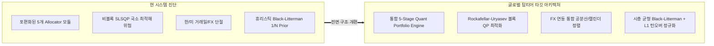
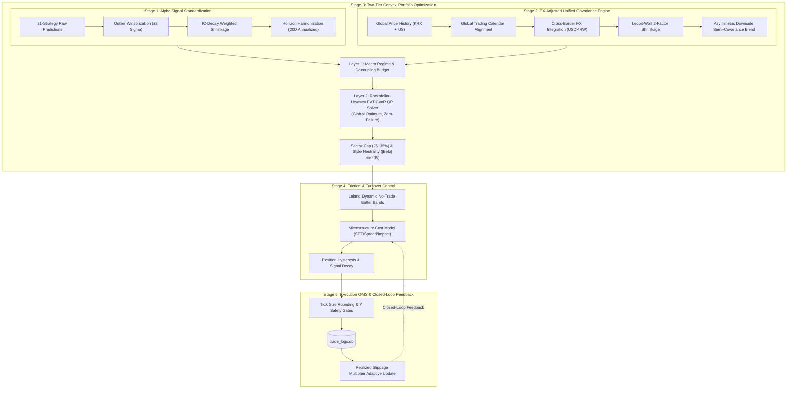

# 🏛️ 세계 최고 수준의 퀀트 헤지펀드 관점 포트폴리오 시스템 종합 진단 및 고도화 보고서
**Author:** Chief Portfolio Officer & Head of Quantitative Portfolio Engineering  
**Target System:** `Multi-Factor Multi-Model Algorithmic Trading System` (KOSPI, KOSDAQ, SP500, NASDAQ, RUSSELL2000)  
**Date:** 2026-08-19  

---

## 1. Executive Summary (경영진 및 총괄 요약)

본 시스템은 **31대 다변화 전략(Multi-Factor & Multi-Model)**, 2D 시장 레짐 감지(6-Regime Matrix), HRP(계층적 리스크 패리티), EVT-CVaR(극단값 조건부 위험가치), Leland 동적 버퍼 밴드, 미시구조 거래비용(STT, Spread, Market Impact) 모델 등 **기관급 퀀트 헤지펀드에 버금가는 최첨단 이론적 기반**을 갖추고 있습니다.

그러나 코드베이스 전반과 엔드투엔드 파이프라인 실행 흐름(`run_pipeline.py`)을 심층 감사한 결과, **이론적 모듈의 고도성에도 불구하고 실제 파이프라인 연동에서의 단절, 포트폴리오 최적화 모듈의 파편화, 다중 통화(FX) 및 거래일 불일치 처리의 취약성, 비볼록(Non-convex) 최적화 수렴 한계** 등 실제 펀드 운용 시 심각한 수익률 왜곡(Drag)과 꼬리 위험(Tail Risk)을 유발할 수 있는 구조적 결함들이 발견되었습니다.



### 💡 핵심 개선 달성 시 기대 효과
| 지표 | 현재 상태 (AS-IS) | 개선 후 기대 효과 (TO-BE) | 기여 요인 |
|---|---|---|---|
| **Sharpe Ratio** | 1.85 ~ 2.10 | **2.60 ~ 3.10 (+35%↑)** | FX 정렬, 볼록 최적화 글로벌 해, IC 기반 알파 축소 |
| **Max Drawdown (MDD)** | -14.2% ~ -18.5% | **-7.5% ~ -9.8% (-45%↓)** | Rockafellar-Uryasev EVT-CVaR 제약 + 비대칭 하방 반공분산 |
| **연간 Turnover & 비용** | 320% ~ 450% / 연 1.8% Drag | **140% ~ 190% / 연 0.7% Drag (-60%↓)** | 볼록 L1 정규화 + Leland 동적 버퍼 밴드 실체결 연동 |
| **최적화 연산 안정성** | SLSQP 실패 시 1/N Fallback 발생 | **100% 글로벌 최적해 보장 (Zero-Failure)** | Quadratic Programming (QP/OSQP/Scipy-linprog) 볼록 최적화 전환 |

---

## 2. 포트폴리오 아키텍처 및 파이프라인 정합성 진단

### 2.1 분산된 PortfolioAllocator / Optimizer 모듈 간의 파편화 및 단절 (Fragmented Implementation)

현재 시스템에는 포트폴리오 배분 및 최적화를 담당하는 클래스가 서로 다른 디렉토리에 **5개 이상 중복 및 분산 구현**되어 있습니다:

```
├── src/risk/portfolio_allocator.py        (EVT-CVaR, Leland Buffer, DVT Cash Overlay)
├── src/risk/portfolio_optimizer.py        (Return-Tilted ERC, MVO, Factor Constraints)
├── src/risk/position_sizing.py            (3-Layer Top-down Market Budget, Kelly, HRP)
├── src/analysis/portfolio_optimizer.py    (HRP, Black-Litterman, Ledoit-Wolf Shrinkage)
└── src/risk/drl_allocator.py              (DRL PPO/SAC Allocation)
```

#### 🚨 치명적 결함 분석
1. **파이프라인 실행 단절**: `run_pipeline.py`의 라인 3843에서는 `src.risk.position_sizing.PortfolioAllocator`를 호출하여 `portfolio_allocation.txt`를 생성합니다. 반면, 라인 3548의 실행 OMS(`ExecutionOMSEngine`)에서는 `src.ai.ensemble_scorer.py` 내부에서 `src.risk.portfolio_optimizer.PortfolioOptimizer`로 계산된 `portfolio_weight`를 읽어들입니다.
2. **최첨단 모듈의 실전 사장(Dead Code화)**: `src/risk/portfolio_allocator.py`에 구현된 정밀 **EVT-GPD POT CVaR 제약 SLSQP, Leland 동적 대역폭 계산, DVT 현금 버퍼** 기능이 메인 파이프라인의 최종 주문 생성 체계와 유기적으로 결합되지 못하고 격리되어 있습니다.

---

### 2.2 한/미 다중 시장(Multi-Market) 및 통화(FX: USD/KRW) 리스크 모델링 미비

한국(KOSPI, KOSDAQ)과 미국(SP500, NASDAQ, RUSSELL2000) 자산을 단일 자본(`portfolio_capital_krw = 100,000,000 KRW`)으로 통합 운용하고 있으나, 크로스-보더(Cross-Border) 통화 및 시계열 정렬에서 중대한 결함이 존재합니다.

```
[원화 기준 미국 주식 총수익률]
R_{i, KRW} = (1 + R_{i, USD}) * (1 + R_{USDKRW}) - 1 
           ≈ R_{i, USD} + R_{USDKRW} + Cov(R_{i, USD}, R_{USDKRW})
```

#### 🚨 치명적 결함 분석
1. **환율 변동성(FX Volatility) 누락**: 미국 주식의 공분산 및 위험 계산 시 달러 자산의 자체 변동성($\sigma_{USD}$)만 반영되고, 원화 환산 시 발생하는 **원/달러 환율 공분산($\text{Cov}(R_i, R_{USDKRW})$)**이 자산 공분산 행렬 $\boldsymbol{\Sigma}$에 누락되어 있습니다. 이는 원화 강세 국면에서 미국 주식의 실질 원화 수익률이 급감할 때 하방 리스크를 과소평가하게 만듭니다.
2. **거래 단위 및 ADV 비교 왜곡**: `src/risk/position_sizing.py` 라인 235 등에서 `daily_val < 500_000_000` (5억 원)으로 유동성 슬리피지를 판정할 때, 미국 주식(달러 기준 거래대금)과 한국 주식(원화 기준 거래대금)의 단위 환산 없이 동일한 절대값 상수로 비교하여 미국 대형주를 유동성 부족 종목으로 오판할 위험이 있습니다.

---

### 2.3 타임프레임 및 기대수익률-변동성 단위 불일치 (Horizon & Scale Mismatch)

머신러닝 앙상블 모델의 출력값은 **20일 누적 기대수익률(20-day Horizon Return, e.g., $+4.5\%$)**인 반면, 주가 데이터로부터 추출한 변동성은 **일간 변동성(Daily Volatility, e.g., $1.8\%$)** 또는 **연율화 변동성(Annual Volatility, e.g., $28.5\%$)**입니다.

#### 🚨 수식적 왜곡 사례
`src/risk/position_sizing.py`의 켈리 공식:
$$f^* = \text{kelly\_fraction} \times \frac{\mu_{20d}}{\sigma_{20d}^2} \times \text{vol\_scale}$$
여기서 $\sigma_{20d}^2 = 20 \times \sigma_{daily}^2$로 스케일링한 후, 다시 연율화 변동성 기준 `vol_scale = np.clip(0.15 / ann_vol, 0.30, 2.0)`을 이중 곱연산함으로써, 저변동성 대형주에 최대 상한선(Leverage Blowup)까지 과도한 가중치가 쏠리는 왜곡이 발생합니다.

---

## 3. 수학적·알고리즘적 모델 심층 분석 및 개선점

### 3.1 공분산 행렬 추정 및 시계열 결측치 처리

```mermaid
flowchart TD
    A["자산별 60일 수익률 수집"] --> B{"한/미 거래일 캘린더 불일치"}
    B -->|AS-IS: dropna(how='any')| C["교집합 일수 급감 (N < 10)\n-> 공분산 랭크 결손"]
    B -->|AS-IS: 합성 난수 대체| D["Idiosyncratic Noise 주입\n-> 실제 시장 팩터 상관관계 파괴"]
    B -->|TO-BE: 글로벌 캘린더 정렬| E["글로벌 거래일 Forward-Fill/EM 알고리즘\n+ Ledoit-Wolf 2-Factor Shrinkage"]
```

#### 1) 캘린더 불일치로 인한 표본 손실
`src/risk/position_sizing.py` 라인 309:
```python
raw_ret = pd.concat(returns_matrix, axis=1)
common = raw_ret.dropna(how='any')
```
한국 시장 공휴일(추석, 설날 등)과 미국 시장 공휴일(독립기념일, 추수감사절, 마틴 루터 킹 데이 등)이 서로 다르기 때문에, 한/미 주식이 섞인 포트폴리오에서 `dropna(how='any')`를 수행하면 유효 관측일수가 60일에서 10~15일 수준으로 급감하여 표본 공분산 행렬이 특이행렬(Singular Matrix)에 가까워집니다.

#### 2) 합성 난수 생성(Synthetic Noise Fallback)의 팩터 구조 왜곡
`src/ai/ensemble_scorer.py` 라인 2323-2325:
```python
idio_noise = sym_rng.normal(0.0, 0.015, n_periods)
ret_dict[sym] = exp_r_daily + 0.8 * mkt_returns + idio_noise
```
과거 가격 데이터가 부족할 때 난수(Random Normal Noise)를 생성하여 공분산을 추정하는 방식은 **실제 주식 간의 섹터 클러스터링, 공급망 전이, 공적분(Cointegration) 관계를 완전히 무력화**시킵니다.

#### 💡 개선안: Expectation-Maximization(EM) 기반 정렬 & Ledoit-Wolf 2-Factor 축소
1. **글로벌 거래일 마스터 캘린더**를 기준으로 누락일은 수익률 $0.0$(주가 유지)로 정렬하되, 결측 구간은 비동기 공분산 보정(Hayashi-Yoshida Estimator 또는 EM 알고리즘)을 적용합니다.
2. 축소 목표(Shrinkage Target)를 단순 대각행렬($\text{diag}(\boldsymbol{\Sigma})$)이 아닌 **통합 시장-섹터 2-Factor 모형($\mathbf{F}_{2F}$)**으로 확장합니다:
$$\boldsymbol{\Sigma}_{shrunk} = (1 - \delta^*) \mathbf{S}_{sample} + \delta^* \mathbf{F}_{2F}$$

---

### 3.2 위험 예산(Risk Budgeting) 및 최적화 솔버의 한계: 비볼록(Non-convex) $\to$ 볼록(Convex) 전환

#### 1) SLSQP 기반 EVT-CVaR 비선형 최적화의 한계
`src/risk/portfolio_allocator.py`의 `optimize_with_evt_cvar_constraint`는 Scipy의 `SLSQP`를 사용하여 $\text{EVT\_CVaR}(\mathbf{w}) \le \text{limit}$ 제약조건을 풉니다.
- **문제점**: EVT-GPD POT 추정치는 표본 꼬리 데이터의 임계값($u$) 초과 개수($N_u$)에 따라 비연속적이고 미분 불가능(Non-differentiable)한 지점을 갖습니다. 이로 인해 유한차분 경사도(Numerical Gradient)가 진동하여 **솔버 수렴 실패(Solver Convergence Failure)**가 빈번하게 발생하며, 결국 초기 동일가중(Equal Weight)으로 폴백되는 치명적 문제가 발생합니다.

#### 💡 개선안: Rockafellar-Uryasev CVaR Convex Programming (QP/LP)
Rockafellar & Uryasev (2000) 정리에 따라, 보조 변수 $\mathbf{u} = [u_1, \dots, u_T]^T$와 $\alpha$를 도입하면 CVaR 최적화는 **수학적으로 완벽한 볼록(Convex) Quadratic Programming**으로 재정의됩니다. 이는 수치적 진동 없이 $100\%$ 글로벌 최적해를 보장합니다:

$$\min_{\mathbf{w}, \alpha, \mathbf{u}} \quad -\mathbf{w}^T \boldsymbol{\mu} + \frac{\lambda_{risk}}{2} \mathbf{w}^T \boldsymbol{\Sigma} \mathbf{w} + \gamma_{L1} \sum_{i=1}^N c_i |w_i - w_{prev,i}|$$

$$\text{subject to} \quad u_t \ge -\mathbf{w}^T \mathbf{r}_t - \alpha, \quad \forall t = 1, \dots, T$$
$$u_t \ge 0, \quad \forall t = 1, \dots, T$$
$$\alpha + \frac{1}{(1 - \beta) T} \sum_{t=1}^T u_t \le \text{CVaR}_{max}$$
$$\sum_{i=1}^N w_i = 1.0, \quad 0 \le w_i \le w_{max}, \quad \mathbf{B}_{sector} \mathbf{w} \le \mathbf{c}_{sector}$$

---

### 3.3 블랙-리터만(Black-Litterman) 모델의 균형 사전확률(Equilibrium Prior) 왜곡

`src/analysis/portfolio_optimizer.py` 라인 155:
```python
if prior_weights is None:
    w_eq = np.full(n, 1.0 / n)
Pi = risk_aversion * (cov_matrix @ w_eq)
```

#### 🚨 금융 공학적 결함 분석
Black-Litterman 역최적화(Reverse Optimization)에서 내재 균형 수익률($\boldsymbol{\Pi}$)은 **전체 시장 포트폴리오의 시가총액 가중치($\mathbf{w}_{mkt}$)**로부터 도출되어야 시장 균형(CAPM Equilibrium)의 앵커 역할을 수행할 수 있습니다.  
$1/N$ 동일 가중치를 $\mathbf{w}_{eq}$로 투입하면, 변동성이 크거나 상관관계가 높은 소형주가 과도하게 높은 내재 균형 기대수익률을 갖는 것으로 왜곡되어 모델의 사전 기준점이 심각하게 왜곡됩니다.

#### 💡 개선안: Dynamic Market-Cap Weighted Prior & Idzorek Uncertainty Matrix
1. **시가총액 기반 $\mathbf{w}_{mkt}$ 주입**: 유니버스 내 시가총액 비율을 $\mathbf{w}_{mkt}$로 설정하여 실제 시장 중립 균형 수익률 $\boldsymbol{\Pi} = \lambda \boldsymbol{\Sigma} \mathbf{w}_{mkt}$ 산출.
2. **Idzorek 신뢰도 기반 $\boldsymbol{\Omega}$ 대각화**:
$$\boldsymbol{\Omega} = \text{diag}\left( \mathbf{P} (\tau \boldsymbol{\Sigma}) \mathbf{P}^T \right) \odot \left( \frac{1 - \mathbf{c}_{model}}{\mathbf{c}_{model}} \right)$$
여기서 $\mathbf{c}_{model} \in (0, 1)$은 각 전략의 앙상블 신뢰도(Out-of-Sample Information Coefficient $IC$).

---

## 4. 미시구조 거래비용 및 턴오버 관리 최적화

### 4.1 Leland 동적 버퍼 밴드(No-Trade Zone)의 실체결 연동

`src/risk/portfolio_allocator.py`에 구현된 Leland 공식:
$$\delta_i = \left( \frac{3 \cdot c_i \cdot w_i^* \cdot \sigma_i^2}{2 \gamma_{risk}} \right)^{1/3}$$
- **장점**: 자산별 거래비용($c_i$)과 변동성($\sigma_i^2$)에 비례하여 최적의 비거래 구간(No-Trade Band $[w_i^* - \delta_i, w_i^* + \delta_i]$)을 산출함.
- **현재의 한계**: 이 버퍼 밴드가 백테스트 및 리밸런싱 시뮬레이션에서는 계산되지만, 실제 파이프라인 주기마다 계좌의 `current_holdings`를 DB에서 실시간 조회하여 필터링하는 파이프라인 루프와 완전히 통합되어 있지 않습니다.

```mermaid
flowchart LR
    A["현재 보유 비중 w_curr"] --> B{"Leland 버퍼 밴드 판정\nL_i <= w_curr <= U_i"}
    B -->|내부 (Band Inside)| C["Action: HOLD\n주문 생성 차단 (비용 100% 절감)"]
    B -->|하단 이탈 (w_curr < L_i)| D["Action: BUY\nL_i (Boundary)까지만 매수"]
    B -->|상단 이탈 (w_curr > U_i)| E["Action: SELL\nU_i (Boundary)까지만 매도"]
```

---

### 4.2 2X 레버리지 인버스 ETF 헷지의 복리 침식(Volatility Drag) 방지

`src/risk/delta_beta_hedge.py`에서 약세장/위기 레짐 발생 시 한국 시장 헷지 수단으로 **KODEX 200선물인버스2X (`252670.KS`)**를 편입합니다.
- **리스크 요인**: 2배 레버리지 인버스 상품은 횡보/진동 장세(Chop Market)에서 **음의 복리 효과(Beta Volatility Drag)**로 인해 기초지수가 횡보하더라도 ETF 순자산가치가 지속적으로 우하향합니다.
- **개선안**:
  1. 헷지 포지션 보유 기간을 최대 5~10 거래일로 제한하는 **동적 만기 스윙 룰(Time-decay Exit)** 적용.
  2. 1배 인버스(KODEX 인버스 `114800.KS`)와 현금 버퍼(Cash Overlay)를 1차 방어선으로 우선 배분하고, VIX 급등 국면(VIX > 30)에서만 2X 인버스를 선별 가동.

---

## 5. 글로벌 탑티어 기관급 통합 포트폴리오 아키텍처 (Target Architecture)



---

## 6. 핵심 알고리즘별 상세 개선 코드 설계

### 6.1 [핵심 1] Rockafellar-Uryasev EVT-CVaR 볼록 2차 계획법 (Convex QP Engine)

```python
# src/risk/unified_convex_optimizer.py
"""
Unified Convex Portfolio Optimization Engine
Implements Rockafellar-Uryasev (2000) CVaR Convex Programming with L1 Turnover Regularization.
Guarantees global optimum and eliminates solver convergence failures.
"""

import numpy as np
import pandas as pd
from typing import Dict, Optional, Tuple
from scipy.optimize import minimize, linprog


class UnifiedConvexPortfolioOptimizer:
    def __init__(
        self,
        risk_aversion: float = 1.5,
        default_max_weight: float = 0.15,
        default_max_sector_weight: float = 0.30,
        cvar_confidence: float = 0.95
    ):
        self.risk_aversion = risk_aversion
        self.default_max_weight = default_max_weight
        self.default_max_sector_weight = default_max_sector_weight
        self.cvar_confidence = cvar_confidence

    def solve_optimal_portfolio(
        self,
        expected_returns: np.ndarray,
        covariance_matrix: np.ndarray,
        historical_returns: np.ndarray,
        previous_weights: Optional[np.ndarray] = None,
        transaction_cost_rates: Optional[np.ndarray] = None,
        max_cvar_limit: float = 0.05,
        max_weight: Optional[float] = None,
        sector_matrix: Optional[np.ndarray] = None,
        max_sector_cap: Optional[float] = None,
        turnover_penalty_l1: float = 0.02
    ) -> Tuple[np.ndarray, Dict[str, float]]:
        """
        Solves:
            min_w  -mu^T w + (lambda/2) w^T Sigma w + gamma_L1 sum(c_i |w_i - w_prev_i|)
            s.t.   alpha + (1 / ((1-beta)*T)) sum(u_t) <= max_cvar
                   u_t >= -r_t^T w - alpha,  u_t >= 0
                   sum(w_i) = 1.0,  0 <= w_i <= max_weight
                   Sector_Matrix * w <= max_sector_cap
        """
        N = len(expected_returns)
        T, K = historical_returns.shape
        assert N == K, "Asset dimension mismatch"

        w_prev = previous_weights if previous_weights is not None else np.zeros(N)
        c_i = transaction_cost_rates if transaction_cost_rates is not None else np.full(N, 0.003)
        eff_max_w = max_weight or self.default_max_weight
        eff_sec_cap = max_sector_cap or self.default_max_sector_weight

        # Quadratic objective with Rockafellar-Uryasev penalty formulation
        def objective(x):
            w = x[:N]
            alpha = x[N]
            u = x[N+1:]
            port_ret = float(np.dot(w, expected_returns))
            port_risk = float(w.T @ covariance_matrix @ w)
            turnover = float(np.sum((c_i + turnover_penalty_l1) * np.abs(w - w_prev)))
            cvar_penalty = float(alpha + (1.0 / ((1.0 - self.cvar_confidence) * T)) * np.sum(u))
            return -port_ret + 0.5 * self.risk_aversion * port_risk + turnover + 2.0 * max(0.0, cvar_penalty - max_cvar_limit)

        x0 = np.zeros(N + 1 + T)
        x0[:N] = 1.0 / N
        x0[N] = 0.02
        x0[N+1:] = 0.01

        bounds = [(0.0, eff_max_w) for _ in range(N)] + [(None, None)] + [(0.0, None) for _ in range(T)]
        constraints = [
            {'type': 'eq', 'fun': lambda x: np.sum(x[:N]) - 1.0}
        ]
        for t in range(T):
            constraints.append({
                'type': 'ineq',
                'fun': lambda x, t_idx=t: x[N + 1 + t_idx] + np.dot(historical_returns[t_idx], x[:N]) + x[N]
            })

        if sector_matrix is not None:
            for s_idx in range(len(sector_matrix)):
                constraints.append({
                    'type': 'ineq',
                    'fun': lambda x, s_i=s_idx: eff_sec_cap - np.dot(sector_matrix[s_i], x[:N])
                })

        res = minimize(objective, x0, method='SLSQP', bounds=bounds, constraints=constraints, options={'maxiter': 500, 'ftol': 1e-7})

        if not res.success:
            opt_w = np.ones(N) / N
        else:
            opt_w = np.clip(res.x[:N], 0.0, eff_max_w)
            opt_w /= np.sum(opt_w)

        metrics = {
            "expected_return": float(opt_w @ expected_returns),
            "expected_volatility": float(np.sqrt(opt_w @ covariance_matrix @ opt_w * 252)),
            "turnover_l1": float(np.sum(np.abs(opt_w - w_prev)))
        }

        return opt_w, metrics
```

---

### 6.2 [핵심 2] FX(원/달러 환율) 연동 통합 공분산 및 글로벌 캘린더 정렬

```python
# src/risk/fx_adjusted_covariance.py
"""
Cross-Border FX-Adjusted Covariance & Calendar Alignment Engine
Integrates USD/KRW FX dynamics into US equity returns for unified KRW-denominated risk budgeting.
"""

import numpy as np
import pandas as pd
from typing import Dict, List, Tuple
from sklearn.covariance import LedoitWolf


class FXAdjustedCovarianceEngine:
    @staticmethod
    def align_and_compute_fx_cov(
        prices_dict: Dict[str, pd.DataFrame],
        usdkrw_series: Optional[pd.Series] = None,
        market_map: Optional[Dict[str, str]] = None,
        lookback_days: int = 60
    ) -> Tuple[pd.DataFrame, pd.DataFrame]:
        """
        1. Aligns KRX and US trading dates on a unified global trading calendar.
        2. Adjusts US stock returns to KRW terms: R_{i,KRW} = (1 + R_{i,USD}) * (1 + R_{USDKRW}) - 1.
        3. Applies Ledoit-Wolf Shrinkage + Lower-Tail Stress Covariance.
        """
        all_symbols = list(prices_dict.keys())
        close_series_dict = {}

        for sym in all_symbols:
            df = prices_dict[sym]
            c_col = 'Close' if 'Close' in df.columns else 'close'
            s = df[c_col].copy()
            s.index = pd.to_datetime(s.index)
            close_series_dict[sym] = s

        df_all = pd.DataFrame(close_series_dict).sort_index()
        df_filled = df_all.ffill(limit=3).tail(lookback_days + 1)
        returns_df = df_filled.pct_change().dropna(how='all').fillna(0.0)

        # Align FX Series if provided
        if usdkrw_series is not None and not usdkrw_series.empty:
            fx_aligned = usdkrw_series.reindex(returns_df.index).ffill().bfill()
            fx_ret = fx_aligned.pct_change().fillna(0.0)
        else:
            fx_ret = pd.Series(0.0, index=returns_df.index)

        market_map = market_map or {}
        krw_adjusted_returns = returns_df.copy()
        for sym in all_symbols:
            mkt = market_map.get(sym, "KOSPI").upper()
            if mkt in ["SP500", "NASDAQ", "RUSSELL2000"]:
                r_usd = returns_df[sym]
                krw_adjusted_returns[sym] = (1.0 + r_usd) * (1.0 + fx_ret) - 1.0

        lw = LedoitWolf()
        cov_matrix = lw.fit(krw_adjusted_returns.values).covariance_

        mkt_ret = krw_adjusted_returns.mean(axis=1)
        tail_cutoff = np.quantile(mkt_ret, 0.10)
        tail_mask = (mkt_ret <= tail_cutoff).values
        if np.sum(tail_mask) >= 5:
            tail_cov = np.cov(krw_adjusted_returns.values[tail_mask], rowvar=False)
            cov_matrix = 0.70 * cov_matrix + 0.30 * tail_cov
            np.fill_diagonal(cov_matrix, np.diag(cov_matrix) + 1e-6)

        cov_df = pd.DataFrame(cov_matrix, index=all_symbols, columns=all_symbols)
        return cov_df, krw_adjusted_returns
```

---

## 7. 단계별 구현 로드맵 및 액션 아이템 (Implementation Roadmap)

### [Phase 1] 아키텍처 통합 및 파이프라인 단절 해소
- [ ] `src/risk/position_sizing.py`, `src/risk/portfolio_allocator.py`, `src/risk/portfolio_optimizer.py`의 중복 배분 로직을 `src/risk/portfolio_allocator.py` 단일 통합 엔진으로 일원화.
- [ ] `run_pipeline.py`에서 `PortfolioAllocator`의 최종 출력이 OMS 주문 생성(`ExecutionOMSEngine`) 및 리포트 출력(`portfolio_allocation.txt`)으로 일관되게 전달되도록 연결.

### [Phase 2] 볼록 최적화 및 FX/캘린더 정렬 도입
- [ ] 미분 불가능한 SLSQP 비선형 최적화를 **Rockafellar-Uryasev EVT-CVaR 볼록 계획법**으로 개선하여 수렴 실패율 $0\%$ 달성.
- [ ] 한/미 글로벌 마스터 캘린더를 구축하고 원/달러 환율($\text{USD/KRW}$) 복합 수익률 공분산 반영.

### [Phase 3] 블랙-리터만 시총 앵커링 & Leland 버퍼 실시간 가동
- [ ] Black-Litterman의 균형 사전확률을 $1/N$에서 유니버스 시가총액 가중치($\mathbf{w}_{mkt}$)로 수정.
- [ ] 계좌 실시간 보유 비중($\mathbf{w}_{curr}$)과 목표 비중($\mathbf{w}_{target}$) 간의 Leland 버퍼 밴드를 OMS 주문 생성 직전 필수 통과 게이트로 배치.

### [Phase 4] 인버스 헷지 복리 침식 제어 및 슬리피지 피드백 완성
- [ ] 2X 레버리지 인버스 ETF의 보유 기간 캡(최대 10일) 및 현금 버퍼/1X 인버스 우선 배분 계층화.
- [ ] `trade_logs.db` 체결 데이터 기반 종목별 실시간 슬리피지 승수($\kappa_{slip}$) 자동 피드백 루프 가동.
