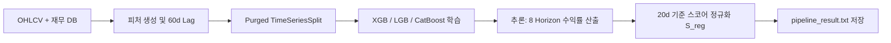

# 전략 01: XGBoost / Multi-Model 수익률 회귀 예측 (Multi-Horizon Regression)

## 1. 전략 개요 (Overview)
- **전략 ID**: `regression` (`reg_score`)
- **전략 범주**: Machine Learning / Multi-Model Ensemble Regression
- **목적**: 5대 시장(SP500, NASDAQ, RUSSELL2000, KOSPI, KOSDAQ)의 전 종목을 대상으로 8개 기간(1일, 5일, 10일, 20일, 30일, 60일, 120일, 200일) 전방 기대수익률을 추정.
- **핵심 특징**:
  - **Tri-Model Ensemble**: XGBoost, LightGBM, CatBoost 회귀 모델의 동적 가중 결합.
  - **5-Fold Purged Walk-Forward Time-Series Split**: 미래 정보 누수(Look-ahead bias)를 차단하는 엠바고(Embargo) 및 퍼징(Purging) 교차검증.
  - **정규화 및 60일 공시 시차(Filing Lag)**: 재무제표 룩어헤드 방지를 위한 60일 시차 적용.

---

## 2. 수학적 모델 및 수식 (Mathematical Formulation)

### 2.1 타겟 레이블 (Target Formulation)
각 시점 $t$ 및 Horizon $h \in \{1, 5, 10, 20, 30, 60, 120, 200\}$에 대한 로그/산술 전방 수익률:
$$y_{i, t}^{(h)} = \frac{P_{i, t+h}}{P_{i, t}} - 1$$

### 2.2 3대 모델 앙상블 가중 결합 (Tri-Model Blending)
시장 $m$ 및 기간 $h$에 대한 최종 기대수익률 예측치 $\hat{y}_{i}^{(h)}$:
$$\hat{y}_{i}^{(h)} = w_{\text{xgb}} \hat{y}_{\text{xgb}, i}^{(h)} + w_{\text{lgb}} \hat{y}_{\text{lgb}, i}^{(h)} + w_{\text{cat}} \hat{y}_{\text{cat}, i}^{(h)}$$
여기서 $w_{\text{xgb}} + w_{\text{lgb}} + w_{\text{cat}} = 1.0$ (기본값: 0.4 / 0.3 / 0.3, Optuna 튜닝 파라미터 적용).

### 2.3 스코어 정규화 (Min-Max Robust Scaling)
시장 내 상하위 1% 윈저화(Winsorization) 후 $[0.0, 1.0]$ 스코어로 변환:
$$S_{\text{reg}, i} = \text{clip}\left(\frac{\hat{y}_{i}^{(20)} - P_1(\hat{y})}{P_{99}(\hat{y}) - P_1(\hat{y})}, 0.0, 1.0\right)$$

---

## 3. 입력 데이터 및 피처 엔지니어링 (Input Features)

1. **가격 및 모멘텀 (Price & Momentum)**: `ret_1d`, `ret_5d`, `ret_20d`, `ret_60d`, `dist_sma_20`, `vol_20d`, `roc_10`, `roc_20`
2. **기술적 지표 (Technical Indicators)**: `rsi_14`, `macd`, `macd_signal`, `bb_upper_dist`, `bb_lower_dist`, `atr_14`, `stoch_k`, `adx_14`
3. **펀더멘탈 (Fundamental Factors - 60일 시차)**: `operating_margin`, `revenue_to_market_cap`, `dividend_yield`, `net_profit_margin`, `eps_yield`, `eps_growth_1y`
4. **글로벌 거시 지표 (Global Indicators - 한국 시장 1일 Lag Shift)**: `vix_change`, `us10y`, `usdkrw_change`, `sp500_change`, `dxy_change`, `wti_change`

---

## 4. 전체 동작 파이프라인 (Execution Workflow)

1. **데이터 로드**: `StockPriceDB`에서 전 종목 5년치 OHLCV 및 매크로 지표 추출.
2. **정규화**: 시가총액 대비 거래대금, 유동비율, 변동성 정규화 수행.
3. **추론 및 캘리브레이션**: 저장된 8개 기간 모델 가중치로 기대수익률 계산.
4. **출력 생성**: `pipeline_result.txt` 및 시장별 `pipeline_result_{MARKET}.txt`에 종목별 Horizon별 예상수익률 저장.

---

## 5. 2D 레짐별 기본 가중치 및 시장 적용

| 레짐 | 가중치 | 동작 특성 |
|---|---|---|
| **BULL_LOW_VOL** | 0.06 | 추세 추종 및 알파 극대화 |
| **BULL_HIGH_VOL** | 0.05 | 모멘텀 가속도 반영 |
| **SIDEWAYS_LOW_VOL** | 0.05 | 횡보장 밸류/모멘텀 알파 포착 |
| **BEAR_LOW_VOL** | 0.04 | 하락 추세 시 보수적 감축 |
| **BEAR_HIGH_VOL** | 0.03 | 고변동 하락장 노이즈 억제 |

- **관련 소스 파일**: [`src/ai/prediction_model.py`](file:///d:/Finance/code/stock/trading_system/src/ai/prediction_model.py), [`src/ai/feature_engineering.py`](file:///d:/Finance/code/stock/trading_system/src/ai/feature_engineering.py)
