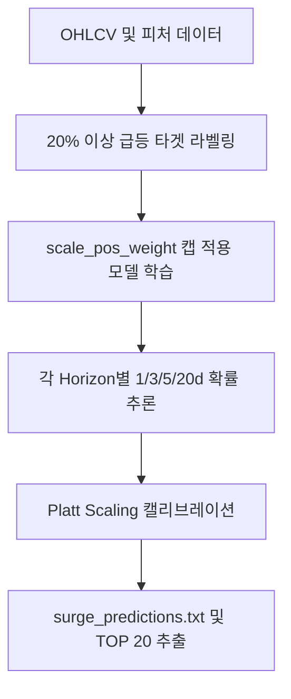

# 전략 02: 급등 분류기 (Surge Classifier)

## 1. 전략 개요 (Overview)
- **전략 ID**: `surge` (`surge_score`)
- **전략 범주**: Machine Learning / Imbalanced Classification
- **목적**: 향후 1일, 3일, 5일, 20일 내 단기 20% 이상 급등(Surge Event)이 발생할 사후 확률(Posterior Probability)을 예측.
- **핵심 특징**:
  - **극단적 불균형 데이터셋 보정**: 양성 샘플 비율이 1~3% 미만인 급등 이벤트를 포착하기 위해 `scale_pos_weight`를 적용하되 최대 20.0으로 캡(Cap)하여 오탐(False Positive) 방지.
  - **3대 모델 앙상블**: XGBClassifier, LGBMClassifier, CatBoostClassifier 결합.
  - **Isotonic & Platt Calibration**: 과대 추정된 확률을 보정하여 실제 승률과 정합성 유지.

---

## 2. 수학적 모델 및 수식 (Mathematical Formulation)

### 2.1 타겟 정의 (Binary Surge Event)
시점 $t$에서 종목 $i$의 기간 $h \in \{1, 3, 5, 20\}$일 내 최고가 또는 종가 기준 급등 여부:
$$y_{i, t}^{\text{surge}, (h)} = \mathbb{I}\left( \max_{1 \le k \le h} \frac{P_{i, t+k}}{P_{i, t}} - 1 \ge 0.20 \right)$$

### 2.2 손실 함수 및 클래스 가중치 (Cost-Sensitive Cross-Entropy)
음성 샘플 수 $N_-$, 양성 샘플 수 $N_+$에 대해:
$$w_+ = \min\left( \frac{N_-}{N_+}, 20.0 \right)$$
$$\mathcal{L}(\theta) = -\sum_{i} \left[ w_+ y_i \log p_i + (1 - y_i) \log(1 - p_i) \right]$$

### 2.3 앙상블 확률 및 캘리브레이션 (Calibrated Probability)
$$p_{\text{blend}, i} = w_{\text{xgb}} p_{\text{xgb}, i} + w_{\text{lgb}} p_{\text{lgb}, i} + w_{\text{cat}} p_{\text{cat}, i}$$
$$\hat{P}(\text{Surge} \mid X) = \sigma(a \cdot p_{\text{blend}, i} + b)$$

---

## 3. 입력 데이터 및 주요 급등 피처 (Key Surge Features)

1. **변동성 및 캔들 패턴 (Range & Candlestick)**: 당일 일중 고저폭 (`bb_width`), 5일 평균 대비 당일 레인지 비율 (`range_5v20`), 갭 상승폭.
2. **거래량 폭발 (Volume Surge)**: 20일 평균 거래량 대비 당일 거래량 배수 (`volume_ratio`), 체결강도.
3. **돌파 지표 (Breakout Dynamics)**: 52주 신고가 근접률 (`distance_from_52w_high`), 상단 볼린저 밴드 이탈도 (`bb_upper_dist`).

---

## 4. 전체 동작 파이프라인 (Execution Workflow)

1. **타겟 생성**: 과거 데이터에서 20% 급등 레이블 생성 (이상치 제거 필터링).
2. **학습 및 검증**: AUC 지표 기반 Early Stopping 적용.
3. **추론 및 정렬**: Horizon별 급등 확률 상위 20개 종목 추출.
4. **결과 출력**: `surge_predictions.txt` 및 시장별 파일 생성.

---

## 5. 2D 레짐별 기본 가중치

| 레짐 | 가중치 | 동작 특성 |
|---|---|---|
| **BULL_HIGH_VOL** | 0.05 | 강세 고변동장에서 급등주 발생 확률 최고 |
| **BULL_LOW_VOL** | 0.04 | 안정적 상승장 내 돌파 종목 포착 |
| **SIDEWAYS_LOW_VOL** | 0.04 | 테마 순환매 및 개별 종목 서지 선별 |
| **BEAR_LOW_VOL** | 0.03 | 선별적 단기 반등 베팅 |
| **BEAR_HIGH_VOL** | 0.02 | 투매장 오탐 리스크 방지를 위한 최저 비중 |

- **관련 소스 파일**: [`src/ai/prediction_model.py`](file:///d:/Finance/code/stock/trading_system/src/ai/prediction_model.py)
