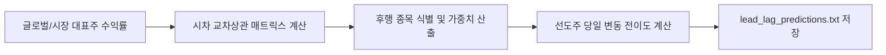

# 전략 03: Lead-Lag 시차 상관성 전략 (2-Tier Lead-Lag Matrix)

## 1. 전략 개요 (Overview)
- **전략 ID**: `lead_lag` (`ll_score`)
- **전략 범주**: Statistical / Cross-Asset Time-Lag Correlation
- **목적**: 업종 대표 대형주(Leader)와 후행하는 중소형주(Follower) 간의 시차 가격 전이 관계를 포착하여 후행 매수 기회를 선점.
- **핵심 특징**:
  - **2-Tier 구조**: 1단계 지수/업종 대표주 선별 ➔ 2단계 1~3일 시차 교차상관관계(Cross-Correlation) 산출.
  - **US-KR 시차 보정 (+1d US Lag Shift)**: 한국 시장 개장 시 전일 미국 시장 종가 정보를 결합할 때 당일 미래 정보를 사용하지 않도록 철저한 1일 시차 적용.

---

## 2. 수학적 모델 및 수식 (Mathematical Formulation)

### 2.1 시차 교차상관도 (Cross-Correlation with Lag $\tau$)
선도주 $X$의 $t-\tau$ 시점 수익률과 후행주 $Y$의 $t$ 시점 수익률 간의 피어슨 상관계수:
$$\rho_{XY}(\tau) = \frac{\text{Cov}(r_{X, t-\tau}, r_{Y, t})}{\sigma_X \sigma_Y}, \quad \tau \in \{1, 2, 3\}$$

### 2.2 선도 강도 및 후행 점수 (Follower Score)
선도주들의 당일(또는 1일 전) 누적 수익률 $r_{X_k, t}$과 상관성 가중치 $\omega_{k}$:
$$\text{RawScore}(Y) = \sum_{k \in \text{Leaders}} \omega_{k} \cdot r_{X_k, t} \cdot \mathbb{I}(\rho_{X_k Y}(\tau) > \theta_{\text{threshold}})$$
여기서 $\theta_{\text{threshold}} \ge 0.35$.

### 2.3 스코어 정규화
$$S_{\text{LL}, i} = \text{clip}\left(\frac{\text{RawScore}(i) - \mu_{\text{mkt}}}{3 \sigma_{\text{mkt}}} \cdot 0.5 + 0.5, 0.0, 1.0\right)$$

---

## 3. 입력 데이터 및 처리 방식 (Data Pipeline)

1. **선도주 선정**:
   - 미국: NVDA, AAPL, MSFT, AMZN, GOOGL, TSLA, XLF, XLE 등
   - 한국: 삼성전자(005930), SK하이닉스(000660), 현대차(005380), LG에너지솔루션 등
2. **시계열 정렬 및 시차 처리**:
   - 미국 시장 데이터는 한국 시간 기준 $T-1$ 거래일 데이터를 엄격히 정합.
3. **상관 행렬 갱신**: 60일 롤링 윈도우 기반 동적 상관계수 업데이트.

---

## 4. 전체 동작 파이프라인 (Workflow)

1. **상관성 행렬 구축**: `model.compute_lead_lag()`에서 선도주군과 전체 유니버스 간 교차상관 행렬 산출.
2. **추론**: 선도주가 급등했으나 아직 동조화 상승하지 않은 후행 종목군 랭킹 산출.
3. **출력 파일**: `lead_lag_predictions.txt` 및 시장별 파일 작성.

---

## 5. 2D 레짐별 기본 가중치

| 레짐 | 가중치 | 동작 특성 |
|---|---|---|
| **BULL_LOW_VOL** | 0.05 | 온기 전이와 업종 내 순환매 확산 효과 극대화 |
| **BULL_HIGH_VOL** | 0.04 | 대형주 주도 후 중소형주 갭 메우기 포착 |
| **SIDEWAYS_LOW_VOL** | 0.04 | 섹터 리더 상승 후 밸류체인 후행 매매 |
| **BEAR_LOW_VOL** | 0.03 | 선도주 낙폭 과대 시 동반 반등주 선별 |
| **BEAR_HIGH_VOL** | 0.02 | 전체 시장 급락 시 동조화 붕괴로 비중 축소 |

- **관련 소스 파일**: [`src/ai/prediction_model.py`](file:///d:/Finance/code/stock/trading_system/src/ai/prediction_model.py), [`src/ai/ml_strategy_adapters.py`](file:///d:/Finance/code/stock/trading_system/src/ai/ml_strategy_adapters.py)
