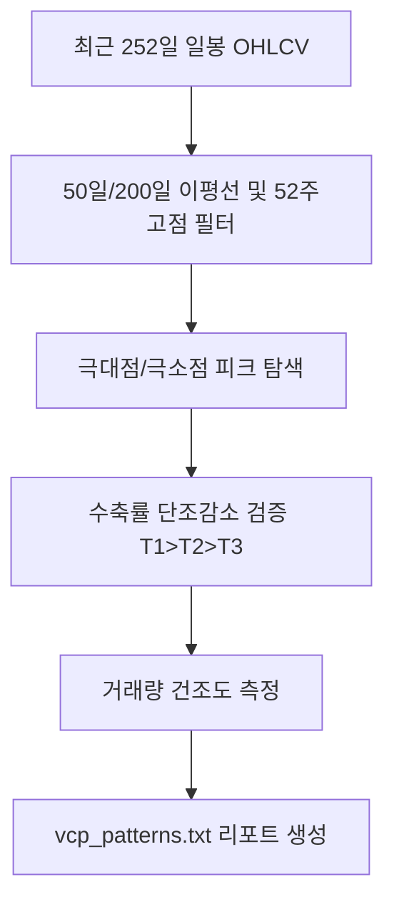

# 전략 04: 규칙 기반 변동성 수축 패턴 검출 (VCP Rule Detector)

## 1. 전략 개요 (Overview)
- **전략 ID**: `vcp_rule` (`vcp_rule_score`)
- **전략 범주**: Technical Quantitative Pattern / Mark Minervini VCP Rule
- **목적**: 마크 미너비니(Mark Minervini)의 변동성 수축 패턴(Volatility Contraction Pattern, VCP)을 정량적 규칙으로 검출하여 돌파 임박 종목을 탐지.
- **핵심 특징**:
  - **다단계 수축(2~4회)**: 이전 파동 대비 고저 진폭(Range)이 점진적으로 50% 이상 감소.
  - **거래량 건조(Volume Dry-up)**: 수축이 진행될수록 50일 평균 거래량 대비 급격한 거래량 감소.
  - **추세 정렬(Trend Template)**: 50일/200일 이동평균선 상회 및 52주 고점 25% 이내 위치.

---

## 2. 수학적 모델 및 수식 (Mathematical Formulation)

### 2.1 수축비율 산출 (Contraction Peak Range)
$k$번째 수축 단계의 고점 $H_k$와 저점 $L_k$에 대해:
$$C_k = \frac{H_k - L_k}{H_k}$$
조건: $C_1 > C_2 > C_3$ (예: $20\% \to 10\% \to 4\%$) 및 $C_k \le 0.5 \cdot C_{k-1}$.

### 2.2 거래량 건조 비율 (Volume Contraction Ratio)
최근 수축 국면 거래량 $V_{\text{recent}}$과 50일 평균 거래량 $\bar{V}_{50}$:
$$\text{VolDry} = \frac{V_{\text{recent}}}{\bar{V}_{50}} \le 0.70$$

### 2.3 VCP 규칙 점수 (VCP Score Composite: 0~100점)
$$\text{Score} = w_1 \cdot \mathbb{I}(\text{Contraction Count} \ge 2) + w_2 \cdot \mathbb{I}(\text{Vol Dry}) + w_3 \cdot \mathbb{I}(P > \text{SMA}_{50} > \text{SMA}_{200}) + w_4 \cdot \left(1 - \frac{H_{52} - P}{H_{52}}\right)$$
최종 스코어 $S_{\text{vcp\_rule}} = \text{Score} / 100.0 \in [0.0, 1.0]$.

---

## 3. 입력 데이터 및 검출 조건 (Pattern Rules)

| 조건 항목 | 수식/판정 기준 | 필수 여부 |
|---|---|---|
| **이평선 배열** | $P > \text{SMA}_{50}$ 및 $\text{SMA}_{50} > \text{SMA}_{200}$ | 필수 (추세 필터) |
| **52주 신고가 근접** | $(H_{52} - P) / H_{52} \le 0.25$ | 필수 |
| **수축 단계수** | 최소 2회 이상의 점진적 진폭 축소 ($T_1 \to T_2 \to T_3$) | 필수 |
| **최종 피벗 진폭** | 마지막 수축 폭 $\le 8\%$ | 가점 요건 |
| **거래량 감소** | 수축 피벗 구간 거래량 급감 ($\le 60\%$) | 가점 요건 |

---

## 4. 전체 동작 파이프라인 (Execution Workflow)

1. **사전 필터링**: 추세 템플릿 미충족 종목 신속 제외.
2. **피크 탐색**: 로컬 고점/저점을 연결하여 수축 파동 계산.
3. **점수화 및 상세 리포트 생성**: `vcp_patterns.txt`에 수축 단계별 퍼센트($21.5\% > 10.2\% > 3.8\%$) 및 체크리스트 출력.

---

## 5. 2D 레짐별 기본 가중치

| 레짐 | 가중치 | 동작 특성 |
|---|---|---|
| **BULL_LOW_VOL** | 0.05 | 전형적인 전고점 돌파 매매 최적 환경 |
| **BULL_HIGH_VOL** | 0.04 | 급등 전 에너지 응축 종목 선별 |
| **SIDEWAYS_LOW_VOL** | 0.04 | 박스권 상단 돌파 준비 종목 포착 |
| **BEAR_LOW_VOL** | 0.02 | 하락장 내 돌파 실패율 증가로 축소 |
| **BEAR_HIGH_VOL** | 0.01 | 하락 변동장에서는 돌파 매매 극도 제한 |

- **관련 소스 파일**: [`src/ai/vcp_detector.py`](file:///d:/Finance/code/stock/trading_system/src/ai/vcp_detector.py), [`src/ai/ml_strategy_adapters.py`](file:///d:/Finance/code/stock/trading_system/src/ai/ml_strategy_adapters.py)
