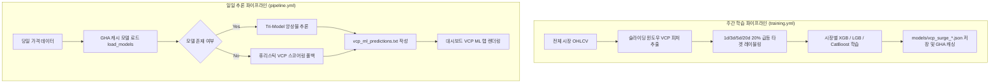

# 전략 05: 머신러닝 기반 VCP 급등 분류기 (VCP ML Predictor)

## 1. 전략 개요 (Overview)
- **전략 ID**: `vcp_ml` (`vcp_ml_score`)
- **전략 범주**: Machine Learning / Pattern Recognition + Surge Classification
- **목적**: 규칙 기반 VCP 패턴의 주관성을 극복하고, 5개 시장별 VCP 패턴 형성 후 실제 급등으로 이어질 확률을 기계학습 모델로 산출.
- **핵심 특징**:
  - **11대 VCP 전용 벡터 피처 + 30대 기술적 피처 결합**: `range_5v20`, `vol_20v60`, `dist_ma50`, `monotonic`, `vcp_score` 등.
  - **Tri-Model Ensemble**: 시장별 XGBClassifier, LGBMClassifier, CatBoostClassifier 결합.
  - **휴리스틱 폴백 안전망 (Heuristic Fallback)**: 모델 캐시 미탑재 시에도 가격 시계열 기반 정량적 수축도 점수로 안전하게 대체 추론.

---

## 2. 수학적 모델 및 수식 (Mathematical Formulation)

### 2.1 11대 VCP 벡터 피처 (VCP Feature Set)
1. $\text{range\_5v20} = \frac{\text{Range}_{5\text{d}}}{\text{Range}_{20\text{d}}}$
2. $\text{vol\_20v60} = \frac{\text{Vol}_{20\text{d}}}{\text{Vol}_{60\text{d}}}$
3. $\text{dist\_ma50} = \frac{P - \text{SMA}_{50}}{\text{SMA}_{50}}$
4. $\text{dist\_ma200} = \frac{P - \text{SMA}_{200}}{\text{SMA}_{200}}$
5. $\text{range\_pos\_10d} = \frac{P - L_{10\text{d}}}{H_{10\text{d}} - L_{10\text{d}}}$
6. $\text{monotonic} \in \{0, 1\}$ (수축폭 단조감소 여부)
7. $\text{vcp\_score} \in [0, 100]$ (규칙 엔진 점수)

### 2.2 시장별 가중 앙상블 (Multi-Market Ensemble Prediction)
시장 $M \in \{\text{KOSPI}, \text{KOSDAQ}, \text{SP500}, \text{NASDAQ}, \text{RUSSELL2000}\}$ 및 Horizon $h \in \{1, 3, 5, 20\}$에 대해:
$$P(\text{Surge}_{h} \mid \mathbf{x}) = w_{\text{xgb}} P_{\text{xgb}}(\mathbf{x}) + w_{\text{lgb}} P_{\text{lgb}}(\mathbf{x}) + w_{\text{cat}} P_{\text{cat}}(\mathbf{x})$$

### 2.3 휴리스틱 폴백 수식 (Fallback when no models cached)
$$P_{\text{fallback}} = \text{clip}\left( \frac{\text{vcp\_score}}{100.0} \times 0.40 + 0.05, 0.05, 0.45 \right)$$

---

## 3. 학습 및 추론 파이프라인 (Workflow Architecture)

---

## 4. 2D 레짐별 기본 가중치

| 레짐 | 가중치 | 동작 특성 |
|---|---|---|
| **BULL_LOW_VOL** | 0.05 | 돌파 성공률이 가장 높은 환경 |
| **BULL_HIGH_VOL** | 0.05 | 급등 테마 및 VCP 돌파 결합 |
| **SIDEWAYS_LOW_VOL** | 0.04 | 횡보 박스권 수축 후 상방 분출 포착 |
| **BEAR_LOW_VOL** | 0.02 | 하락장 내 가짜 돌파(Bull Trap) 회피 |
| **BEAR_HIGH_VOL** | 0.01 | 변동성 급증 시 VCP 신뢰도 저하 반영 |

- **관련 소스 파일**: [`src/ai/vcp_ml_predictor.py`](file:///d:/Finance/code/stock/trading_system/src/ai/vcp_ml_predictor.py), [`src/ai/feature_engineering.py`](file:///d:/Finance/code/stock/trading_system/src/ai/feature_engineering.py)
