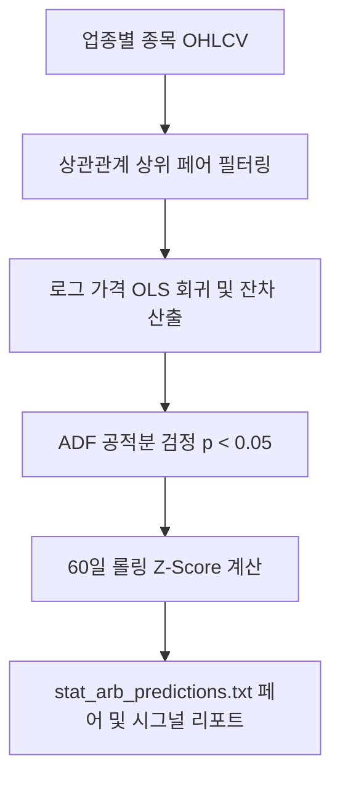

# 전략 07: 통계적 차익거래 공적분 (Stat-Arb Cointegration)

## 1. 전략 개요 (Overview)
- **전략 ID**: `stat_arb` (`stat_arb_score`)
- **전략 범주**: Quantitative Statistical Arbitrage / Pairs Trading
- **목적**: 동일 업종 또는 유사 팩터 노출 종목 쌍 간의 로그 가격 공적분(Cointegration) 잔차(Residual)의 평균 회귀(Mean-Reversion)를 이용하여 횡보/비효율 시장에서 알파를 창출.
- **핵심 특징**:
  - **로그 가격 기반 공적분 (Log Cointegration)**: 주가 단위 크기 차이로 인한 왜곡을 방지하기 위해 $\ln(P_A), \ln(P_B)$ 공간에서 Engle-Granger 2단계 검정 수행.
  - **정상성(Stationarity) 검증**: ADF (Augmented Dickey-Fuller) p-value $\le 0.05$ 통과 페어만 선별.
  - **동적 Z-Score 잔차 트래킹**: $Z \le -2.0$ 과매도 이탈 시 강한 매수 점수 부여.

---

## 2. 수학적 모델 및 수식 (Mathematical Formulation)

### 2.1 Engle-Granger 1단계: OLS 공적분 회귀
$$\ln(P_{A, t}) = \alpha + \beta \ln(P_{B, t}) + \epsilon_t$$
헤지 비율(Hedge Ratio) $\beta$ 및 잔차 $\epsilon_t$ 산출.

### 2.2 Engle-Granger 2단계: 잔차 정상성 검정 (ADF Test)
$$\Delta \epsilon_t = \gamma \epsilon_{t-1} + \sum_{p=1}^{k} \delta_p \Delta \epsilon_{t-p} + u_t$$
검정 통계량이 임계값보다 작고 $p < 0.05$일 때 공적분 성립.

### 2.3 잔차 스프레드 Z-Score 및 점수화
$$\mu_\epsilon = \frac{1}{60}\sum_{\tau=0}^{59} \epsilon_{t-\tau}, \quad \sigma_\epsilon = \text{std}_{60}(\epsilon)$$
$$Z_t = \frac{\epsilon_t - \mu_\epsilon}{\sigma_\epsilon}$$
종목 A의 저평가 이탈(스프레드 하단) 시 매수 점수:
$$S_{\text{StatArb}, A} = \text{clip}\left( 0.5 - \frac{Z_t}{4.0}, 0.0, 1.0 \right)$$
($Z = -2.0 \implies S = 1.0$, $Z = 0 \implies S = 0.5$, $Z = +2.0 \implies S = 0.0$)

---

## 3. 입력 데이터 및 처리 방식 (Data & Pairs Selection)

1. **페어 후보군 형성**: 동일 섹터/업종 내 상관계수 $\rho \ge 0.70$ 종목 쌍 추출.
2. **공적분 스캐닝**: 최근 120~252일 일봉 기준 Engle-Granger 테스트 일괄 수행.
3. **잔차 반감기(Half-Life) 필터**: 오르슈타인-울렌벡(OU) 프로세스 기반 반감기가 5~30일 범위인 유효 페어만 최종 채택.

---

## 4. 전체 동작 파이프라인 (Execution Workflow)

1. **스캔**: `StatisticalArbitrageEngine.scan_pairs()`에서 상위 유효 페어 선별.
2. **신호 산출**: 각 종목별 평균 잔차 Z-Score 기반 매수/중립/매도 스코어 매핑.
3. **출력**: `stat_arb_predictions.txt`에 유효 페어명, 헤지비율, p-value, 현재 Z-score 기록.

---

## 5. 2D 레짐별 기본 가중치

| 레짐 | 가중치 | 동작 특성 |
|---|---|---|
| **SIDEWAYS_LOW_VOL** | 0.06 | 횡보 저변동장에서 차익거래 승률 최고 (주력 레짐) |
| **BULL_LOW_VOL** | 0.04 | 안정적 추세장 내 일시적 괴리 수렴 |
| **BEAR_LOW_VOL** | 0.04 | 하락장 내 상대가치 방어 매매 |
| **BULL_HIGH_VOL** | 0.02 | 강력한 모멘텀장에서는 스프레드 발산 위험 |
| **BEAR_HIGH_VOL** | 0.02 | 위기장에서는 공적분 붕괴(Breakdown) 위험으로 축소 |

- **관련 소스 파일**: [`src/core/stat_arb.py`](file:///d:/Finance/code/stock/trading_system/src/core/stat_arb.py)
