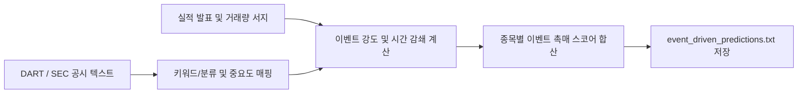

# 전략 10: 이벤트 드리븐 공시/수급 촉매 (Event-Driven Catalyst)

## 1. 전략 개요 (Overview)
- **전략 ID**: `event_driven` (`event_score`)
- **전략 범주**: Catalyst / Disclosure & Flow Anomaly
- **목적**: DART 전자공시(한국), SEC EDGAR(미국)의 핵심 호재성 공시, 어닝 서프라이즈(실적 깜짝 발표), 자사주 취득/소각, 대량 거래량 폭발(거래량 3배 이상) 등 단기 촉매(Catalyst) 이벤트를 수치화.
- **핵심 특징**:
  - **4대 주요 촉매 복합 집계**:
    1. 대규모 수주 및 공급계약 체결
    2. 자사주 매입 및 소각 결정 공시
    3. 어닝 서프라이즈 (컨센서스 대비 영업이익 +15% 이상)
    4. 20일 평균 대비 거래량 3배 이상 폭발 (Volume Surge $\ge 3.0$)
  - **지수 감쇄(Exponential Decay)**: 이벤트 발생 시점으로부터 경과일에 따라 점수 감쇄 적용 ($T_{1/2} = 5$일).

---

## 2. 수학적 모델 및 수식 (Mathematical Formulation)

### 2.1 이벤트 강도 함수 (Catalyst Impact)
이벤트 $e$의 고유 중요도 가중치 $W_e$와 발생 후 경과일 $d_e$:
$$I(e, d_e) = W_e \cdot \exp\left( -\frac{\ln 2}{T_{1/2}} \cdot d_e \right)$$

가중치 테이블:
- **자사주 소각 (Share Cancellation)**: $W = 1.0$
- **어닝 서프라이즈 ($\ge +20\%$)**: $W = 0.8$
- **단일판매/공급계약 체결 ($\ge$ 매출액 10%)**: $W = 0.7$
- **자사주 취득 결정**: $W = 0.6$
- **거래량 300% 이상 서지**: $W = 0.5$

### 2.2 복합 이벤트 점수
$$\text{RawScore}_i = \min\left( \sum_{e \in \text{Events}(i)} I(e, d_e), 2.0 \right)$$
$$S_{\text{event}, i} = \text{clip}\left( \frac{\text{RawScore}_i}{2.0}, 0.0, 1.0 \right)$$

---

## 3. 입력 데이터 및 처리 방식 (Data Pipeline)

1. **DART Open API**: 한국 상장사 주요 공시 실시간 수집 및 파싱.
2. **SEC RSS / 8-K Feed**: 미국 기업 중대 공시 수집.
3. **실적 발표치 vs 컨센서스**: FnGuide / yfinance 어닝 데이터 대조.
4. **거래량 시계열**: 당일 거래량 / 최근 20일 평균 거래량.

---

## 4. 전체 동작 파이프라인 (Execution Workflow)

1. **이벤트 파서**: `EventDrivenEngine`이 최근 10영업일 내 공시 및 거래량 이상 징후 스캔.
2. **감쇄 적용**: 오늘 발생한 신선한 이벤트에 최고 가중치 부여.
3. **출력**: `event_driven_predictions.txt`에 검출된 이벤트 사유와 점수 리스팅.

---

## 5. 2D 레짐별 기본 가중치

| 레짐 | 가중치 | 동작 특성 |
|---|---|---|
| **SIDEWAYS_LOW_VOL** | 0.05 | 지수 정체 시 개별주 공시 재료 반응도 최고 (주력 레짐) |
| **BULL_HIGH_VOL** | 0.04 | 상승장에서 호재성 재료의 상방 탄력성 배가 |
| **BULL_LOW_VOL** | 0.04 | 실적/수주 호재 기반 점진적 우상향 |
| **BEAR_LOW_VOL** | 0.03 | 약세장 속 자사주 소각 등 주주환원 방어주 선별 |
| **BEAR_HIGH_VOL** | 0.02 | 거시적 패닉 시 개별 호재 무력화 반영 |

- **관련 소스 파일**: [`src/core/event_driven.py`](file:///d:/Finance/code/stock/trading_system/src/core/event_driven.py)
