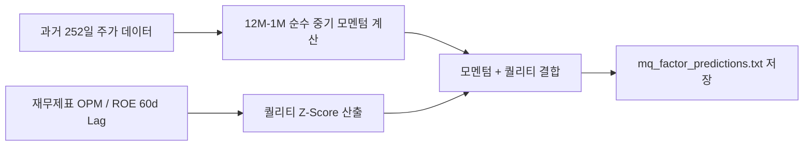

# 전략 11: 퀄리티 결합 모멘텀 (Momentum Quality, MQ Factor)

## 1. 전략 개요 (Overview)
- **전략 ID**: `mq_factor` (`mq_score`)
- **전략 범주**: Quantitative Factor / Novy-Marx & Asness MQ
- **목적**: 최근 1개월 단기 반전 노이즈(Short-term Reversal Noise)를 제거한 12M-1M 중기 모멘텀에 영업이익률/ROE 등 펀더멘탈 퀄리티(Quality)를 결합하여, 실적이 뒷받침되는 고품질 모멘텀주를 선별.
- **핵심 특징**:
  - **12M-1M 모멘텀**: $R_{\text{12M-1M}} = \frac{P_{t-20}}{P_{t-252}} - 1$ (단기 과열 노이즈 제거).
  - **수익성 퀄리티 (Gross Profitability & OPM)**: 영업이익률(OPM) 및 자기자본이익률(ROE) 결합.
  - **추세 안정성(Smooth Momentum)**: 상승일 비율(Positive Day Ratio)이 높고 변동성이 낮은 우상향 종목 우대.

---

## 2. 수학적 모델 및 수식 (Mathematical Formulation)

### 2.1 중기 모멘텀 및 안정성 (Momentum & Smoothness)
$$M_{12-1, i} = \frac{P_{i, t-20}}{P_{i, t-252}} - 1$$
$$\text{Smoothness}_i = \frac{\text{Mean}(r_{\text{daily}})}{\text{Std}(r_{\text{daily}})}$$

### 2.2 펀더멘탈 퀄리티 복합 점수 (Quality Score)
$$Q_i = 0.5 \cdot \text{Z}(\text{OPM}_i) + 0.5 \cdot \text{Z}(\text{ROE}_i)$$

### 2.3 최종 MQ 팩터 스코어 (Composite MQ Score)
$$\text{MQ\_Raw}_i = 0.5 \cdot \text{Z}(M_{12-1, i}) + 0.3 \cdot Q_i + 0.2 \cdot \text{Z}(\text{Smoothness}_i)$$
$$S_{\text{mq}, i} = \text{clip}\left( \frac{\text{MQ\_Raw}_i - \mu_{\text{mkt}}}{3 \sigma_{\text{mkt}}} \cdot 0.5 + 0.5, 0.0, 1.0 \right)$$

---

## 3. 입력 데이터 및 처리 방식 (Data Pipeline)

1. **252일 일봉 수정주가 시계열**: 12개월 전부터 1개월 전까지의 누적 수익률 계산.
2. **최근 공시 재무제표 (60일 시차)**: 영업이익, 매출액, 자본총계, 당기순이익.
3. **일별 수익률 시계열**: 변동성 대비 일평균 수익률(샤프형 궤적) 측정.

---

## 4. 전체 동작 파이프라인 (Execution Workflow)

---

## 5. 2D 레짐별 기본 가중치

| 레짐 | 가중치 | 동작 특성 |
|---|---|---|
| **BULL_LOW_VOL** | 0.06 | 퀄리티 모멘텀 팩터의 장기 초과수익 극대화 (주력 레짐) |
| **BULL_HIGH_VOL** | 0.05 | 실적 우량주의 강한 추세 지속 |
| **SIDEWAYS_LOW_VOL** | 0.04 | 실적 기반 개별주 우상향 선별 |
| **BEAR_LOW_VOL** | 0.03 | 실적 없는 단순 테마주 배제 효과 |
| **BEAR_HIGH_VOL** | 0.02 | 고변동 하락장 노이즈 억제 |

- **관련 소스 파일**: [`src/core/mq_factor.py`](file:///d:/Finance/code/stock/trading_system/src/core/mq_factor.py)
