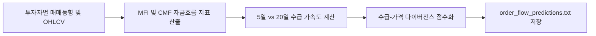

# 전략 13: 주문 흐름 불균형 및 자금흐름가속도 (Order Flow Imbalance & MFI)

## 1. 전략 개요 (Overview)
- **전략 ID**: `order_flow` (`order_flow_score`)
- **전략 범주**: Flow / Microstructure & Money Flow Index (MFI)
- **목적**: 외국인 및 기관의 순매수 유입 강도, 자금흐름지수(Money Flow Index, MFI), 체결강도의 가속도(Acceleration)를 측정하여 스마트 머니의 집중 매집 종목을 선별.
- **핵심 특징**:
  - **수급 가속도 (Flow Acceleration)**: 최근 5일 순매수 유입 속도가 20일 평균 속도 대비 가속화되는 변곡점 탐지.
  - **체결 강도 및 틱 볼륨 불균형 (Tick Imbalance)**: 상승 틱 거래량 비율과 하락 틱 거래량 비율의 비대칭성 측정.
  - **가격-수급 다이버전스 (Flow-Price Divergence)**: 주가는 횡보하거나 조정을 받으나 외인/기관 순매수는 지속 증가하는 다이버전스 포착.

---

## 2. 수학적 모델 및 수식 (Mathematical Formulation)

### 2.1 자금흐름지수 (Money Flow Index, MFI)
전형적 가격 $P_{\text{typical}} = \frac{\text{High} + \text{Low} + \text{Close}}{3}$, 원시자금흐름 $\text{RMF} = P_{\text{typical}} \times \text{Volume}$:
$$\text{Positive Money Flow (PMF)} = \sum_{t \in \text{Up Days}} \text{RMF}_t$$
$$\text{Negative Money Flow (NMF)} = \sum_{t \in \text{Down Days}} \text{RMF}_t$$
$$\text{MFI}_{14} = 100 - \frac{100}{1 + \frac{\text{PMF}_{14}}{\text{NMF}_{14}}}$$

### 2.2 기관/외인 수급 가속도 (Flow Acceleration)
최근 5일간의 순매수 합 $F_{5\text{d}}$, 20일간의 순매수 합 $F_{20\text{d}}$에 대해:
$$\text{FlowAcc}_i = \frac{F_{5\text{d}, i} / 5}{F_{20\text{d}, i} / 20 + \epsilon}$$

### 2.3 주문 흐름 복합 점수
$$\text{RawScore}_i = 0.40 \cdot \frac{\text{MFI}_{14, i}}{100.0} + 0.35 \cdot \text{Sigmoid}(\text{FlowAcc}_i) + 0.25 \cdot \text{DivergenceScore}_i$$
$$S_{\text{flow}, i} = \text{clip}(\text{RawScore}_i, 0.0, 1.0)$$

---

## 3. 입력 데이터 및 처리 방식 (Data Pipeline)

1. **투자자별 매매동향 (한국 KRX)**: 외국인, 기관, 투신, 연기금 일별 순매수 수량 및 거래대금.
2. **고가/저가/종가/거래량 시계열**: MFI 지표 및 체결 불균형 대용치 산출.
3. **미국 시장 대용치**: 온밸런스볼륨(OBV) 및 Chaikin Money Flow (CMF) 결합.

---

## 4. 전체 동작 파이프라인 (Execution Workflow)

---

## 5. 2D 레짐별 기본 가중치

| 레짐 | 가중치 | 동작 특성 |
|---|---|---|
| **BULL_LOW_VOL** | 0.05 | 기관/외인 주도 지속 매집주 추종 (주력 레짐) |
| **BULL_HIGH_VOL** | 0.04 | 급격한 수급 쏠림 현상 포착 |
| **SIDEWAYS_LOW_VOL** | 0.04 | 횡보장에서 세력 매집 다이버전스 선별 |
| **BEAR_LOW_VOL** | 0.03 | 외인/기관 방어적 순매수 종목 탐색 |
| **BEAR_HIGH_VOL** | 0.02 | 전반적 자금 유출 시 신호 왜곡 방지 |

- **관련 소스 파일**: [`src/core/order_flow.py`](file:///d:/Finance/code/stock/trading_system/src/core/order_flow.py)
