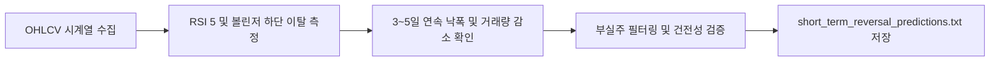

# 전략 14: 단기 과매도 평균회귀 (Short-Term Mean Reversal)

## 1. 전략 개요 (Overview)
- **전략 ID**: `short_term_reversal` (`reversal_score`)
- **전략 범주**: Quantitative Factor / Short-Term Mean Reversal
- **목적**: 3~5일 연속 단기 급락, RSI 과매도(RSI < 30), 볼린저 밴드 하단 이탈(-2σ 이하) 등 과도한 패닉 매도로 균형 가격에서 일시적으로 이탈한 우량주의 단기 기술적 반등(Mean-Reversion)을 공략.
- **핵심 특징**:
  - **다중 과매도 조건 결합**: 3일 연속 음봉 + RSI(5) 과매도 + 볼린저 하단 이탈도.
  - **퀄리티/추세 필터 결합**: 200일 이동평균선 상회 또는 재무 건전성이 유지되는 우량주의 일시적 눌림목만 선별하여 칼날 잡기(Falling Knife) 리스크 원천 차단.
  - **빠른 수익 실현(Holding Period 1~5일)**: 평균 3영업일 내 기술적 반등 시 청산.

---

## 2. 수학적 모델 및 수식 (Mathematical Formulation)

### 2.1 3~5일 단기 낙폭 지수 (Short-Term Return)
$$R_{3\text{d}, i} = \frac{P_{i, t}}{P_{i, t-3}} - 1, \quad R_{5\text{d}, i} = \frac{P_{i, t}}{P_{i, t-5}} - 1$$

### 2.2 볼린저 밴드 하단 이탈도 (%B)
$$%B_i = \frac{P_{i, t} - \text{LowerBB}_{20, 2\sigma}}{\text{UpperBB}_{20, 2\sigma} - \text{LowerBB}_{20, 2\sigma}}$$

### 2.3 복합 반등 점수 (Reversal Bounce Score)
$$\text{RevScore}_i = 0.40 \cdot \max\left(0.0, 1.0 - \frac{\text{RSI}_{5, i}}{30.0}\right) + 0.35 \cdot \max(0.0, -R_{3\text{d}, i} \times 10) + 0.25 \cdot \max(0.0, -%B_i)$$
$$S_{\text{rev}, i} = \text{clip}(\text{RevScore}_i, 0.0, 1.0)$$

---

## 3. 입력 데이터 및 필터 조건 (Data & Quality Filter)

1. **OHLCV 시계열**: 최근 60일 일봉 데이터.
2. **기술적 지표**: RSI(5), 볼린저 밴드(20, 2), 5일 연속 하락 여부.
3. **위험 회피 필터 (Hard Gates)**:
   - 최근 1개월 내 감사의견 거절, 횡령/배임 등 중대 악재 공시 종목 즉시 제외.
   - 20일 거래대금 10억원 미만 소형주 제외.

---

## 4. 전체 동작 파이프라인 (Execution Workflow)

---

## 5. 2D 레짐별 기본 가중치

| 레짐 | 가중치 | 동작 특성 |
|---|---|---|
| **SIDEWAYS_LOW_VOL** | 0.05 | 횡보장 밴드 하단 매수 / 상단 매도 최적 환경 |
| **BEAR_LOW_VOL** | 0.04 | 하락장 내 기술적 과매도 반등 공략 |
| **BULL_LOW_VOL** | 0.03 | 상승장 내 건강한 눌림목 매수 |
| **BEAR_HIGH_VOL** | 0.03 | 급락장 패닉 셀링 후 V자 반등 포착 |
| **BULL_HIGH_VOL** | 0.02 | 강한 상승장에서는 모멘텀 추종이 유리 |

- **관련 소스 파일**: [`src/core/short_term_reversal.py`](file:///d:/Finance/code/stock/trading_system/src/core/short_term_reversal.py)
