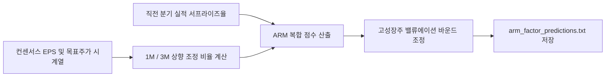

# 전략 15: 애널리스트 추정치 상향 모멘텀 (Analyst Revision Momentum, ARM Factor)

## 1. 전략 개요 (Overview)
- **전략 ID**: `arm_factor` (`arm_score`)
- **전략 범주**: Fundamental Factor / Earnings Revisions & Consensus Alpha
- **목적**: 증권사 애널리스트들의 실적 추정치(컨센서스 EPS, 매출액, 목표주가)가 최근 1~3개월간 상향 조정(Upward Revisions)되는 종목을 포착하여 포스트 어닝 어나운스먼트 드리프트(PEAD) 알파를 획득.
- **핵심 특징**:
  - **3대 수정 지표 결합**: 1개월/3개월 컨센서스 EPS 수정률, 목표주가 상향 비율, 투자의견 점수.
  - **어닝 서프라이즈 모멘텀 결합**: 직전 분기 실적 발표 시 컨센서스 상회 폭 반영.
  - **고성장 기업 PER 페널티 제한**: 고성장주(매출/EPS 성장률 > 30%)에 대해 단순 고PER로 인한 과도한 감점을 방지하는 적응형 밸류에이션 바운드 적용.

---

## 2. 수학적 모델 및 수식 (Mathematical Formulation)

### 2.1 EPS 추정치 수정률 (EPS Revision Rate)
당일 컨센서스 $\text{EPS}_{t}$와 1개월(30일) 전 컨센서스 $\text{EPS}_{t-30}$:
$$\Delta \text{EPS}_{1\text{M}, i} = \frac{\text{EPS}_{t, i} - \text{EPS}_{t-30, i}}{|\text{EPS}_{t-30, i}| + \epsilon}$$

### 2.2 목표주가 수정 모멘텀 (Target Price Revision)
$$\Delta \text{TP}_{1\text{M}, i} = \frac{\text{TargetPrice}_{t, i} - \text{TargetPrice}_{t-30, i}}{\text{TargetPrice}_{t-30, i}}$$

### 2.3 복합 ARM 점수 (Composite ARM Score)
$$\text{RawScore}_i = 0.45 \cdot \text{Z}(\Delta \text{EPS}_{1\text{M}, i}) + 0.35 \cdot \text{Z}(\Delta \text{TP}_{1\text{M}, i}) + 0.20 \cdot \text{SurpriseScore}_i$$
$$S_{\text{arm}, i} = \text{clip}\left( \frac{\text{RawScore}_i - \mu_{\text{mkt}}}{3 \sigma_{\text{mkt}}} \cdot 0.5 + 0.5, 0.0, 1.0 \right)$$

---

## 3. 입력 데이터 및 처리 방식 (Data Pipeline)

1. **컨센서스 시계열 데이터**:
   - 한국: FnGuide / WiseFn 컨센서스 EPS, Target Price, 애널리스트 리포트 수.
   - 미국: yfinance / LSEG 컨센서스 EPS Estimate 30d/90d revision.
2. **컨센서스 미제공 소형주 처리**: 최근 분기 영업이익 전년동기대비(YoY) 증가율 및 팩터 중앙값으로 정밀 대체.

---

## 4. 전체 동작 파이프라인 (Execution Workflow)

---

## 5. 2D 레짐별 기본 가중치

| 레짐 | 가중치 | 동작 특성 |
|---|---|---|
| **BULL_LOW_VOL** | 0.06 | 실적 상향주에 기관 매수세 집중 (주력 레짐) |
| **BULL_HIGH_VOL** | 0.05 | 어닝 모멘텀 급등주 선별 |
| **SIDEWAYS_LOW_VOL** | 0.04 | 지수 횡보 시 실적 턴어라운드 종목 차별화 |
| **BEAR_LOW_VOL** | 0.03 | 실적 하향 사이클 기업 회피 |
| **BEAR_HIGH_VOL** | 0.02 | 거시적 실적 하향 압력 시 비중 축소 |

- **관련 소스 파일**: [`src/core/arm_factor.py`](file:///d:/Finance/code/stock/trading_system/src/core/arm_factor.py)
