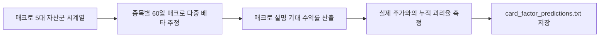

# 전략 16: 크로스에셋 레짐 다이버전스 (Cross-Asset Regime Divergence, CARD Factor)

## 1. 전략 개요 (Overview)
- **전략 ID**: `card_factor` (`card_score`)
- **전략 범주**: Macro Factor / Cross-Asset Divergence & Mean Reversion
- **목적**: 주식-원자재(WTI/Gold)-환율(USDKRW/DXY)-금리(US10Y) 간의 거시 경제적 상관관계 이탈 및 가격 괴리율(Divergence)을 측정하여, 매크로 펀더멘탈 대비 과도하게 눌린 종목의 역발상 매수 기회를 포착.
- **핵심 특징**:
  - **다중 자산 민감도(Macro Beta)**: 유가/환율/금리 변동에 대한 개별 주식의 60일 롤링 회귀 베타 산출.
  - **이론 균형가 대비 괴리도**: 매크로 팩터 모델이 설명하는 적정 가격 대비 실제 주가의 저평가 스프레드 측정.
  - **헤지 효과**: 환율 급등이나 원자재 쇼크 시 수혜를 받는 방어주/수출주 자동 선별.

---

## 2. 수학적 모델 및 수식 (Mathematical Formulation)

### 2.1 다중 자산 팩터 회귀 모델 (Multi-Asset Factor Regression)
종목 $i$의 수익률과 매크로 자산군 변화율 간의 다중 선형 회귀:
$$r_{i, t} = \alpha_i + \beta_{\text{FX}, i} \Delta \text{USD}_t + \beta_{\text{Oil}, i} \Delta \text{WTI}_t + \beta_{\text{Rate}, i} \Delta \text{US10Y}_t + \beta_{\text{Mkt}, i} r_{m, t} + \epsilon_{i, t}$$

### 2.2 거시 균형 괴리율 (Macro Imbalance Residual)
최근 20일간의 누적 잔차 합:
$$\text{Divergence}_i = \sum_{\tau=0}^{19} \epsilon_{i, t-\tau}$$

### 2.3 CARD 스코어링 (Contrarian Macro Score)
거시 환경 대비 주가가 과도하게 하락하여 $\text{Divergence}_i < -2\sigma$인 경우 높은 매수 점수 부여:
$$S_{\text{card}, i} = \text{clip}\left( 0.5 - \frac{\text{Divergence}_i}{3 \sigma_\epsilon}, 0.0, 1.0 \right)$$

---

## 3. 입력 데이터 및 매크로 지표 (Macro Dataset)

1. **환율**: 원/달러 환율 (`USDKRW`), 달러 인덱스 (`DXY`).
2. **원자재**: WTI 원유 선물, 금(Gold) 현물 가격.
3. **금리**: 미국 10년물 국채 금리 (`US10Y`), 한국 10년물 국고채 (`KTB10Y`).
4. **글로벌 지수**: S&P 500, 나스닥 100 지수.

---

## 4. 전체 동작 파이프라인 (Execution Workflow)

---

## 5. 2D 레짐별 기본 가중치

| 레짐 | 가중치 | 동작 특성 |
|---|---|---|
| **BEAR_HIGH_VOL** | 0.05 | 거시 쇼크 시 매크로 괴리 과대 낙폭주 반등 공략 (주력 레짐) |
| **SIDEWAYS_LOW_VOL** | 0.04 | 환율/유가 안정 국면 내 수혜주 차별화 |
| **BEAR_LOW_VOL** | 0.04 | 금리/환율 압박 속 방어주 선별 |
| **BULL_HIGH_VOL** | 0.03 | 인플레이션/원자재 랠리 연동주 포착 |
| **BULL_LOW_VOL** | 0.02 | 안정적 상승장에서는 매크로 영향력 미미 |

- **관련 소스 파일**: [`src/core/card_factor.py`](file:///d:/Finance/code/stock/trading_system/src/core/card_factor.py)
