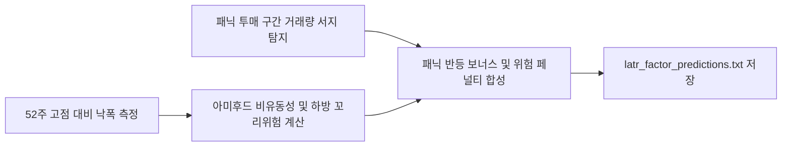

# 전략 17: 유동성 조정 꼬리위험 프리미엄 (LATR Factor)

## 1. 전략 개요 (Overview)
- **전략 ID**: `latr_factor` (`latr_score`)
- **전략 범주**: Risk-Premium Factor / Tail Risk & Liquidity Surge
- **목적**: 52주 최고가 대비 낙폭(Drawdown), 아미후드(Amihud) 비유동성 비율, 하방 왜도/꼬리위험(CVaR Penalty)을 결합하여, 과도한 패닉 투매(Panic Selling) 후 거래량 폭발과 함께 극단적 반등(Extreme Bounce)이 임박한 기회 종목을 선별.
- **핵심 특징**:
  - **단조 낙폭 점수 (Monotonic Drawdown Score)**: 목표 낙폭(Target Drawdown, 기본 35%) 기준 정규화.
  - **패닉 거래량 폭발 보너스 (Panic Bounce Bonus)**: 낙폭 $\ge 80\%$ 상태에서 거래량 2.5배 이상 서지 시 +0.12 추가 가점.
  - **비유동성 및 꼬리위험 페널티**: 유동성이 너무 낮아 호가 공백이 발생하거나 하방 두터운 꼬리(Fat Tail) 종목에 대한 감점 페널티.

---

## 2. 수학적 모델 및 수식 (Mathematical Formulation)

### 2.1 52주 고점 대비 낙폭 및 아미후드 비유동성 (Amihud Illiquidity)
$$\text{DD}_i = \frac{H_{52, i} - P_i}{H_{52, i}}$$
$$\text{DD\_Score}_i = \text{clip}\left( \frac{\text{DD}_i}{\max(0.01, \text{TargetDD})}, 0.0, 1.25 \right)$$
$$\text{Amihud}_i = \frac{1}{20}\sum_{\tau=0}^{19} \frac{|r_{i, t-\tau}|}{\text{Volume}_{i, t-\tau} \times P_{i, t-\tau}} \times 10^6$$

### 2.2 하방 꼬리위험 (Tail Risk / Expected Shortfall)
과거 60일 하위 5% 최악 수익률의 평균치:
$$\text{TailRisk}_i = \text{CVaR}_{0.05}(r_{i})$$

### 2.3 LATR 원시 점수 (Composite LATR Score)
$$\text{LATR\_Raw}_i = 0.40 \cdot \text{DD\_Score}_i + 0.35 \cdot \min(\text{VolSurge}_i, 3.0) - 0.15 \cdot |\text{TailRisk}_i| - 0.10 \cdot \min(\text{Amihud}_i, 2.0) + \text{Bonus}_i$$
여기서 $\text{Bonus}_i = 0.12 \text{ if } (\text{VolSurge} \ge 2.5 \text{ and } \text{DD\_Score} \ge 0.80) \text{ else } 0.0$.

### 2.4 스코어 정규화
$$S_{\text{latr}, i} = \text{clip}\left( \frac{\text{LATR\_Raw}_i - P_1}{P_{99} - P_1}, 0.0, 1.0 \right)$$

---

## 3. 입력 데이터 및 처리 방식 (Data Pipeline)

1. **252일 일봉 OHLCV**: 52주 최고가($H_{52}$), 거래대금, 일별 수익률 시계열.
2. **거래량 서지 지수**: 최근 3일 평균 거래량 / 60일 평균 거래량.
3. **안전성 필터**: 자본잠식 종목 및 관리종목 배제.

---

## 4. 전체 동작 파이프라인 (Execution Workflow)

---

## 5. 2D 레짐별 기본 가중치

| 레짐 | 가중치 | 동작 특성 |
|---|---|---|
| **BEAR_HIGH_VOL** | 0.05 | 극심한 패닉 투매 후 급반등 V자 포착 (주력 레짐) |
| **BEAR_LOW_VOL** | 0.04 | 지속적 낙폭과대 우량주 반등 선별 |
| **SIDEWAYS_LOW_VOL** | 0.04 | 박스권 하단 낙폭 과대주 매수 |
| **BULL_HIGH_VOL** | 0.03 | 단기 급조정 종목 반등 공략 |
| **BULL_LOW_VOL** | 0.03 | 상승장에서는 완만한 눌림목으로 작용 |

- **관련 소스 파일**: [`src/core/latr_factor.py`](file:///d:/Finance/code/stock/trading_system/src/core/latr_factor.py)
