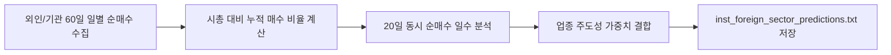

# 전략 18: 외인/기관 2개월 누적 수급 & 업종 주도성 (Inst & Foreign Sector Flow)

## 1. 전략 개요 (Overview)
- **전략 ID**: `inst_foreign_sector` (`inst_foreign_sector_score`)
- **전략 범주**: Institutional Flow / Cumulative Net Buying & Sector Leadership
- **목적**: 외국인 및 투신/사모펀드/연기금의 최근 40~60거래일(약 2~3개월) 누적 순매수 강도와 업종 내 주도주 상관성을 측정하여, 메이저 주포(Smart Money)의 중장기 매집 종목을 선별.
- **핵심 특징**:
  - **시가총액 대비 누적 순매수 비중 (Net Buy % of Market Cap)**: 소형주/대형주의 절대 금액 왜곡을 방지하기 위해 시가총액 대비 순매수 금액 비율 표준화.
  - **외인/기관 동반 순매수(쌍끌이 매수)**: 외국인과 기관이 동시에 순매수하는 일수 및 비중 가산점.
  - **수급 연속성(Consistency)**: 단발성 블록딜이 아닌 지속적인 분할 매집 패턴 검출.

---

## 2. 수학적 모델 및 수식 (Mathematical Formulation)

### 2.1 시총 대비 60일 누적 순매수 비율
종목 $i$의 시가총액 $\text{Cap}_i$, 최근 60일간 외국인 순매수 합 $F_{\text{For}, 60\text{d}}$, 기관 순매수 합 $F_{\text{Inst}, 60\text{d}}$:
$$\text{ForRatio}_i = \frac{F_{\text{For}, 60\text{d}, i}}{\text{Cap}_i}, \quad \text{InstRatio}_i = \frac{F_{\text{Inst}, 60\text{d}, i}}{\text{Cap}_i}$$

### 2.2 쌍끌이 매수 일수 비율 (Dual Net Buy Ratio)
최근 20거래일 중 외인과 기관이 동시 순매수한 일수 $N_{\text{dual}}$:
$$\text{DualRatio}_i = \frac{N_{\text{dual}, 20\text{d}}}{20}$$

### 2.3 수급 주도성 복합 점수
$$\text{RawScore}_i = 0.40 \cdot \text{Z}(\text{ForRatio}_i) + 0.35 \cdot \text{Z}(\text{InstRatio}_i) + 0.25 \cdot \text{DualRatio}_i$$
$$S_{\text{flow\_sec}, i} = \text{clip}\left( \frac{\text{RawScore}_i - \mu_{\text{mkt}}}{3 \sigma_{\text{mkt}}} \cdot 0.5 + 0.5, 0.0, 1.0 \right)$$

---

## 3. 입력 데이터 및 처리 방식 (Data Pipeline)

1. **한국 KRX 투자자별 매매동향**: 외국인, 기관합계, 투신, 연기금의 60일 일별 순매수 데이터.
2. **미국 시장 대용치**: 13F 기관 보유 지분 변동률 및 다크풀 누적 매수세.
3. **업종 매핑**: KRX 산업 분류별 누적 수급 집계.

---

## 4. 전체 동작 파이프라인 (Execution Workflow)

---

## 5. 2D 레짐별 기본 가중치

| 레짐 | 가중치 | 동작 특성 |
|---|---|---|
| **BULL_LOW_VOL** | 0.06 | 외인/기관 메이저 주도 추세장 최적화 (주력 레짐) |
| **BULL_HIGH_VOL** | 0.05 | 기관 매수세 쏠림 주도주 편승 |
| **SIDEWAYS_LOW_VOL** | 0.04 | 횡보장 속 스마트머니 매집주 포착 |
| **BEAR_LOW_VOL** | 0.03 | 메이저 수급 지지선 방어주 선별 |
| **BEAR_HIGH_VOL** | 0.02 | 전반적 외인 이탈장 시 비중 축소 |

- **관련 소스 파일**: [`src/core/inst_foreign_sector.py`](file:///d:/Finance/code/stock/trading_system/src/core/inst_foreign_sector.py)
