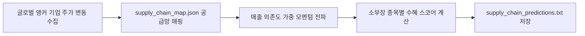

# 전략 19: 공급망 온기 전이 모멘텀 (Supply Chain Momentum)

## 1. 전략 개요 (Overview)
- **전략 ID**: `supply_chain` (`supply_chain_score`)
- **전략 범주**: Network Quantitative Factor / Value Chain Spillover
- **목적**: 전방 산업의 글로벌/국내 대표 대형주(Anchor Client, 예: Apple, Nvidia, TSMC, 삼성전자, 현대차)의 단기 주가 상승 모멘텀이 1~3일 시차를 두고 후방 소재/부품/장비(소부장) 밸류체인 기업으로 확산(Spillover)되는 온기 전이 효과를 포착.
- **핵심 특징**:
  - **공급망 지식 그래프 (Supply Chain Graph)**: 앵커 기업과 소부장 벤더 간의 납품 관계 맵(`supply_chain_map.json`) 구축.
  - **매출 의존도 가중치 (Revenue Dependency Weight)**: 전방 고객사향 매출 비중이 높을수록 높은 민감도 부여.
  - **시차 모멘텀 전파 (Lagged Momentum Propagation)**: 전방 고객사 1일/3일 누적 수익률을 공급망 엣지(Edge)를 통해 전파.

---

## 2. 수학적 모델 및 수식 (Mathematical Formulation)

### 2.1 전방 앵커 기업 모멘텀 신호
전방 대표기업 $A_k$의 1일 및 3일 수익률:
$$R_{A_k, \text{short}} = 0.6 \cdot r_{A_k, t} + 0.4 \cdot r_{A_k, t-1}$$

### 2.2 소부장 벤더의 공급망 수혜 점수 (Spillover Score)
종목 $i$의 전방 고객사 집합 $\mathcal{C}(i)$ 및 매출 의존도 가중치 $\alpha_{i, k}$:
$$\text{SupplyChainScore}_i = \sum_{k \in \mathcal{C}(i)} \alpha_{i, k} \cdot R_{A_k, \text{short}} \cdot \mathbb{I}(R_{A_k, \text{short}} > 0)$$
여기서 $\sum_k \alpha_{i, k} = 1.0$.

### 2.3 스코어 정규화
$$S_{\text{sc}, i} = \text{clip}\left( \frac{\text{SupplyChainScore}_i - \mu_{\text{mkt}}}{2.5 \sigma_{\text{mkt}}} \cdot 0.5 + 0.5, 0.0, 1.0 \right)$$

---

## 3. 공급망 맵 및 입력 데이터 (Supply Chain Mapping)

1. **글로벌 테크 공급망**:
   - **Nvidia 밸류체인**: SK하이닉스, 한미반도체, 이수페타시스, 대덕전자, Broadcom, TSMC 등
   - **Apple 밸류체인**: LG이노텍, LG디스플레이, BH, 하이비젼시스템, Foxconn 등
   - **Tesla/EV 밸류체인**: LG에너지솔루션, POSCO홀딩스, 에코프로비엠, 엘앤에프 등
   - **현대차/기아 밸류체인**: 현대모비스, 현대위아, 만도(HL만도), 화신, 에스엘 등
2. **가격 데이터**: 국내외 앵커 기업의 실시간/종가 수익률.

---

## 4. 전체 동작 파이프라인 (Execution Workflow)

---

## 5. 2D 레짐별 기본 가중치

| 레짐 | 가중치 | 동작 특성 |
|---|---|---|
| **BULL_LOW_VOL** | 0.05 | 대형주 랠리 후 소부장으로의 확산 최적 (주력 레짐) |
| **BULL_HIGH_VOL** | 0.05 | 테마/산업 생태계 동반 급등 포착 |
| **SIDEWAYS_LOW_VOL** | 0.04 | 특정 글로벌 호재 섹터 밸류체인 집중 공략 |
| **BEAR_LOW_VOL** | 0.02 | 전방 수요 둔화 우려 시 비중 축소 |
| **BEAR_HIGH_VOL** | 0.01 | 거시적 하락 시 개별 공급망 효과 둔화 |

- **관련 소스 파일**: [`src/core/supply_chain.py`](file:///d:/Finance/code/stock/trading_system/src/core/supply_chain.py)
