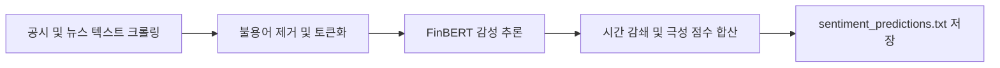

# 전략 20: NLP 공시/뉴스 감성 퀀트 (NLP Sentiment Catalyst)

## 1. 전략 개요 (Overview)
- **전략 ID**: `sentiment` (`sentiment_score`)
- **전략 범주**: NLP & AI Sentiment / Textual Quantitative Alpha
- **목적**: DART 전자공시 본문, SEC 8-K/10-Q 공시 텍스트, 주요 경제 뉴스 헤드라인 및 실적 요약문을 사전 학습된 금융 특화 언어 모델(FinBERT) 및 LLM 파이프라인으로 분석하여 호재/악재 감성 강도를 정량화.
- **핵심 특징**:
  - **금융 특화 FinBERT 분석**: 일반 텍스트가 아닌 금융 도메인 사전 학습 모델(Prosus / KR-FinBERT) 활용.
  - **3단계 감성 분류 및 신뢰도 가중치**: Positive, Neutral, Negative 확률 분포 산출.
  - **중대성 필터(Materiality Filter)**: 단순 반복 뉴스 배제, 투자 판단에 중대한 영향을 미치는 본문 텍스트 중심 스코어링.

---

## 2. 수학적 모델 및 수식 (Mathematical Formulation)

### 2.1 텍스트 감성 확률 벡터 (Sentiment Probability Vector)
문서 또는 문장 집합 $\mathcal{D}_i = \{d_1, d_2, \dots, d_K\}$에 대해 FinBERT 분류 확률:
$$\mathbf{p}(d) = [p_{\text{pos}}(d), p_{\text{neu}}(d), p_{\text{neg}}(d)]$$

### 2.2 문서별 순감성 지수 (Net Sentiment Polarity)
$$\text{Polarity}(d) = p_{\text{pos}}(d) - p_{\text{neg}}(d) \in [-1.0, +1.0]$$

### 2.3 시간 감쇄 및 중대성 가중 점수
뉴스/공시 $d$의 최신성 $t(d)$와 신뢰도 $c(d)$:
$$\text{SentRaw}_i = \sum_{d \in \mathcal{D}_i} \text{Polarity}(d) \cdot c(d) \cdot \exp(-\lambda \Delta t_d)$$
최종 스코어 정규화:
$$S_{\text{sent}, i} = \text{clip}\left( 0.5 + 0.25 \cdot \text{SentRaw}_i, 0.0, 1.0 \right)$$

---

## 3. 입력 데이터 및 처리 방식 (Data Pipeline)

1. **DART Open API 공시 요약**: 주요사항보고서, 실적공시, 수주공시 텍스트.
2. **SEC EDGAR 공시**: 8-K 중대 이벤트 공시 텍스트.
3. **네이버 금융 / 로이터 뉴스 헤드라인**: 최근 24~48시간 내 기업 관련 뉴스.

---

## 4. 전체 동작 파이프라인 (Execution Workflow)

---

## 5. 2D 레짐별 기본 가중치

| 레짐 | 가중치 | 동작 특성 |
|---|---|---|
| **BULL_HIGH_VOL** | 0.04 | 시장 관심 집중 시 긍정적 뉴스 모멘텀 가속 |
| **SIDEWAYS_LOW_VOL** | 0.04 | 개별 기업 호재 뉴스에 대한 높은 주가 민감도 |
| **BULL_LOW_VOL** | 0.03 | 안정적 상승장 내 실적/수주 텍스트 긍정 평가 |
| **BEAR_LOW_VOL** | 0.03 | 악재성 공시 종목 사전 배제 효과 |
| **BEAR_HIGH_VOL** | 0.02 | 거시적 패닉 시 텍스트 감성 지표 신뢰도 저하 반영 |

- **관련 소스 파일**: [`src/core/llm_sentiment_engine.py`](file:///d:/Finance/code/stock/trading_system/src/core/llm_sentiment_engine.py), [`src/ai/ml_strategy_adapters.py`](file:///d:/Finance/code/stock/trading_system/src/ai/ml_strategy_adapters.py)
