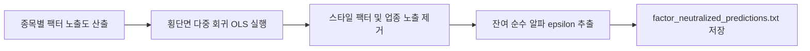

# 전략 21: 멀티팩터 스타일 중립화 순수 알파 (Multi-Factor Style Neutralizer)

## 1. 전략 개요 (Overview)
- **전략 ID**: `factor_neutralized` (`factor_neutralized_score`)
- **전략 범주**: Factor Neutralization / Pure Alpha Extraction
- **목적**: 파마-프렌치 5-팩터(Fama-French 5-Factor: 시장, 시가총액, 밸류, 수익성, 투자 성향) 및 업종(Industry) 공통 위험 요인 노출도를 다중 회귀로 직교화(Orthogonalization)하여 제거함으로써, 스타일 편향 없는 순수 잔여 알파(Idiosyncratic Pure Alpha)를 추출.
- **핵심 특징**:
  - **Fama-French 5-Factor + Momentum 노출 통제**: $R_m - R_f$, SMB, HML, RMW, CMA, WML 팩터 동시 통제.
  - **섹터 중립화 (Sector Neutralization)**: 업종 더미 변수를 포함하여 특정 섹터 쏠림 방지.
  - **직교 잔차 알파 (Orthogonal Residual Alpha)**: 스타일 팩터의 변동성을 배제한 기업 고유 알파 획득.

---

## 2. 수학적 모델 및 수식 (Mathematical Formulation)

### 2.1 팩터 횡단면 회귀 모델 (Cross-Sectional Factor Regression)
종목 $i$의 원시 앙상블 기대수익률 또는 실현수익률 $r_{i}$:
$$r_i = \alpha_i + \beta_{\text{size}} \text{Size}_i + \beta_{\text{value}} \text{Value}_i + \beta_{\text{prof}} \text{Prof}_i + \beta_{\text{inv}} \text{Inv}_i + \beta_{\text{mom}} \text{Mom}_i + \sum_{s} \gamma_s \text{Sector}_{s, i} + \epsilon_i$$

### 2.2 스타일 잔차(Residual) 순수 알파
$$\alpha_{\text{pure}, i} = \epsilon_i = r_i - \hat{r}_i(\mathbf{F})$$
스타일 팩터 $\mathbf{F}$의 선형 결합으로 설명되는 기대수익률 $\hat{r}_i$를 차감.

### 2.3 스코어 정규화
$$S_{\text{neutral}, i} = \text{clip}\left( \frac{\alpha_{\text{pure}, i} - \mu_\epsilon}{3 \sigma_\epsilon} \cdot 0.5 + 0.5, 0.0, 1.0 \right)$$

---

## 3. 입력 데이터 및 팩터 정의 (Data & Factor Exposures)

1. **Size (SMB)**: $\ln(\text{MarketCap})$.
2. **Value (HML)**: $\text{Book-to-Market Ratio} = \text{BPS} / P$.
3. **Profitability (RMW)**: 영업이익 / 자기자본 (Operating Profitability).
4. **Investment (CMA)**: 총자산 증가율 (Asset Growth Rate).
5. **Momentum (WML)**: 12M-1M 누적 수익률.
6. **Sector Dummies**: 원-핫 인코딩된 업종 분류.

---

## 4. 전체 동작 파이프라인 (Execution Workflow)

---

## 5. 2D 레짐별 기본 가중치

| 레짐 | 가중치 | 동작 특성 |
|---|---|---|
| **SIDEWAYS_LOW_VOL** | 0.05 | 스타일 팩터 노이즈가 제거된 개별 알파 발굴 최적 |
| **BULL_LOW_VOL** | 0.04 | 안정적 상승장 속 순수 알파 기여 |
| **BEAR_LOW_VOL** | 0.04 | 시장 급변 시 스타일 왜곡 방어 |
| **BULL_HIGH_VOL** | 0.03 | 강한 스타일 랠리 장세 대비 보조 역할 |
| **BEAR_HIGH_VOL** | 0.02 | 전체 시장 급락 시 잔차 분산 확대 반영 |

- **관련 소스 파일**: [`src/core/multi_factor_neutralizer.py`](file:///d:/Finance/code/stock/trading_system/src/core/multi_factor_neutralizer.py)
