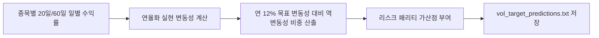

# 전략 22: 동적 변동성 타겟팅 및 리스크 파리티 (Dynamic Volatility Targeting)

## 1. 전략 개요 (Overview)
- **전략 ID**: `vol_target` (`vol_target_score`)
- **전략 범주**: Risk Management / Volatility Targeting & Risk Parity
- **목적**: 종목의 실현 변동성(Realized Volatility)과 시장 전체의 목표 변동성(연율화 12%)을 비교하여, 저변동성 고안정 종목에 최적 레버리지 가산점을 부여하고 고변동성 위험 종목의 비중을 축소(Inverse Volatility Scaling)하는 리스크 패리티 점수를 산출.
- **핵심 특징**:
  - **연율화 12% 타겟팅**: 목표 변동성 $\sigma_{\text{target}} = 12\%$ 기준 동적 비중 조절.
  - **하방 변동성(Downside Semi-Variance) 우대**: 단순 변동성이 아닌 하락 시 변동성에 더 큰 페널티 부과.
  - **포트폴리오 리스크 예산 균등화**: 개별 종목의 리스크 기여도(Risk Contribution) 평탄화.

---

## 2. 수학적 모델 및 수식 (Mathematical Formulation)

### 2.1 20일 실현 변동성 산출 (Annualized Realized Volatility)
일별 로그 수익률 $r_t = \ln(P_t / P_{t-1})$에 대해:
$$\sigma_{i, 20\text{d}} = \sqrt{252} \times \sqrt{\frac{1}{19}\sum_{\tau=0}^{19} (r_{i, t-\tau} - \bar{r}_i)^2}$$

### 2.2 목표 변동성 스케일링 계수 (Target Scaling Factor)
$$\text{ScaleFactor}_i = \frac{\sigma_{\text{target}}}{\max(\sigma_{i, 20\text{d}}, 0.05)}$$
(여기서 $\sigma_{\text{target}} = 0.12$, 최대 스케일링 상한 2.0x, 하한 0.2x 적용)

### 2.3 볼 타겟 스코어 정규화
안정적 변동성을 유지하면서도 기대수익률이 우수한 종목에 높은 점수 부여:
$$S_{\text{vol\_target}, i} = \text{clip}\left( \frac{\text{ScaleFactor}_i - 0.2}{1.8}, 0.0, 1.0 \right)$$

---

## 3. 입력 데이터 및 처리 방식 (Data Pipeline)

1. **최근 60일 일봉 종가 데이터**: 20일/60일 실현 변동성 및 하방 변동성 계산.
2. **시장 전체 변동성 지표**: VIX 및 VKOSPI 레벨 연동.
3. **이상치 필터**: 거래정지 후 재개 등으로 인한 비정상 변동성 평활화.

---

## 4. 전체 동작 파이프라인 (Execution Workflow)

---

## 5. 2D 레짐별 기본 가중치

| 레짐 | 가중치 | 동작 특성 |
|---|---|---|
| **BEAR_HIGH_VOL** | 0.05 | 고변동 하락장 속 리스크 축소 및 저변동 방어주 필수 (주력 레짐) |
| **BEAR_LOW_VOL** | 0.04 | 하락장 내 포트폴리오 변동성 통제 |
| **SIDEWAYS_LOW_VOL** | 0.03 | 안정적 변동성 관리 |
| **BULL_LOW_VOL** | 0.03 | 강세장 안정적 비중 배분 |
| **BULL_HIGH_VOL** | 0.02 | 공격적 랠리 시 모멘텀에 우선순위 양보 |

- **관련 소스 파일**: [`src/core/vol_target.py`](file:///d:/Finance/code/stock/trading_system/src/core/vol_target.py)
