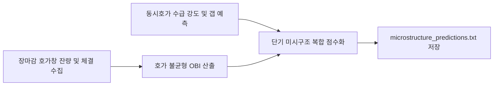

# 전략 23: 미시구조 호가 불균형 및 오버나이트 갭 (Microstructure Imbalance)

## 1. 전략 개요 (Overview)
- **전략 ID**: `microstructure` (`microstructure_score`)
- **전략 범주**: Market Microstructure / Order Book & Overnight Gap
- **목적**: 장 마감 동시호가 체결 수급, 호가창 매수/매도 잔량 불균형(Order Book Imbalance, OBI), 익일 시가 갭(Overnight Gap) 예측 강도를 분석하여 장마감 및 초단기 유동성 우위 종목을 선별.
- **핵심 특징**:
  - **호가 불균형 (Order Book Depth Imbalance)**: 최우선 5단계 매수 잔량 합 vs 매도 잔량 합의 비대칭성 측정.
  - **종가 동시호가 집중도 (Closing Auction Flow)**: 하루 전체 거래량 중 장마감 10분 동시호가 체결 비중 및 가격 상승 압력 분석.
  - **오버나이트 갭 모멘텀**: 미국 시장의 야간 선물/환율 변동에 연동된 익일 시초가 갭상승 예측.

---

## 2. 수학적 모델 및 수식 (Mathematical Formulation)

### 2.1 호가 잔량 불균형 (Order Book Imbalance, OBI)
$K=5$단계 매수 잔량 $V_{\text{bid}, k}$ 및 매도 잔량 $V_{\text{ask}, k}$:
$$\text{OBI} = \frac{\sum_{k=1}^K V_{\text{bid}, k} - \sum_{k=1}^K V_{\text{ask}, k}}{\sum_{k=1}^K V_{\text{bid}, k} + \sum_{k=1}^K V_{\text{ask}, k}} \in [-1.0, +1.0]$$

### 2.2 종가 동시호가 수급 강도 (Auction Power)
동시호가 체결량 $V_{\text{close}}$, 당일 총 거래량 $V_{\text{total}}$, 동시호가 주가 변동률 $\Delta P_{\text{close}}$:
$$\text{AuctionScore} = \frac{V_{\text{close}}}{V_{\text{total}}} \times \text{sign}(\Delta P_{\text{close}}) \times 100$$

### 2.3 복합 미시구조 점수
$$\text{RawScore}_i = 0.50 \cdot \text{OBI}_i + 0.35 \cdot \text{Sigmoid}(\text{AuctionScore}_i) + 0.15 \cdot \text{OvernightGapPredict}_i$$
$$S_{\text{micro}, i} = \text{clip}(0.5 + 0.4 \cdot \text{RawScore}_i, 0.0, 1.0)$$

---

## 3. 입력 데이터 및 처리 방식 (Data Pipeline)

1. **호가창 및 틱 데이터**: 매수/매도 5호가 잔량 시계열 (KRX 및 미국 ECN).
2. **장마감 동시호가 데이터**: 15:20~15:30 체결 데이터.
3. **오버나이트 변수**: E-mini S&P 선물, 야간 NDF 원/달러 환율 변동.

---

## 4. 전체 동작 파이프라인 (Execution Workflow)

---

## 5. 2D 레짐별 기본 가중치

| 레짐 | 가중치 | 동작 특성 |
|---|---|---|
| **BULL_HIGH_VOL** | 0.04 | 호가 쏠림과 강력한 익일 시가 갭 포착 |
| **SIDEWAYS_LOW_VOL** | 0.04 | 장마감 수급 유입 세력주 탐지 |
| **BULL_LOW_VOL** | 0.03 | 안정적 매수 잔량 우위 추종 |
| **BEAR_HIGH_VOL** | 0.03 | 패닉 동시호가 투매 후 반등 갭 공략 |
| **BEAR_LOW_VOL** | 0.02 | 유동성 부족 환경 영향 최소화 |

- **관련 소스 파일**: [`src/core/microstructure.py`](file:///d:/Finance/code/stock/trading_system/src/core/microstructure.py), [`src/data_layer/overnight_gap_shifter.py`](file:///d:/Finance/code/stock/trading_system/src/data_layer/overnight_gap_shifter.py)
