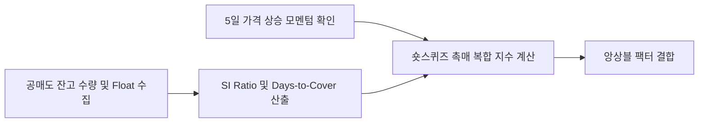

# 전략 25: 공매도 잔고 및 숏스퀴즈 촉매 (Short Interest & Squeeze)

## 1. 전략 개요 (Overview)
- **전략 ID**: `short_squeeze` (`short_squeeze_score`)
- **전략 범주**: Flow Anomaly / Short Interest & Days-to-Cover
- **목적**: 유통주식수 대비 공매도 잔고 비율(Short Interest % of Float)이 높고, 상환에 필요한 일수(Days-to-Cover, DTC)가 긴 상태에서 단기 주가 상승 모멘텀이 발생할 때 폭발적인 숏커버링(Short Covering) 및 숏스퀴즈(Short Squeeze) 랠리를 포착.
- **핵심 특징**:
  - **3대 숏스퀴즈 핵심 지표 결합**: Short Interest % of Float, Days-to-Cover (DTC), 단기 5일 모멘텀.
  - **스퀴즈 임계점(Threshold Gating)**: 공매도 잔고율 $\ge 5\%$ 및 DTC $\ge 3.0$일 충족 시 스퀴즈 촉매 발동.
  - **한국/미국 시장 공매도 데이터 정합**: KRX 공매도 잔고 공시(T+2) 및 미국 FINRA/SEC 공매도 데이터 반영.

---

## 2. 수학적 모델 및 수식 (Mathematical Formulation)

### 2.1 공매도 잔고 비율 및 Days-to-Cover (DTC)
유동주식수 $\text{Float}_i$, 공매도 잔고 수량 $\text{ShortShares}_i$, 20일 평균 일일 거래량 $\text{ADTV}_{20, i}$:
$$\text{SI\_Ratio}_i = \frac{\text{ShortShares}_i}{\text{Float}_i}$$
$$\text{DTC}_i = \frac{\text{ShortShares}_i}{\text{ADTV}_{20, i}}$$

### 2.2 숏스퀴즈 촉매 강도 (Squeeze Catalyst Trigger)
최근 5일간 주가 상승률 $R_{5\text{d}, i}$:
$$\text{SqueezeFactor}_i = \text{SI\_Ratio}_i \times \text{DTC}_i \times \max(0.0, R_{5\text{d}, i} + 0.05)$$

### 2.3 스코어 정규화
$$S_{\text{squeeze}, i} = \text{Sigmoid}\left( \frac{\text{SqueezeFactor}_i - \mu_{\text{mkt}}}{\sigma_{\text{mkt}}} \right) \in [0.0, 1.0]$$

---

## 3. 입력 데이터 및 처리 방식 (Data Pipeline)

1. **KRX 공매도 잔고 통계**: 종목별 공매도 잔고 수량, 금액, 비중.
2. **미국 FINRA / yfinance Short Metrics**: Short % of Float, Short Ratio.
3. **일평균 거래량 및 유동주식수**: 시계열 결합.

---

## 4. 전체 동작 파이프라인 (Execution Workflow)

---

## 5. 2D 레짐별 기본 가중치

| 레짐 | 가중치 | 동작 특성 |
|---|---|---|
| **BULL_HIGH_VOL** | 0.05 | 강세 고변동장에서 폭발적인 숏스퀴즈 발생 빈도 최고 |
| **BULL_LOW_VOL** | 0.04 | 점진적 숏커버링 유입 랠리 |
| **SIDEWAYS_LOW_VOL** | 0.03 | 개별주 깜짝 실적 후 숏스퀴즈 |
| **BEAR_HIGH_VOL** | 0.02 | 약세장에서는 공매도 압력 지속으로 주의 |
| **BEAR_LOW_VOL** | 0.01 | 하락 추세 시 신호 신뢰도 축소 |

- **관련 소스 파일**: [`src/core/short_interest_squeeze.py`](file:///d:/Finance/code/stock/trading_system/src/core/short_interest_squeeze.py)
