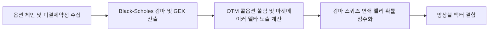

# 전략 28: 감마 스퀴즈 및 델타 가속도 (Gamma Squeeze & Delta Acceleration)

## 1. 전략 개요 (Overview)
- **전략 ID**: `gamma_squeeze` (`gamma_squeeze_score`)
- **전략 범주**: Derivatives Dynamics / Market Maker Hedging Squeeze
- **목적**: 대규모 콜 옵션 매수 유입 시 옵션 시장조성자(Market Makers)가 델타 중립(Delta-Neutral)을 유지하기 위해 기초자산 주식을 기계적으로 추격 매수해야 하는 감마 스퀴즈(Gamma Squeeze) 메커니즘을 포착.
- **핵심 특징**:
  - **Net Delta Exposure & Gamma Exposure (GEX)**: 행사가별 미결제약정과 감마($\Gamma = \frac{\partial^2 C}{\partial S^2}$)를 곱한 총 감마 노출도 산출.
  - **콜 미결제약정 집중도 (Call OI Concentration)**: 외가격(OTM) 콜 옵션 행사가에 미결제약정이 집중된 핀(Pin) 구간 탐지.
  - **급등 가속도 피드백 루프**: 주가 상승 $\to$ 델타 증가 $\to$ 마켓메이커 현물 매수 $\to$ 주가 추가 상승의 연쇄 작용 포착.

---

## 2. 수학적 모델 및 수식 (Mathematical Formulation)

### 2.1 총 감마 노출도 (Net Gamma Exposure, GEX)
각 행사가 $K$, 만기 $T$에 대한 콜 감마 $\Gamma_{\text{call}, K}$, 풋 감마 $\Gamma_{\text{put}, K}$, 미결제약정 $\text{OI}$:
$$\text{GEX} = \sum_K \left( \text{OI}_{\text{call}, K} \cdot \Gamma_{\text{call}, K} - \text{OI}_{\text{put}, K} \cdot \Gamma_{\text{put}, K} \right) \times S^2 \times 100$$

### 2.2 콜 옵션 거래량 가속도 (Call Volume Acceleration)
$$\text{CallVolAcc}_i = \frac{\text{CallVolume}_{t, i}}{\text{AvgCallVolume}_{20\text{d}, i} + \epsilon}$$

### 2.3 감마 스퀴즈 발동 점수 (Gamma Squeeze Trigger)
$$\text{GammaScore}_i = \min\left(1.0, 0.40 \cdot \text{Z}(\text{GEX}_i) + 0.40 \cdot \text{Sigmoid}(\text{CallVolAcc}_i - 2.0) + 0.20 \cdot \mathbb{I}(P \approx K_{\text{max\_OI}})\right)$$
$$S_{\text{gamma}, i} = \text{clip}(\text{GammaScore}_i, 0.0, 1.0)$$

---

## 3. 입력 데이터 및 처리 방식 (Data Pipeline)

1. **미국 시장**: yfinance / CBOE 개별 주식 옵션 체인의 행사가별 Volume, Open Interest, Implied Volatility.
2. **블랙-숄즈 그릭스(Greeks) 엔진**: 실시간 주가와 만기일을 바탕으로 $\Delta, \Gamma$ 수치 계산.
3. **한국 시장 대용치**: 개별주식 선물 미결제약정 급증 및 외인 콜옵션 순매수 연동.

---

## 4. 전체 동작 파이프라인 (Execution Workflow)

---

## 5. 2D 레짐별 기본 가중치

| 레짐 | 가중치 | 동작 특성 |
|---|---|---|
| **BULL_HIGH_VOL** | 0.05 | 고변동 강세장에서 감마 스퀴즈 빈도 및 탄력 최고 (주력 레짐) |
| **BULL_LOW_VOL** | 0.04 | 상승장 옵션 매수세 유입 추종 |
| **SIDEWAYS_LOW_VOL** | 0.03 | 개별 실적주 콜옵션 집중 포착 |
| **BEAR_HIGH_VOL** | 0.01 | 하락장에서는 풋 감마 하방 압력으로 작용 |
| **BEAR_LOW_VOL** | 0.01 | 약세장 시그널 제한 |

- **관련 소스 파일**: [`src/core/gamma_squeeze.py`](file:///d:/Finance/code/stock/trading_system/src/core/gamma_squeeze.py)
