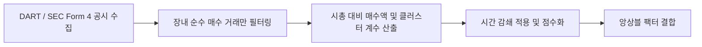

# 전략 29: 대주주 및 임원 내부자 매수 (Insider Buying)

## 1. 전략 개요 (Overview)
- **전략 ID**: `insider_buying` (`insider_buying_score`)
- **전략 범주**: Information Advantage / Corporate Insider Filings
- **목적**: 기업의 대표이사, 등기임원, 최대주주 등 내부자(Insiders)의 장내 직접 지분 매수(Form 4, 임원/주요주주 특정증권등 소유상황보고서)를 포착하여 내부자가 자기 자금으로 자사 주식을 매입하는 강력한 저평가/자신감 시그널을 수량화.
- **핵심 특징**:
  - **직접 장내 매수(Open Market Purchase)만 선별**: 스톡옵션 행사나 증여/상속이 아닌 순수 장내 매수 거래만 필터링.
  - **매수 규모 및 지분율 비중 가중치 (Purchase Value % of Market Cap)**: 매수 총액 및 지분 변동률이 클수록 높은 점수 부여.
  - **다수 내부자 집단 매수 (Cluster Buying)**: 복수의 임원/대주주가 동시 매수할 때 가산점.

---

## 2. 수학적 모델 및 수식 (Mathematical Formulation)

### 2.1 시총 대비 내부자 매수 강도 (Insider Purchase Ratio)
최근 30일간 내부자 순 장내매수 금액 $\text{NetBuyAmount}_i$, 시가총액 $\text{MarketCap}_i$:
$$\text{InsiderRatio}_i = \frac{\text{NetBuyAmount}_i}{\text{MarketCap}_i}$$

### 2.2 클러스터 매수 계수 (Cluster Factor)
최근 30일 내 매수에 참여한 고유 내부자 수 $N_{\text{insiders}}$:
$$\text{ClusterFactor}_i = 1.0 + 0.2 \cdot \min(N_{\text{insiders}} - 1, 5)$$

### 2.3 시간 감쇄 및 최종 점수
이벤트 경과일 $d$에 대해 $T_{1/2} = 20$일 감쇄 적용:
$$\text{InsiderRaw}_i = \text{InsiderRatio}_i \times \text{ClusterFactor}_i \times \exp\left(-\frac{\ln 2}{20} \cdot d\right)$$
$$S_{\text{insider}, i} = \text{clip}\left( 0.5 + 0.5 \cdot \text{Sigmoid}(\text{Z}(\text{InsiderRaw}_i)), 0.0, 1.0 \right)$$

---

## 3. 입력 데이터 및 처리 방식 (Data Pipeline)

1. **한국 DART 임원/주요주주 소유보고서**: 취득방법 '장내매수' 필터링.
2. **미국 SEC Form 4**: Transaction Code `P` (Open market or private purchase) 데이터 수집.
3. **매도 공시 페널티**: 대주주 대량 장내 매도 발생 시 감점 처리.

---

## 4. 전체 동작 파이프라인 (Execution Workflow)

---

## 5. 2D 레짐별 기본 가중치

| 레짐 | 가중치 | 동작 특성 |
|---|---|---|
| **BEAR_LOW_VOL** | 0.05 | 하락장에서 내부자 매수는 바닥 신호의 최고 신뢰도 (주력 레짐) |
| **SIDEWAYS_LOW_VOL** | 0.04 | 횡보 국면 내 강력한 실적 반등 예고 |
| **BEAR_HIGH_VOL** | 0.04 | 패닉 투매 시 대주주 책임경영 매수 포착 |
| **BULL_LOW_VOL** | 0.03 | 중기적 성장 확신 공유 |
| **BULL_HIGH_VOL** | 0.02 | 상승 과열장 대비 보조 지표 |

- **관련 소스 파일**: [`src/core/insider_buying.py`](file:///d:/Finance/code/stock/trading_system/src/core/insider_buying.py)
