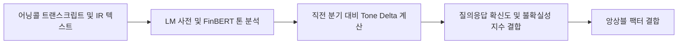

# 전략 30: 어닝콜 경영진 텍스트 톤 변화 (Earnings Tone Drift)

## 1. 전략 개요 (Overview)
- **전략 ID**: `earnings_tone_drift` (`earnings_tone_drift_score`)
- **전략 범주**: NLP & Text Mining / Management Tone Shift & Sentiment Drift
- **목적**: 실적 발표 콘퍼런스콜(Earnings Conference Call)의 경영진 발언(Prepared Remarks) 및 질의응답(Q&A) 세션 텍스트에서 경영진의 어조 변화(Tone Drift: 확신, 불확실성, 낙관, 방어적 태도)를 계량화하여 향후 주가 표류 알파를 획득.
- **핵심 특징**:
  - **직전 분기 대비 톤 변화율 (Tone Delta)**: 단순 감성이 아닌 전기 대비 긍정 어조 증가율($\Delta \text{Tone} = \text{Tone}_t - \text{Tone}_{t-1}$) 추적.
  - **경영진 vs 애널리스트 Q&A 괴리**: 애널리스트의 날카로운 질문에 대한 경영진의 답변 확신도(Certainty Score) 측정.
  - **불확실성 단어 빈도(Loughran-McDonald Dictionary)**: 불확실/위험 어휘 비중 감소 시 가산점.

---

## 2. 수학적 모델 및 수식 (Mathematical Formulation)

### 2.1 톤 점수 산출 (Loughran-McDonald Financial Sentiment)
긍정 단어 수 $N_{\text{pos}}$, 부정 단어 수 $N_{\text{neg}}$, 불확실성 단어 수 $N_{\text{unc}}$, 총 단어 수 $N_{\text{total}}$:
$$\text{Tone}_t = \frac{N_{\text{pos}} - N_{\text{neg}} - 0.5 \cdot N_{\text{unc}}}{N_{\text{total}} + 1}$$

### 2.2 톤 변화율 (Tone Drift Delta)
$$\Delta \text{Tone} = \text{Tone}_{t} - \text{Tone}_{t-1}$$

### 2.3 어닝 톤 드리프트 스코어
$$\text{ToneRaw}_i = 0.6 \cdot \text{Z}(\Delta \text{Tone}_i) + 0.4 \cdot \text{Z}(\text{Tone}_{t, i})$$
$$S_{\text{tone}, i} = \text{clip}\left( \frac{\text{ToneRaw}_i - \mu_{\text{mkt}}}{3 \sigma_{\text{mkt}}} \cdot 0.5 + 0.5, 0.0, 1.0 \right)$$

---

## 3. 입력 데이터 및 처리 방식 (Data Pipeline)

1. **미국 시장**: Seeking Alpha / SEC 8-K 및 Form 10-Q 어닝콜 트랜스크립트 텍스트.
2. **한국 시장**: 상장사 실적발표회 IR 자료 텍스트 및 DART 영업실적 등에 대한 전망 공시 텍스트.
3. **금융 특화 사전 및 FinBERT 톤 분류기**: 결합 파이프라인.

---

## 4. 전체 동작 파이프라인 (Execution Workflow)

---

## 5. 2D 레짐별 기본 가중치

| 레짐 | 가중치 | 동작 특성 |
|---|---|---|
| **BULL_LOW_VOL** | 0.04 | 경영진 톤 호전에 따른 장기 완만한 드리프트 상승 |
| **SIDEWAYS_LOW_VOL** | 0.04 | 실적 발표 후 경영진 가이던스 변화 차별화 |
| **BULL_HIGH_VOL** | 0.03 | 호실적 컨콜 급등 추종 |
| **BEAR_LOW_VOL** | 0.03 | 방어적/불확실성 어조 종목 사전 차단 |
| **BEAR_HIGH_VOL** | 0.02 | 거시 변수 우선 국면 시 비중 축소 |

- **관련 소스 파일**: [`src/core/earnings_tone_drift.py`](file:///d:/Finance/code/stock/trading_system/src/core/earnings_tone_drift.py)
