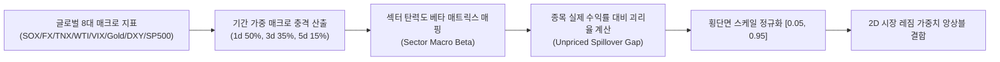

# 전략 32: 크로스에셋 거시 파급 모멘텀 (Cross-Asset Spillover Momentum)

## 1. 전략 개요 (Overview)
- **전략 ID**: `cross_asset_spillover` (`cross_asset_spillover_score`)
- **전략 범주**: Global Macro Impulses & Sector Elasticity Spillover Diffusion
- **목적**: 글로벌 거시 핵심 동인(반도체 지수 SOX, 달러/원 환율 USDKRW, 미국 10년물 국채금리 TNX, 유가 WTI, 변동성 VIX, 금 Gold, 달러 인덱스 DXY, S&P 500)의 급격한 가격 변화가 한국 및 미국 업종별 대표주에 미치는 파급 효과를 포착하고, 아직 개별 주가에 완전히 반영되지 않은(Unpriced) 시차 지연(Lead-Lag) 알파를 선취.
- **핵심 특징**:
  - **업종별 거시 탄력도 벡터 (Sector Macro Elasticity Vector)**: 15개 이상 세부 섹터(반도체, IT, 에너지, 화학, 금융, 방산, 조선, 자동차, 헬스케어 등)에 대해 8대 글로벌 거시 변수에 대한 사전 추정 민감도($\beta_{s,k}$)를 부여.
  - **글로벌 매크로 임펄스 (Global Macro Impulse)**: 1일/3일/5일 누적 거시 팩터 충격의 가중합을 계산하여 업종별 기대 수익률 임팩트를 산출.
  - **미가격 파급 확산도 (Unpriced Spillover Gap)**: 거시 팩터가 제시하는 기대 변동폭 대비 개별 종목의 실제 주가 반응 간의 괴리($\text{MacroImpulse}_s - R_{i,t}$)를 산출하여 저평가 지연 수혜주를 매수.

---

## 2. 수학적 모델 및 수식 (Mathematical Formulation)

### 2.1 글로벌 매크로 충격 벡터 (Global Macro Impulse Vector)
8대 글로벌 거시 변수 $M \in \{\text{SOX}, \text{USDKRW}, \text{WTI}, \text{TNX}, \text{VIX}, \text{Gold}, \text{DXY}, \text{SP500}\}$에 대해 기간 가중 수익률 $\Delta M_k$:
$$\Delta M_k = 0.50 \cdot r_{k, 1d} + 0.35 \cdot r_{k, 3d} + 0.15 \cdot r_{k, 5d}$$

### 2.2 섹터 기대 매크로 임팩트 (Sector Macro Elasticity)
해당 종목이 속한 업종 $s$의 거시 탄력도 계수 $\beta_{s,k}$:
$$\text{MacroImpulse}_s = \sum_{k=1}^{8} \beta_{s,k} \cdot \Delta M_k$$

### 2.3 개별 종목 미반영 괴리율 및 점수화 (Unpriced Spillover Alpha)
종목 $i$의 최근 $N$일 누적 수익률 $R_{i}$:
$$\text{SpilloverGap}_i = \text{MacroImpulse}_{s(i)} - R_{i}$$
$$\text{RawScore}_i = \text{MacroImpulse}_{s(i)} + 0.6 \cdot \text{SpilloverGap}_i$$
$$S_{\text{cross\_asset\_spillover}, i} = \text{clip}\left( \frac{\text{RawScore}_i - \mu_{\text{mkt}}}{3 \sigma_{\text{mkt}}} \cdot 0.5 + 0.5, 0.05, 0.95 \right)$$

---

## 3. 입력 데이터 및 처리 방식 (Data Pipeline)

1. **글로벌 거시 시계열**: `market_indicators.db`에 저장된 SOX, USDKRW, WTI, TNX, VIX, Gold, DXY, SP500 일별 종가 시계열.
2. **섹터 분류 메타데이터**: GICS / KRX 표준 업종 분류 코드.
3. **개별 종목 OHLCV**: 20일 이상 일별 수정주가 데이터.

---

## 4. 전체 동작 파이프라인 (Execution Workflow)

---

## 5. 2D 레짐별 기본 가중치

| 레짐 | 가중치 | 동작 특성 |
|---|---|---|
| **BULL_LOW_VOL** | 0.03 | 매크로 순풍(SOX 강세, 수출주 환율 우호) 환경 지속성 반영 |
| **BULL_HIGH_VOL** | 0.02 | 고변동성 국면 매크로 오버슈팅 종목 필터링 |
| **SIDEWAYS_LOW_VOL** | 0.03 | 매크로 변수에 따른 섹터 순환매 시차 공략 (주력 레짐) |
| **SIDEWAYS_HIGH_VOL** | 0.02 | 변동성 장세 단기 매크로 충격 신속 반영 |
| **BEAR_LOW_VOL** | 0.02 | 금리/환율 역풍 취약 업종 회피 및 방어 섹터 선별 |
| **BEAR_HIGH_VOL** | 0.01 | 유동성 위기 국면 비중 축소 |

- **관련 소스 파일**: [`src/core/cross_asset_spillover.py`](file:///d:/Finance/code/stock/trading_system/src/core/cross_asset_spillover.py)
