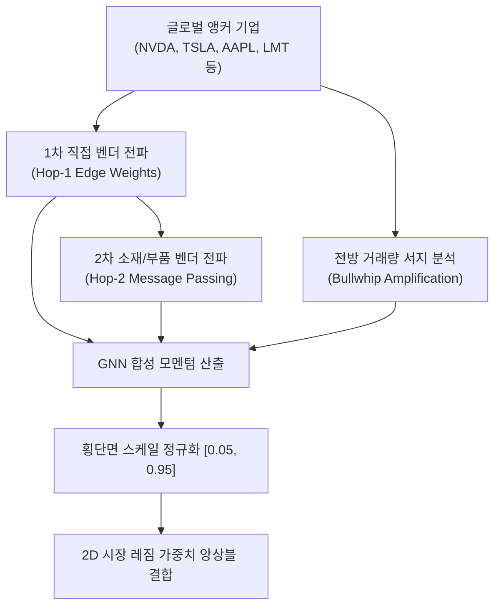

# 전략 33: 공급망 GNN 및 섹터 플로우 다이내믹스 (Supply Chain GNN & Sector Flow)

## 1. 전략 개요 (Overview)
- **전략 ID**: `supply_chain_gnn` (`supply_chain_gnn_score`)
- **전략 범주**: Relational Graph Neural Network & Bullwhip Shock Amplification
- **목적**: 글로벌 빅테크 및 전방 앵커 기업(NVIDIA, Apple, Tesla, TSMC 등)과 국내외 핵심 벤더/부품/장비 공급사 간의 관계형 다중 홉(Multi-Hop) 가치사슬 그래프에서 발생하는 수익률 전파 및 비선형 채찍효과(Bullwhip Effect) 온기 전이를 정밀 추적.
- **핵심 특징**:
  - **2-홉 관계형 그래프 메시지 패싱 (2-Hop Relational Graph Message Passing)**: 1차 직접 공급사뿐만 아니라 2차 소재/장비 공급사까지 단계별 전이 가중치를 감쇠 적용하여 전파.
  - **비선형 채찍효과 증폭 (Bullwhip Shock Amplification)**: 최종 완제품 수요의 변동이 공급망 상류(Upstream)로 갈수록 주문 변동폭이 기하급수적으로 확대되는 현상을 파생 지표로 모델링.
  - **섹터 유동성 모멘텀 결합**: 섹터 내 외국인/기관 수급 가속도와 결합하여 고품질 전이 신호 선별.

---

## 2. 수학적 모델 및 수식 (Mathematical Formulation)

### 2.1 1-홉 및 2-홉 이웃 노드 메시지 수렴 (Graph Message Aggregation)
앵커 기업 $u \in \mathcal{N}_1(v)$의 단기 수익률 $r_u$ 및 엣지 가중치 $w_{uv} \in [0, 1]$:
$$h_v^{(1)} = \frac{\sum_{u \in \mathcal{N}_1(v)} w_{uv} \cdot r_u}{\sum_{u \in \mathcal{N}_1(v)} w_{uv}}$$
2차 홉 공급사 $k \in \mathcal{N}_2(v)$의 2차 전파 신호:
$$h_v^{(2)} = \frac{\sum_{k \in \mathcal{N}_2(v)} w_{kv}^{(2)} \cdot h_k^{(1)}}{\sum_{k \in \mathcal{N}_2(v)} w_{kv}^{(2)}}$$

### 2.2 채찍효과 증폭 계수 (Bullwhip Effect Amplification Factor)
전방 대표주의 거래량 급증률 $\text{VolSurge}_u = \frac{\text{Vol}_{u, t}}{\text{SMA}_{20}(\text{Vol}_u)}$:
$$\text{Amp}_v = 1.0 + \gamma \cdot \max_{u \in \mathcal{N}(v)} \left( \max(0, \text{VolSurge}_u - 1.0) \right) \quad (\gamma = 0.25)$$

### 2.3 공급망 GNN 합성 점수 (Composite Score)
$$\text{GNNRaw}_v = \left( 0.70 \cdot h_v^{(1)} + 0.30 \cdot h_v^{(2)} \right) \cdot \text{Amp}_v$$
$$S_{\text{supply\_chain\_gnn}, v} = \text{clip}\left( \frac{\text{GNNRaw}_v - \mu_{\text{mkt}}}{3 \sigma_{\text{mkt}}} \cdot 0.5 + 0.5, 0.05, 0.95 \right)$$

---

## 3. 입력 데이터 및 처리 방식 (Data Pipeline)

1. **글로벌 공급망 관계형 지식 그래프 (Global Value Chain Edges)**:
   - AI/반도체: NVDA $\to$ TSM/SK하이닉스/삼성전자, TSM $\to$ ASML/AMAT/LRCX, SK하이닉스 $\to$ 한미반도체/원익IPS.
   - 2차전지/클린에너지: TSLA $\to$ LG에너지솔루션/삼성SDI, LGES $\to$ 에코프로비엠/포스코퓨처엠.
   - 방산/항공우주: LMT/RTX $\to$ 한화에어로스페이스 $\to$ LIG넥스원/KAI/한화시스템.
   - AI 전력 인프라: GE/Eaton $\to$ HD현대일렉트릭/LS ELECTRIC/효성중공업.
2. **글로벌 앵커 시계열**: 미국 및 한국 대표 기업의 일별 수정주가 및 거래량.

---

## 4. 전체 동작 파이프라인 (Execution Workflow)

---

## 5. 2D 레짐별 기본 가중치

| 레짐 | 가중치 | 동작 특성 |
|---|---|---|
| **BULL_LOW_VOL** | 0.03 | 글로벌 테크 랠리의 국내 부품/소부장 낙수 효과 극대화 |
| **BULL_HIGH_VOL** | 0.03 | 고변동 상승장 속 강력한 밸류체인 수급 쏠림 추종 |
| **SIDEWAYS_LOW_VOL** | 0.02 | 횡보장 내 앵커 기업 실적 발표 연동 순환매 포착 |
| **SIDEWAYS_HIGH_VOL** | 0.02 | 섹터별 선별적 공급망 전이 신호 반영 |
| **BEAR_LOW_VOL** | 0.02 | 하락장 속 전방 앵커 수주 잔고 우량주 방어 |
| **BEAR_HIGH_VOL** | 0.01 | 위기 국면 비중 축소 |

- **관련 소스 파일**: [`src/core/supply_chain_gnn.py`](file:///d:/Finance/code/stock/trading_system/src/core/supply_chain_gnn.py)
