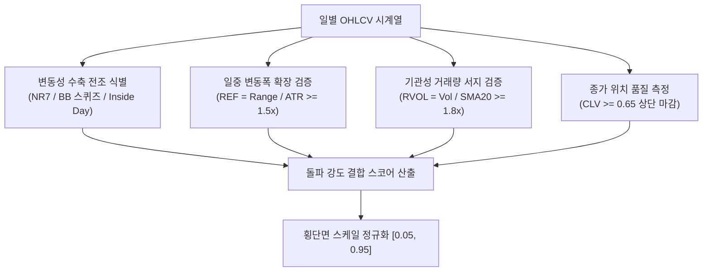

# 전략 34: 레인지 확장 돌파 (Range Expansion Breakout)

## 1. 전략 개요 (Overview)
- **전략 ID**: `range_expansion_breakout` (`range_expansion_score`)
- **전략 범주**: Volatility Compression & Directional Expansion Breakout
- **목적**: 가격과 거래량이 극단적으로 수축(NR7, 볼린저 밴드 스퀴즈, 인사이드 데이)된 이후 발생하는 폭발적인 일중 변동성 확장(Range Expansion)과 기관성 거래량 폭증을 포착하여 신고가/추세 돌파 초입부를 포착.
- **핵심 특징**:
  - **변동성 압축 전조 (Compression Precursor)**: 직전 7거래일 중 가장 좁은 일중 변동폭(NR7, Narrow Range 7), 볼린저 밴드폭 최저치, 또는 모선 내부 캔들(Inside Day) 식별.
  - **레인지 확장 계수 (Range Expansion Factor, REF)**: 당일 일중 진폭($\text{High} - \text{Low}$)이 14일 ATR 대비 1.5배 이상 폭발적으로 확장되는지 검증.
  - **상대 거래량 서지 (Relative Volume Surge, RVOL)**: 20일 이동평균 거래량 대비 1.8배 이상 대량 거래 수반 확인.
  - **종가 위치 품질 (Close Location Value, CLV)**: 당일 캔들의 상단 35% 이내(CLV $\ge 0.65$)에서 종가가 형성되어 매수세 우위 확인.

---

## 2. 수학적 모델 및 수식 (Mathematical Formulation)

### 2.1 변동성 수축 전조 지수 (Compression Precursor $C_i$)
직전 $t-1$ 시점의 NR7 조건(7일 최저 변동폭) 및 볼린저 밴드폭 스퀴즈:
$$\text{Range}_t = \text{High}_t - \text{Low}_t$$
$$\text{NR7}_t = \mathbb{I}\left( \text{Range}_{t-1} = \min_{k=1..7} \text{Range}_{t-k} \right)$$
$$C_i = 0.5 \cdot \text{NR7}_t + 0.5 \cdot \text{BBSqueeze}_{t-1}$$

### 2.2 레인지 확장 계수 (Range Expansion Factor, REF)
$$\text{REF}_t = \frac{\text{High}_t - \text{Low}_t}{\text{ATR}_{14, t-1}}$$
확장 점수 $E_i$:
$$E_i = \text{clip}\left( \frac{\text{REF}_t - 1.0}{1.5}, 0.0, 1.0 \right)$$

### 2.3 상대 거래량 서지 (Relative Volume, RVOL)
$$\text{RVOL}_t = \frac{\text{Volume}_t}{\text{SMA}_{20}(\text{Volume})_{t-1}}$$
거래량 점수 $V_i$:
$$V_i = \text{clip}\left( \frac{\text{RVOL}_t - 1.0}{2.0}, 0.0, 1.0 \right)$$

### 2.4 종가 위치 품질 (Close Location Value, CLV)
$$\text{CLV}_t = \frac{\text{Close}_t - \text{Low}_t}{\text{High}_t - \text{Low}_t + \epsilon} \in [0.0, 1.0]$$

### 2.5 최종 레인지 확장 돌파 스코어
$$\text{RawBreakout}_i = 0.35 \cdot E_i + 0.30 \cdot V_i + 0.20 \cdot \text{CLV}_t + 0.15 \cdot C_i$$
$$S_{\text{range\_expansion}, i} = \text{clip}\left( \text{RawBreakout}_i, 0.05, 0.95 \right)$$

---

## 3. 입력 데이터 및 처리 방식 (Data Pipeline)

1. **OHLCV 데이터**: 개별 종목의 시가, 고가, 저가, 종가, 거래량 시계열 (최소 30일).
2. **기술적 지표 사전 계산**: 14일 ATR(Average True Range), 20일 거래량 SMA, 20일 볼린저 밴드폭.
3. **고속 넘파이 벡터화**: 심볼당 연산 시간을 0.2ms 이내로 억제하여 3,000개 이상 종목을 수 초 내 처리.

---

## 4. 전체 동작 파이프라인 (Execution Workflow)

---

## 5. 2D 레짐별 기본 가중치

| 레짐 | 가중치 | 동작 특성 |
|---|---|---|
| **BULL_LOW_VOL** | 0.03 | 지속적인 상승 추세 속 건강한 전고점 돌파 포착 |
| **BULL_HIGH_VOL** | 0.04 | 모멘텀 팽창 국면 가장 강력한 알파 발휘 (주력 레짐) |
| **SIDEWAYS_LOW_VOL** | 0.02 | 횡보 박스권 상단 상향 돌파 추적 |
| **SIDEWAYS_HIGH_VOL** | 0.02 | 휩소(속임수) 돌파 필터링 강화 |
| **BEAR_LOW_VOL** | 0.01 | 하락장 내 돌파 신호 빈도 감소 |
| **BEAR_HIGH_VOL** | 0.01 | 위기 국면 비중 축소 |

- **관련 소스 파일**: [`src/core/range_expansion_breakout.py`](file:///d:/Finance/code/stock/trading_system/src/core/range_expansion_breakout.py)
