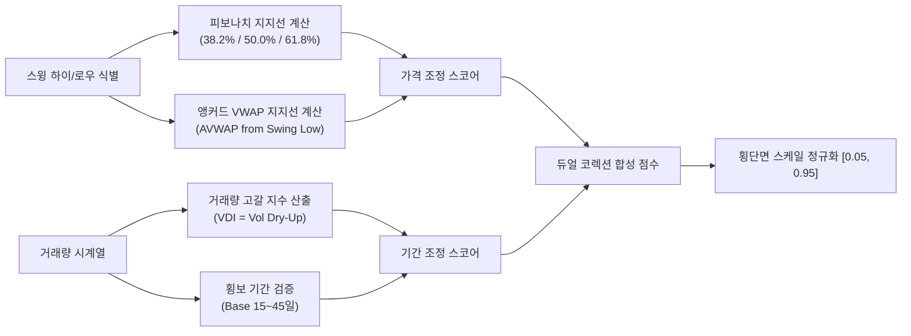

# 전략 35: 듀얼 코렉션 (Dual Correction: 가격 조정 및 기간 조정)

## 1. 전략 개요 (Overview)
- **전략 ID**: `dual_correction` (`dual_correction_score`)
- **전략 범주**: Technical Pullback & Multi-Horizon Consolidation
- **목적**: 주가가 강력한 상승 추세를 기록한 이후 나타나는 **가격 조정(Price Retracement)**과 **기간 조정(Time Consolidation)**의 완료 시점을 정밀하게 포착하여, 거래량이 마르고 지지선에서 반등하는 최적의 눌림목(Low-Risk High-Reward Entry)을 발굴.
- **핵심 특징**:
  - **피보나치 황금비율 지지 (Fibonacci Retracement)**: 120일 스윙 하이/로우 대비 38.2%, 50.0%, 61.8% 되돌림 지지선 수렴도 측정.
  - **앵커드 VWAP (Anchored VWAP, AVWAP)**: 직전 주요 저점(Swing Low)부터 누적된 거래량가중평균가와의 수렴도 평가.
  - **거래량 고갈 지수 (Volume Dry-Up Index, VDI)**: 조정 기간 중 거래량이 50일 평균의 50% 이하로 급감하며 매도 압력이 소멸되는 패닉 흡수 국면 검출.
  - **조정 국면 4단계 분류기**: `TIME_CONSOLIDATION`, `PRICE_PULLBACK`, `ACTIVE_MARKUP`, `BREAKDOWN` 상태를 판정.

---

## 2. 수학적 모델 및 수식 (Mathematical Formulation)

### 2.1 가격 조정 지수 (Price Correction Score $S_{\text{price}}$)
120일 최고가 $P_{\text{high}}$와 최저가 $P_{\text{low}}$ 사이의 피보나치 레벨 $F_{\text{fib}} \in \{0.382, 0.500, 0.618\}$:
$$\text{Level}_k = P_{\text{high}} - F_k \cdot (P_{\text{high}} - P_{\text{low}})$$
현재가 $P_t$와 가장 근접한 피보나치 지지 레벨 간의 근접도:
$$\text{FibDist}_t = \min_k \frac{|P_t - \text{Level}_k|}{\text{ATR}_{14, t}}$$
$$\text{Score}_{\text{fib}} = \exp\left( -0.5 \cdot \text{FibDist}_t^2 \right)$$

앵커드 VWAP 지지 점수:
$$\text{AVWAPDist}_t = \frac{|P_t - \text{AVWAP}_t|}{\text{ATR}_{14, t}}$$
$$\text{Score}_{\text{avwap}} = \exp\left( -0.5 \cdot \text{AVWAPDist}_t^2 \right)$$

### 2.2 기간 조정 지수 (Time Correction Score $S_{\text{time}}$)
거래량 고갈 지수(Volume Dry-Up Index, VDI):
$$\text{VDI}_t = \max\left( 0.0, 1.0 - \frac{\text{SMA}_{5}(\text{Volume})_t}{\text{SMA}_{50}(\text{Volume})_t} \right)$$
조정 기간 지수 (Base Duration, 15~45거래일 횡보 박스권):
$$\text{Score}_{\text{duration}} = \mathbb{I}(15 \le D_{\text{box}} \le 45) \cdot \left( 1.0 - \frac{|D_{\text{box}} - 25|}{30} \right)$$

### 2.3 합성 듀얼 코렉션 점수
$$\text{RawDual}_i = 0.55 \cdot S_{\text{price}} + 0.45 \cdot S_{\text{time}}$$
$$S_{\text{dual\_correction}, i} = \text{clip}\left( \text{RawDual}_i, 0.05, 0.95 \right)$$

---

## 3. 입력 데이터 및 처리 방식 (Data Pipeline)

1. **OHLCV 시계열**: 최소 150거래일 이상의 수정 종가, 고가, 저가, 거래량 데이터.
2. **스윙 포인트 식별 알고리즘**: 프랙탈 롤링 윈도우 기반 주요 고점 및 저점 자동 앵커링.
3. **EMA 리본 스퀴즈 분석**: EMA 8, 21, 34, 55 간의 수렴/정렬 상태 판정.

---

## 4. 전체 동작 파이프라인 (Execution Workflow)

---

## 5. 2D 레짐별 기본 가중치

| 레짐 | 가중치 | 동작 특성 |
|---|---|---|
| **BULL_LOW_VOL** | 0.03 | 추세 상승 중 건전한 눌림목 매수 기회 선별 |
| **BULL_HIGH_VOL** | 0.03 | 단기 급등 후 변동성 축소 반등 국면 포착 |
| **SIDEWAYS_LOW_VOL** | 0.04 | 횡보 박스권 하단 지지선 반등 포착 (주력 레짐) |
| **SIDEWAYS_HIGH_VOL** | 0.03 | 박스권 진폭 활용 스윙 트레이딩 |
| **BEAR_LOW_VOL** | 0.03 | 과매도 지지선 매수 기회 |
| **BEAR_HIGH_VOL** | 0.02 | 위기 국면 비중 축소 |

- **관련 소스 파일**: [`src/core/dual_correction.py`](file:///d:/Finance/code/stock/trading_system/src/core/dual_correction.py)
