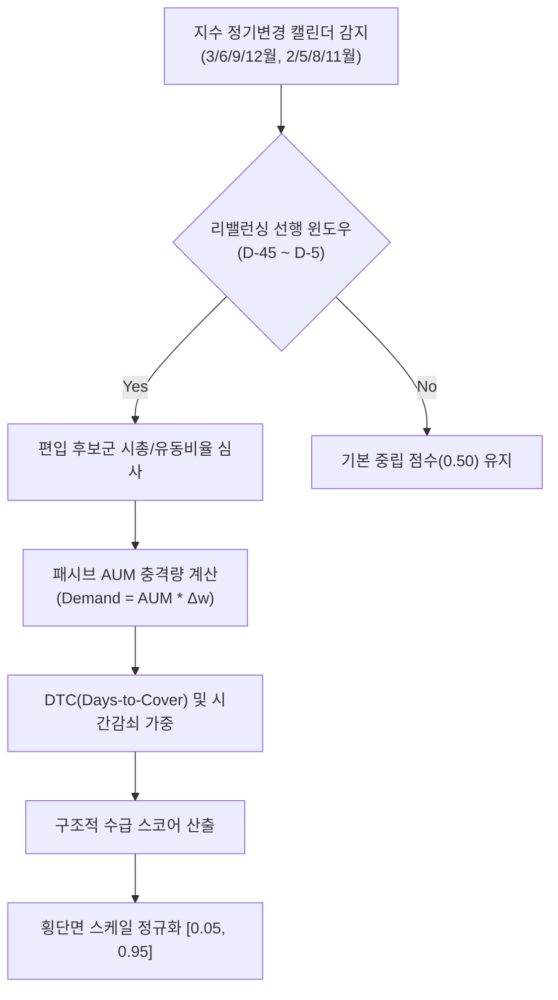

# 전략 36: 인덱스 리밸런싱 구조적 수급 (Index Rebalance Structural Flow)

## 1. 전략 개요 (Overview)
- **전략 ID**: `index_rebalance` (`index_rebalance_score`)
- **전략 범주**: Institutional Passive ETF Structural Flows & Pre-Positioning Alpha
- **목적**: KOSPI 200, KOSDAQ 150, MSCI Korea/World, S&P 500, NASDAQ 100 등 주요 지수를 추종하는 약 40조 원 이상의 글로벌 패시브 자금 리밸런싱에 선행하여, 신규 편입/편출 예상 종목을 15~30일 전 선취매(Pre-positioning)하고 정기변경 당일 기계적 패시브 수급 충격에 유동성을 공급하며 차익을 실현.
- **핵심 특징**:
  - **4대 정기변경 윈도우 추적**: 3월/9월(선물옵션 만기일), 6월/12월(KOSPI200/KOSDAQ150 정기변경), 2/5/8/11월(MSCI 분기 리뷰)의 45일 전방 수급 윈도우 자동 감지.
  - **패시브 추종 수급 충격량 ($N_{\text{DTC}}$)**: 종목별 예상 편입 비중 변화에 추종 AUM을 곱해 필요 매수 대금을 산출하고, 이를 일평균 거래대금(ADV)으로 나눈 Days-to-Cover를 모델링.
  - **유동비율 및 시가총액 순위 심사 룰 복제**: 한국거래소 및 글로벌 지수 산출 기관의 실제 편입 요건(유동주식비율, 산업군별 누적 시가총액 85% 컷오프)을 사전에 시뮬레이션.

---

## 2. 수학적 모델 및 수식 (Mathematical Formulation)

### 2.1 패시브 추종 필요 거래일수 (Days-to-Cover, DTC)
지수 추종 자금 규모 $A_{\text{tracking}}$ (KOSPI 200 기준 약 40조 원, MSCI Korea 기준 약 50조 원), 예상 지수 가중치 변화 $\Delta w_i$:
$$\text{DemandKRW}_i = A_{\text{tracking}} \cdot \Delta w_i$$
$$N_{\text{DTC}, i} = \frac{\text{DemandKRW}_i}{\text{ADV}_{20, i}}$$

### 2.2 리밸런싱 윈도우 시간 감쇠 함수 (Temporal Decay Function)
정기변경 효력 발생일($T_{\text{effective}}$)까지 남은 영업일 $D_{\text{rem}}$:
$$W(D_{\text{rem}}) = \begin{cases} 
\exp\left( -\frac{(D_{\text{rem}} - 15)^2}{50} \right), & 5 \le D_{\text{rem}} \le 40 \\
0.2, & \text{otherwise}
\end{cases}$$

### 2.3 편입 가능성 점수 및 합성 알파 (Composite Score)
시가총액 순위 및 거래대금 기준 편입 확률 $P_{\text{inclusion}, i}$:
$$\text{RawRebal}_i = P_{\text{inclusion}, i} \cdot \log(1.0 + N_{\text{DTC}, i}) \cdot W(D_{\text{rem}})$$
$$S_{\text{index\_rebalance}, i} = \text{clip}\left( \frac{\text{RawRebal}_i - \mu_{\text{mkt}}}{3 \sigma_{\text{mkt}}} \cdot 0.5 + 0.5, 0.05, 0.95 \right)$$

---

## 3. 입력 데이터 및 처리 방식 (Data Pipeline)

1. **지수 구성 종목 및 시가총액 순위**: KOSPI, KOSDAQ, S&P 500 전 종목의 6개월 평균 시총 및 유동시총.
2. **거래대금 데이터**: 20일 및 60일 평균 일일 거래대금(ADV).
3. **지수 리뷰 캘린더**: 연간 4대 지수 정기변경 일정 데이터베이스.

---

## 4. 전체 동작 파이프라인 (Execution Workflow)

---

## 5. 2D 레짐별 기본 가중치

| 레짐 | 가중치 | 동작 특성 |
|---|---|---|
| **BULL_LOW_VOL** | 0.03 | 지수 추종 ETF 자금 유입 확대 국면 선반영 랠리 극대화 |
| **BULL_HIGH_VOL** | 0.03 | 패시브 자금 매수세에 의한 호가 갭업 선취매 |
| **SIDEWAYS_LOW_VOL** | 0.03 | 지수 횡보장 속 기계적 수급 이벤트에 따른 독자 상승 선별 |
| **SIDEWAYS_HIGH_VOL** | 0.02 | 변동성 국면 비중 조절 |
| **BEAR_LOW_VOL** | 0.02 | 하락장 속 패시브 매수 유입 방어주 공략 |
| **BEAR_HIGH_VOL** | 0.01 | 위기 국면 비중 축소 |

- **관련 소스 파일**: [`src/core/index_rebalance.py`](file:///d:/Finance/code/stock/trading_system/src/core/index_rebalance.py)
