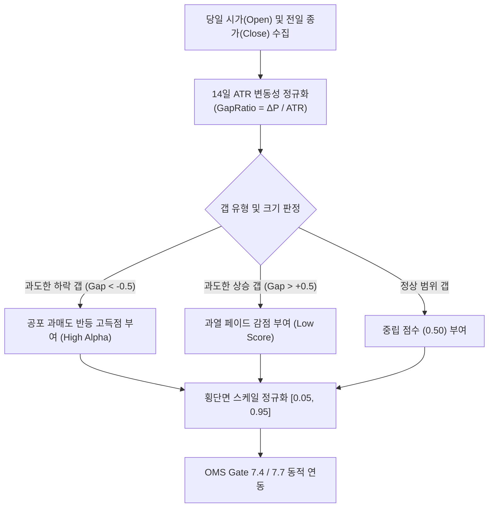

# 전략 37: 오버나이트 갭 반전 (Overnight Gap Reversal & Gap Fade)

## 1. 전략 개요 (Overview)
- **전략 ID**: `overnight_gap_reversal` (`overnight_gap_score`)
- **전략 범주**: Microstructure Gap Mean Reversion & Liquidity Provision
- **목적**: 전일 종가(Close) 대비 당일 시가(Open) 사이에 발생한 비정상적인 가격 괴리(오버나이트 갭, Overnight Gap)를 일일 변동성(ATR) 기준으로 정규화하여, 장 개시 직후 발생하는 투자자들의 과민반응(Overreaction)을 해소하는 통계적 갭 메우기(Gap Fill / Fade) 수익을 창출.
- **핵심 특징**:
  - **ATR 정규화 갭 비율 (ATR-Normalized Gap Ratio)**: 단순 퍼센트 괴리가 아닌, 종목 고유의 변동성 단위로 갭 크기를 표준화하여 소형주와 대형주 간 왜곡을 방지.
  - **비대칭 반전 역발상 모델 (Asymmetric Reversal Logic)**:
    - 과도한 하락 갭($\le -1.5 \text{ ATR}$): 공포 매도 클라이맥스 후 강력한 평균회귀 기술적 반등(High Score).
    - 과도한 상승 갭($\ge +2.0 \text{ ATR}$): 차익 실현 매물 출회 및 장중 피로감에 따른 소진성 갭 페이드(Low Score / Fade).
  - **장중 미해소 갭 왜곡 보정**: 장마감 시점까지 미해소된 갭과 익일 연속성 간의 통계적 필터링 적용.

---

## 2. 수학적 모델 및 수식 (Mathematical Formulation)

### 2.1 ATR 정규화 오버나이트 갭 (Normalized Overnight Gap)
당일 시가 $\text{Open}_t$, 전일 종가 $\text{Close}_{t-1}$, 14일 $\text{ATR}_t$:
$$\text{GapRatio}_t = \frac{\text{Open}_t - \text{Close}_{t-1}}{\text{ATR}_{14, t-1}}$$

### 2.2 갭 채우기 확률 점수화 (Gap Fill Probability Function)
하락 갭은 매수 기회로 평가하며, 상승 과열 갭은 패널티를 부여:
$$S_{\text{gap\_reversal}} = \begin{cases}
0.50 + 0.40 \cdot \min\left(1.0, \frac{-\text{GapRatio}_t - 0.5}{2.0}\right), & \text{GapRatio}_t < -0.5 \\
0.50 - 0.35 \cdot \min\left(1.0, \frac{\text{GapRatio}_t - 0.5}{2.0}\right), & \text{GapRatio}_t > 0.5 \\
0.50, & \text{otherwise}
\end{cases}$$

### 2.3 횡단면 정규화
$$S_{\text{overnight\_gap\_reversal}, i} = \text{clip}\left( S_{\text{gap\_reversal}, i}, 0.05, 0.95 \right)$$

---

## 3. 입력 데이터 및 처리 방식 (Data Pipeline)

1. **OHLCV 시계열**: 개별 종목의 시가, 고가, 저가, 종가 (당일 장시작 직후 즉시 추출 가능).
2. **변동성 지표**: 14일 ATR(Average True Range).
3. **미시구조 데이터**: 동시호가 호가 잔량 및 개장 직후 체결 속도.

---

## 4. 전체 동작 파이프라인 (Execution Workflow)

---

## 5. 2D 레짐별 기본 가중치

| 레짐 | 가중치 | 동작 특성 |
|---|---|---|
| **BULL_LOW_VOL** | 0.02 | 안정적 상승장 속 아침 하락 갭 눌림목 적극 매수 |
| **BULL_HIGH_VOL** | 0.02 | 변동성 상승장 갭 변동성 활용 |
| **SIDEWAYS_LOW_VOL** | 0.03 | 박스권 장세 갭 채우기 확률 극대화 (주력 레짐) |
| **SIDEWAYS_HIGH_VOL** | 0.04 | 고변동 횡보장 속 빈번한 갭 역발상 매매 (주력 레짐) |
| **BEAR_LOW_VOL** | 0.03 | 하락장 속 시초가 투매 반등 포착 |
| **BEAR_HIGH_VOL** | 0.04 | 패닉장 일중 극단적 투매 반등 리바운드 공략 |

- **관련 소스 파일**: [`src/core/overnight_gap_reversal.py`](file:///d:/Finance/code/stock/trading_system/src/core/overnight_gap_reversal.py)
