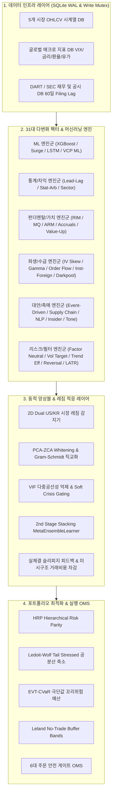

# 31대 퀀트 & 다변화 전략 아키텍처 가이드 (31-Strategy Master Index)

본 문서는 주식 자동매매 및 예측 시스템에 탑재된 **31대 다변화 전략(Multi-Factor & Multi-Model Engine)**의 개별 동작 구조, 수학적 모델링, 데이터 파이프라인 및 2D 레짐 결합 방식을 총괄 안내합니다.

---

## 1. 31대 전략 총괄 매트릭스 (Strategy Matrix)

| # | 전략명 (Display Name) | 전략 ID | 범주 | 출력 파일 | 상세 문서 |
|---|---|---|---|---|---|
| **01** | XGBoost / Multi-Model 회귀 | `regression` | ML | `pipeline_result.txt` | [01_xgboost_regression.md](./01_xgboost_regression.md) |
| **02** | 단기 급등 분류기 (Surge) | `surge` | ML | `surge_predictions.txt` | [02_surge_classifier.md](./02_surge_classifier.md) |
| **03** | Lead-Lag 2-Tier 시차 상관성 | `lead_lag` | Stat | `lead_lag_predictions.txt` | [03_lead_lag_correlation.md](./03_lead_lag_correlation.md) |
| **04** | 규칙 기반 VCP 패턴 검출 | `vcp_rule` | Pattern | `vcp_patterns.txt` | [04_vcp_rule_pattern.md](./04_vcp_rule_pattern.md) |
| **05** | 머신러닝 VCP 급등 분류기 | `vcp_ml` | ML | `vcp_ml_predictions.txt` | [05_vcp_ml_predictor.md](./05_vcp_ml_predictor.md) |
| **06** | 엄격한 인과 시계열 LSTM | `lstm` | Deep Learning | `lstm_predictions.txt` | [06_strict_causal_lstm.md](./06_strict_causal_lstm.md) |
| **07** | 통계적 차익거래 공적분 | `stat_arb` | Stat-Arb | `stat_arb_predictions.txt` | [07_stat_arb_cointegration.md](./07_stat_arb_cointegration.md) |
| **08** | 섹터 로테이션 상대 모멘텀 | `sector` | Factor | `sector_predictions.txt` | [08_sector_rotation.md](./08_sector_rotation.md) |
| **09** | 잔여이익 가치평가 (RIM) | `rim` | Valuation | `rim_predictions.txt` | [09_rim_valuation.md](./09_rim_valuation.md) |
| **10** | 이벤트 드리븐 공시/수급 촉매 | `event_driven` | Catalyst | `event_driven_predictions.txt` | [10_event_driven_catalyst.md](./10_event_driven_catalyst.md) |
| **11** | 퀄리티 결합 모멘텀 (MQ) | `mq_factor` | Factor | `mq_factor_predictions.txt` | [11_momentum_quality_mq.md](./11_momentum_quality_mq.md) |
| **12** | 옵션 IV 스큐 및 풋/콜 비율 | `iv_skew` | Derivatives | `iv_skew_predictions.txt` | [12_options_iv_skew.md](./12_options_iv_skew.md) |
| **13** | 주문 흐름 불균형 & MFI | `order_flow` | Flow | `order_flow_predictions.txt` | [13_order_flow_imbalance.md](./13_order_flow_imbalance.md) |
| **14** | 단기 과매도 평균회귀 | `short_term_reversal` | Factor | `short_term_reversal_predictions.txt` | [14_short_term_reversal.md](./14_short_term_reversal.md) |
| **15** | 애널리스트 추정치 상향 (ARM) | `arm_factor` | Factor | `arm_factor_predictions.txt` | [15_analyst_revision_momentum_arm.md](./15_analyst_revision_momentum_arm.md) |
| **16** | 크로스에셋 다이버전스 (CARD) | `card_factor` | Macro | `card_factor_predictions.txt` | [16_cross_asset_divergence_card.md](./16_cross_asset_divergence_card.md) |
| **17** | 유동성 조정 꼬리위험 (LATR) | `latr_factor` | Risk | `latr_factor_predictions.txt` | [17_liquidity_adjusted_tail_risk_latr.md](./17_liquidity_adjusted_tail_risk_latr.md) |
| **18** | 외인/기관 2개월 누적 수급 | `inst_foreign_sector` | Flow | `inst_foreign_sector_predictions.txt` | [18_inst_foreign_sector_flow.md](./18_inst_foreign_sector_flow.md) |
| **19** | 공급망 온기 전이 모멘텀 | `supply_chain` | Network | `supply_chain_predictions.txt` | [19_supply_chain_momentum.md](./19_supply_chain_momentum.md) |
| **20** | NLP 공시/뉴스 감성 퀀트 | `sentiment` | NLP / AI | `sentiment_predictions.txt` | [20_nlp_sentiment_catalyst.md](./20_nlp_sentiment_catalyst.md) |
| **21** | 멀티팩터 스타일 중립화 | `factor_neutralized` | Pure Alpha | `factor_neutralized_predictions.txt` | [21_multi_factor_style_neutralizer.md](./21_multi_factor_style_neutralizer.md) |
| **22** | 동적 변동성 타겟팅 (12%) | `vol_target` | Risk Parity | `vol_target_predictions.txt` | [22_dynamic_volatility_targeting.md](./22_dynamic_volatility_targeting.md) |
| **23** | 미시구조 호가 불균형 & 갭 | `microstructure` | Microstructure | `microstructure_predictions.txt` | [23_microstructure_imbalance.md](./23_microstructure_imbalance.md) |
| **24** | 발생액 품질 이상현상 | `accruals_quality` | Accounting | 앙상블 피처 결합 | [24_accruals_quality_anomaly.md](./24_accruals_quality_anomaly.md) |
| **25** | 공매도 잔고 및 숏스퀴즈 | `short_squeeze` | Short Squeeze | 앙상블 피처 결합 | [25_short_interest_squeeze.md](./25_short_interest_squeeze.md) |
| **26** | 밸류업 & 총주주환원율 | `valueup_catalyst` | Policy / Value | 앙상블 피처 결합 | [26_value_up_shareholder_yield.md](./26_value_up_shareholder_yield.md) |
| **27** | 카우프만 효율성 & 허스트 | `trend_efficiency` | Trend Filter | 앙상블 피처 결합 | [27_kaufman_trend_efficiency.md](./27_kaufman_trend_efficiency.md) |
| **28** | 감마 스퀴즈 & 델타 가속 | `gamma_squeeze` | Derivatives | 앙상블 피처 결합 | [28_gamma_squeeze.md](./28_gamma_squeeze.md) |
| **29** | 대주주/임원 내부자 매수 | `insider_buying` | Insider Flow | 앙상블 피처 결합 | [29_insider_buying.md](./29_insider_buying.md) |
| **30** | 어닝콜 경영진 톤 변화 | `earnings_tone_drift` | Text Mining | 앙상블 피처 결합 | [30_earnings_tone_drift.md](./30_earnings_tone_drift.md) |
| **31** | 다크풀 블록딜 & HFT | `darkpool` | Alternative Flow | 앙상블 피처 결합 | [31_darkpool_hft_execution.md](./31_darkpool_hft_execution.md) |

---

## 2. 전체 앙상블 및 최적화 흐름도 (End-to-End Orchestration)

---

## 3. 2D 듀얼 시장 레짐 매트릭스 (2D Market Regime Matrix)

시장 레짐은 **추세(Trend: Bull, Sideways, Bear)**와 **변동성(Volatility: Low Vol, High Vol)**의 2차원 공간에서 6개 국면으로 자동 분류되며, 31대 전략의 가중치가 동적으로 재조정됩니다:

1. **BULL_LOW_VOL (안정적 상승장)**: `regression`, `mq_factor`, `trend_efficiency`, `inst_foreign_sector`, `supply_chain` 주력.
2. **BULL_HIGH_VOL (고변동 상승장)**: `surge`, `vcp_ml`, `gamma_squeeze`, `short_squeeze`, `microstructure` 주력.
3. **SIDEWAYS_LOW_VOL (저변동 횡보장)**: `stat_arb`, `sector`, `valueup_catalyst`, `event_driven`, `factor_neutralized` 주력.
4. **SIDEWAYS_HIGH_VOL (고변동 횡보장)**: `short_term_reversal`, `iv_skew`, `card_factor` 주력.
5. **BEAR_LOW_VOL (완만한 하락장)**: `rim`, `accruals_quality`, `insider_buying`, `vol_target` 주력.
6. **BEAR_HIGH_VOL (극심한 위기/패닉장)**: `latr_factor`, `iv_skew`, `vol_target`, `card_factor` 및 위기 소프트 게이팅(Cash 비중 확대).

---

## 4. 관련 핵심 소스 코드 (Core Source Code Links)

- **전략 레지스트리**: [`src/core/strategy_registry.py`](file:///d:/Finance/code/stock/trading_system/src/core/strategy_registry.py)
- **앙상블 스코어러**: [`src/ai/ensemble_scorer.py`](file:///d:/Finance/code/stock/trading_system/src/ai/ensemble_scorer.py)
- **메타 스태킹 앙상블**: [`src/ai/meta_ensemble_learner.py`](file:///d:/Finance/code/stock/trading_system/src/ai/meta_ensemble_learner.py)
- **팩터 직교화 엔진**: [`src/ai/factor_orthogonalizer.py`](file:///d:/Finance/code/stock/trading_system/src/ai/factor_orthogonalizer.py)
- **포트폴리오 할당기**: [`src/risk/portfolio_allocator.py`](file:///d:/Finance/code/stock/trading_system/src/risk/portfolio_allocator.py)
- **실행 OMS 엔진**: [`src/execution/oms_engine.py`](file:///d:/Finance/code/stock/trading_system/src/execution/oms_engine.py)
