# 37대 퀀트 & 다변화 전략 아키텍처 가이드 (37-Strategy Master Index)

본 문서는 주식 자동매매 및 예측 시스템에 탑재된 **37대 다변화 전략(Multi-Factor & Multi-Model Engine)**의 개별 동작 구조, 수학적 모델링, 데이터 파이프라인 및 2D 레짐 결합 방식을 총괄 안내합니다.

---

## 1. 37대 전략 총괄 매트릭스 (Strategy Matrix)

| # | 전략명 (Display Name) | 전략 ID | 범주 | 출력 파일 | 상세 문서 |
|---|---|---|---|---|---|
| **01** | XGBoost / Multi-Model 회귀 | `regression` | ML | `pipeline_result.txt` | [01_xgboost_regression.md](./01_xgboost_regression.md) |
| **02** | 단기 급등 분류기 (Surge) | `surge` | ML | `surge_predictions.txt` | [02_surge_classifier.md](./02_surge_classifier.md) |
| **03** | Lead-Lag 2-Tier 시차 상관성 | `lead_lag` | Stat | `lead_lag_predictions.txt` | [03_lead_lag_correlation.md](./03_lead_lag_correlation.md) |
| **04** | 규칙 기반 VCP 패턴 검출 | `vcp_rule` | Pattern | `vcp_patterns.txt` | [04_vcp_rule_pattern.md](./04_vcp_rule_pattern.md) |
| **05** | 머신러닝 VCP 급등 분류기 | `vcp_ml` | ML | `vcp_ml_predictions.txt` | [05_vcp_ml_predictor.md](./05_vcp_ml_predictor.md) |
| **06** | 엄격한 인과 시계열 LSTM | `lstm` | Deep Learning | `lstm_predictions.txt` | [06_strict_causal_lstm.md](./06_strict_causal_lstm.md) |
| **07** | 통계적 차익거래 공적분 | `stat_arb` | Stat-Arb | `stat_arb_predictions.txt` | [07_stat_arb_cointegration.md](./07_stat_arb_cointegration.md) |
| **08** | 섹터 로테이션 상대 모멘텀 | `sector` | Factor | `sector_predictions.txt` | [08_sector_rotation.md](./08_sector_rotation.md) |
| **09** | 잔여이익 가치평가 (RIM) | `rim` | Valuation | `rim_predictions.txt` | [09_rim_valuation.md](./09_rim_valuation.md) |
| **10** | 이벤트 드리븐 공시/수급 촉매 | `event_driven` | Catalyst | `event_driven_predictions.txt` | [10_event_driven_catalyst.md](./10_event_driven_catalyst.md) |
| **11** | 퀄리티 결합 모멘텀 (MQ) | `mq_factor` | Factor | `mq_factor_predictions.txt` | [11_momentum_quality_mq.md](./11_momentum_quality_mq.md) |
| **12** | 옵션 IV 스큐 및 풋/콜 비율 | `iv_skew` | Derivatives | `iv_skew_predictions.txt` | [12_options_iv_skew.md](./12_options_iv_skew.md) |
| **13** | 주문 흐름 불균형 & MFI | `order_flow` | Flow | `order_flow_predictions.txt` | [13_order_flow_imbalance.md](./13_order_flow_imbalance.md) |
| **14** | 단기 과매도 평균회귀 | `short_term_reversal` | Factor | `short_term_reversal_predictions.txt` | [14_short_term_reversal.md](./14_short_term_reversal.md) |
| **15** | 애널리스트 추정치 상향 (ARM) | `arm_factor` | Factor | `arm_factor_predictions.txt` | [15_analyst_revision_momentum_arm.md](./15_analyst_revision_momentum_arm.md) |
| **16** | 크로스에셋 다이버전스 (CARD) | `card_factor` | Macro | `card_factor_predictions.txt` | [16_cross_asset_divergence_card.md](./16_cross_asset_divergence_card.md) |
| **17** | 유동성 조정 꼬리위험 (LATR) | `latr_factor` | Risk | `latr_factor_predictions.txt` | [17_liquidity_adjusted_tail_risk_latr.md](./17_liquidity_adjusted_tail_risk_latr.md) |
| **18** | 외인/기관 2개월 누적 수급 | `inst_foreign_sector` | Flow | `inst_foreign_sector_predictions.txt` | [18_inst_foreign_sector_flow.md](./18_inst_foreign_sector_flow.md) |
| **19** | 공급망 온기 전이 모멘텀 | `supply_chain` | Network | `supply_chain_predictions.txt` | [19_supply_chain_momentum.md](./19_supply_chain_momentum.md) |
| **20** | NLP 공시/뉴스 감성 퀀트 | `sentiment` | NLP / AI | `sentiment_predictions.txt` | [20_nlp_sentiment_catalyst.md](./20_nlp_sentiment_catalyst.md) |
| **21** | 멀티팩터 스타일 중립화 | `factor_neutralized` | Pure Alpha | `factor_neutralized_predictions.txt` | [21_multi_factor_style_neutralizer.md](./21_multi_factor_style_neutralizer.md) |
| **22** | 동적 변동성 타겟팅 (12%) | `vol_target` | Risk Parity | `vol_target_predictions.txt` | [22_dynamic_volatility_targeting.md](./22_dynamic_volatility_targeting.md) |
| **23** | 미시구조 호가 불균형 & 갭 | `microstructure` | Microstructure | `microstructure_predictions.txt` | [23_microstructure_imbalance.md](./23_microstructure_imbalance.md) |
| **24** | 발생액 품질 이상현상 | `accruals_quality` | Accounting | 앙상블 피처 결합 | [24_accruals_quality_anomaly.md](./24_accruals_quality_anomaly.md) |
| **25** | 공매도 잔고 및 숏스퀴즈 | `short_squeeze` | Short Squeeze | 앙상블 피처 결합 | [25_short_interest_squeeze.md](./25_short_interest_squeeze.md) |
| **26** | 밸류업 & 총주주환원율 | `valueup_catalyst` | Policy / Value | 앙상블 피처 결합 | [26_value_up_shareholder_yield.md](./26_value_up_shareholder_yield.md) |
| **27** | 카우프만 효율성 & 허스트 | `trend_efficiency` | Trend Filter | 앙상블 피처 결합 | [27_kaufman_trend_efficiency.md](./27_kaufman_trend_efficiency.md) |
| **28** | 감마 스퀴즈 & 델타 가속 | `gamma_squeeze` | Derivatives | 앙상블 피처 결합 | [28_gamma_squeeze.md](./28_gamma_squeeze.md) |
| **29** | 대주주/임원 내부자 매수 | `insider_buying` | Insider Flow | 앙상블 피처 결합 | [29_insider_buying.md](./29_insider_buying.md) |
| **30** | 어닝콜 경영진 톤 변화 | `earnings_tone_drift` | Text Mining | `earnings_tone_drift_predictions.txt` | [30_earnings_tone_drift.md](./30_earnings_tone_drift.md) |
| **31** | 다크풀 블록딜 & HFT | `darkpool` | Alternative Flow | `darkpool_predictions.txt` | [31_darkpool_hft_execution.md](./31_darkpool_hft_execution.md) |
| **32** | 크로스에셋 거시 파급 모멘텀 | `cross_asset_spillover` | Macro Impulse | `cross_asset_spillover_predictions.txt` | [32_cross_asset_spillover.md](./32_cross_asset_spillover.md) |
| **33** | 공급망 GNN & 불위그 증폭 | `supply_chain_gnn` | Graph GNN | `supply_chain_gnn_predictions.txt` | [33_supply_chain_gnn.md](./33_supply_chain_gnn.md) |
| **34** | 레인지 확장 돌파 (NR7/REF) | `range_expansion_breakout` | Vol Breakout | `range_expansion_predictions.txt` | [34_range_expansion_breakout.md](./34_range_expansion_breakout.md) |
| **35** | 듀얼 코렉션 (피보나치/AVWAP) | `dual_correction` | Technical Pullback | `dual_correction_predictions.txt` | [35_dual_correction.md](./35_dual_correction.md) |
| **36** | 인덱스 리밸런싱 패시브 수급 | `index_rebalance` | Passive Structural | `index_rebalance_predictions.txt` | [36_index_rebalance.md](./36_index_rebalance.md) |
| **37** | 오버나이트 갭 반전 (ATR Gap) | `overnight_gap_reversal` | Gap Mean-Reversion | `overnight_gap_predictions.txt` | [37_overnight_gap_reversal.md](./37_overnight_gap_reversal.md) |

---

## 2. 전체 앙상블 및 최적화 흐름도 (End-to-End Orchestration)

```mermaid
flowchart TD
    subgraph DataLayer ["1. 데이터 인프라 레이어 (SQLite WAL & Write Mutex)"]
        D1[5개 시장 OHLCV 시계열 DB]
        D2[글로벌 8대 매크로 지표 DB VIX/금리/환율/유가/Gold/DXY/SOX/SP500]
        D3["DART / SEC 재무 및 공시 DB\n(시장별 법정 Filing Lag KRX 45d, US 40d)"]
        D4[글로벌 밸류체인 2-Hop 관계형 지식 그래프]
    end

    subgraph StrategyEngines ["2. 37대 다변화 팩터 & 머신러닝 엔진"]
        S1["ML 엔진군 (XGBoost / Surge / LSTM / VCP ML)"]
        S2["통계/차익 엔진군 (Lead-Lag / Stat-Arb / Sector)"]
        S3["펀더멘탈/가치 엔진군 (RIM / MQ / ARM / Accruals / Value-Up)"]
        S4["파생/수급 엔진군 (IV Skew / Gamma / Order Flow / Inst-Foreign / Darkpool)"]
        S5["대안/촉매 엔진군 (Event-Driven / Supply Chain / NLP / Insider / Tone)"]
        S6["리스크/필터 엔진군 (Factor Neutral / Vol Target / Trend Eff / Reversal / LATR)"]
        S7["매크로/구조적 흐름군 (Cross-Asset Spillover / SC GNN / Range Expansion / Dual Correction / Index Rebalance / Overnight Gap)"]
    end

    subgraph EnsembleLayer ["3. 횡단면 정규화 & 동적 앙상블 레이어"]
        E1[CrossSectionalScoreNormalizer 횡단면 정규화: Percentile Rank & Winsorized CDF]
        E2[결측 전략 동적 제로 가중치 재정규화]
        E3[2D Dual US/KR 시장 레짐 감지기: 6대 국면 매트릭스]
        E4[PCA-ZCA Whitening & Gram-Schmidt 직교화]
        E5[실체결 슬리피지 피드백 & 미시구조 거래비용 차감]
    end

    subgraph PortfolioExecution ["4. 포트폴리오 최적화 & 실행 OMS"]
        P1["UnifiedPortfolioAllocator\n(Black-Litterman + HERC + Risk Parity + EVT-CVaR 4-Model Blending)"]
        P2[3/2승 비선형 시장충격 페널티 목적함수]
        P3[Leland No-Trade Buffer Bands: 신규진입/전량청산 즉시 바이패스]
        P4["8대 주문 안전 게이트 OMS\n(Gate 8: 합성 인버스 헤지 오버레이)"]
        P5[Almgren-Chriss 최적 비선형 트랜치 스케줄러]
    end

    DataLayer --> StrategyEngines
    StrategyEngines --> EnsembleLayer
    EnsembleLayer --> PortfolioExecution
```

---

## 3. 2D 듀얼 시장 레짐 매트릭스 (2D Market Regime Matrix)

시장 레짐은 **추세(Trend: Bull, Sideways, Bear)**와 **변동성(Volatility: Low Vol, High Vol)**의 2차원 공간에서 6개 국면으로 자동 분류되며, 37대 전략의 가중치 합은 정확히 1.0000으로 동적 재조정됩니다:

1. **BULL_LOW_VOL (안정적 상승장)**: `regression`, `mq_factor`, `trend_efficiency`, `inst_foreign_sector`, `supply_chain_gnn`, `range_expansion_breakout`, `index_rebalance` 주력.
2. **BULL_HIGH_VOL (고변동 상승장)**: `surge`, `vcp_ml`, `gamma_squeeze`, `short_squeeze`, `range_expansion_breakout`, `microstructure` 주력.
3. **SIDEWAYS_LOW_VOL (저변동 횡보장)**: `stat_arb`, `sector`, `valueup_catalyst`, `event_driven`, `dual_correction`, `index_rebalance`, `factor_neutralized` 주력.
4. **SIDEWAYS_HIGH_VOL (고변동 횡보장)**: `short_term_reversal`, `overnight_gap_reversal`, `iv_skew`, `card_factor`, `dual_correction` 주력.
5. **BEAR_LOW_VOL (완만한 하락장)**: `rim_valuation`, `accruals_quality`, `insider_buying`, `vol_target`, `cross_asset_spillover` 주력.
6. **BEAR_HIGH_VOL (극심한 위기/패닉장)**: `latr_factor`, `iv_skew`, `vol_target`, `overnight_gap_reversal`, `card_factor` 및 위기 소프트 게이팅 + OMS Gate 8 인버스 ETF 헤지 오버레이.

---

## 4. 3-Tier 알파 시계열 신호 분해 (Multi-Horizon Alpha Signals)

| 티어 | 기간 범위 | 전략 구성 (총 37개) | 티어 비중 |
|---|---|---|---|
| **Slow Tier** | 1개월 ~ 1년 (장기 펀더멘탈/가치) | `regression`, `rim_valuation`, `factor_neutralized`, `valueup_catalyst`, `accruals_quality`, `mq_factor`, `arm_factor`, `card_factor`, `latr_factor`, `vol_target`, `iv_skew`, `earnings_tone_drift` (12개) | 50% |
| **Medium Tier** | 5일 ~ 20일 (스윙/수급/패턴/구조) | `vcp_rule`, `vcp_ml`, `surge`, `lead_lag`, `stat_arb`, `sector_rotation`, `lstm`, `sentiment`, `inst_foreign_sector`, `supply_chain`, `gamma_squeeze`, `short_squeeze`, `insider_buying`, `trend_efficiency`, `event_driven`, `cross_asset_spillover`, `supply_chain_gnn`, `dual_correction`, `index_rebalance` (19개) | 35% |
| **Fast Tier** | 1일 ~ 3일 (단기 미시구조/갭/체결) | `microstructure`, `order_flow`, `short_term_reversal`, `darkpool`, `range_expansion_breakout`, `overnight_gap_reversal` (6개) | 15% |

---

## 5. Alpha Half-Life 기반 동적 실행 라우팅 & RankIC 가중치

시스템은 각 알파의 **반감기(Alpha Half-Life $t_{1/2}$)** 및 실시간 시장 미시구조 상태에 따라 최적 집행 알고리즘 및 라우터를 자동으로 분기합니다:

| 알파 반감기 ($t_{1/2}$) | 목표 전략군 | 최적 집행 알고리즘 | 라우팅 엔진 |
|---|---|---|---|
| **초단기 ($t_{1/2} \le 1$일)** | `overnight_gap_reversal`, `microstructure`, `short_term_reversal` | **Fast-VWAP / Aggressive Limit** | Fast LOB Engine & Direct DMA |
| **단기 ($1\text{일} < t_{1/2} \le 5$일)** | `surge`, `vcp_ml`, `range_expansion_breakout`, `dual_correction` | **Almgren-Chriss TWAP/VWAP Slicing** | SmartOrderRouter (SOR) |
| **중장기 ($t_{1/2} > 5$일)** | `regression`, `rim_valuation`, `mq_factor`, `sector`, `index_rebalance` | **POV (Percentage of Volume) / Passive Peg** | RL Execution Agent & MultiBroker |

### 30일 롤링 RankIC & 패닉 역발상 가중치
- **동적 RankIC 스케일링**: 최근 30거래일 롤링 RankIC를 모니터링하여 예측력이 높은 알파의 가중치를 최대 1.3배 상향하고 저조한 알파는 감쇄.
- **패닉 역발상 알파 (Contrarian Reversal)**: `CrisisLevel.ACTIVE` 또는 `SEVERE` 국면 진입 시 과매도 평균회귀 및 역발상 팩터(`short_term_reversal`, `card_factor`, `iv_skew`, `overnight_gap_reversal`) 가중치를 자동 부스트하여 낙폭과대 반등을 선취.

---

## 6. 관련 핵심 소스 코드 (Core Source Code Links)

- **전략 레지스트리**: [`src/core/strategy_registry.py`](file:///d:/Finance/code/stock/trading_system/src/core/strategy_registry.py)
- **횡단면 정규화 엔진**: [`src/ai/score_normalizer.py`](file:///d:/Finance/code/stock/trading_system/src/ai/score_normalizer.py)
- **앙상블 스코어러**: [`src/ai/ensemble_scorer.py`](file:///d:/Finance/code/stock/trading_system/src/ai/ensemble_scorer.py)
- **팩터 직교화 엔진**: [`src/ai/factor_orthogonalizer.py`](file:///d:/Finance/code/stock/trading_system/src/ai/factor_orthogonalizer.py)
- **통합 기관급 포트폴리오 할당기**: [`src/risk/unified_portfolio_allocator.py`](file:///d:/Finance/code/stock/trading_system/src/risk/unified_portfolio_allocator.py)
- **실행 OMS 엔진**: [`src/execution/oms_engine.py`](file:///d:/Finance/code/stock/trading_system/src/execution/oms_engine.py)
- **스마트 오더 라우터 (SOR)**: [`src/execution/smart_order_router.py`](file:///d:/Finance/code/stock/trading_system/src/execution/smart_order_router.py)
- **강화학습 주문 슬라이싱 에이전트**: [`src/execution/rl_execution_agent.py`](file:///d:/Finance/code/stock/trading_system/src/execution/rl_execution_agent.py)
- **Fast LOB 초저지연 오더북 엔진**: [`src/core/fast_lob_engine.py`](file:///d:/Finance/code/stock/trading_system/src/core/fast_lob_engine.py)
- **FIX 4.4 프로토콜 클라이언트**: [`src/broker/fix_protocol_engine.py`](file:///d:/Finance/code/stock/trading_system/src/broker/fix_protocol_engine.py)
- **Interactive Brokers 커넥터**: [`src/broker/interactive_brokers.py`](file:///d:/Finance/code/stock/trading_system/src/broker/interactive_brokers.py)
- **Almgren-Chriss 집행기**: [`src/execution/almgren_chriss.py`](file:///d:/Finance/code/stock/trading_system/src/execution/almgren_chriss.py)
