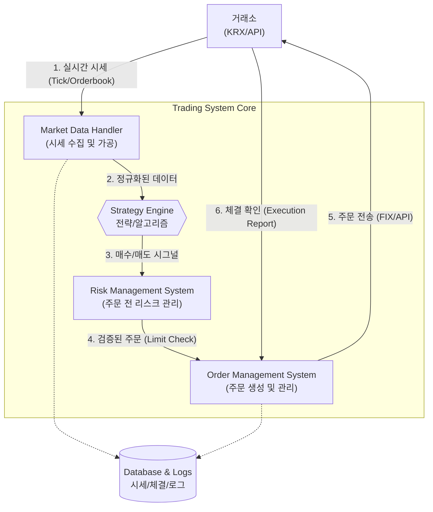

# 주식 트레이딩 시스템 아키텍처

```mermaid
graph TD
    %% 외부 거래소 (Exchange)
    EX["거래소<br/>(KRX/API)"]
    
    %% 시스템 내부 컴포넌트
    subgraph "Trading System Core"
        MDH["Market Data Handler<br/>(시세 수집 및 가공)"]
        STR{{Strategy Engine<br/>전략/알고리즘}}
        RMS["Risk Management System<br/>(주문 전 리스크 관리)"]
        OMS["Order Management System<br/>(주문 생성 및 관리)"]
    end
    
    %% 데이터 저장소
    DB[("Database & Logs<br/>시세/체결/로그")]

    %% 데이터 흐름
    EX -- "1. 실시간 시세 (Tick/Orderbook)" --> MDH
    MDH -- "2. 정규화된 데이터" --> STR
    STR -- "3. 매수/매도 시그널" --> RMS
    RMS -- "4. 검증된 주문 (Limit Check)" --> OMS
    OMS -- "5. 주문 전송 (FIX/API)" --> EX
    
    %% 체결 응답
    EX -- "6. 체결 확인 (Execution Report)" --> OMS
    
    %% DB 저장 흐름
    MDH -.-> DB
    OMS -.-> DB
```
