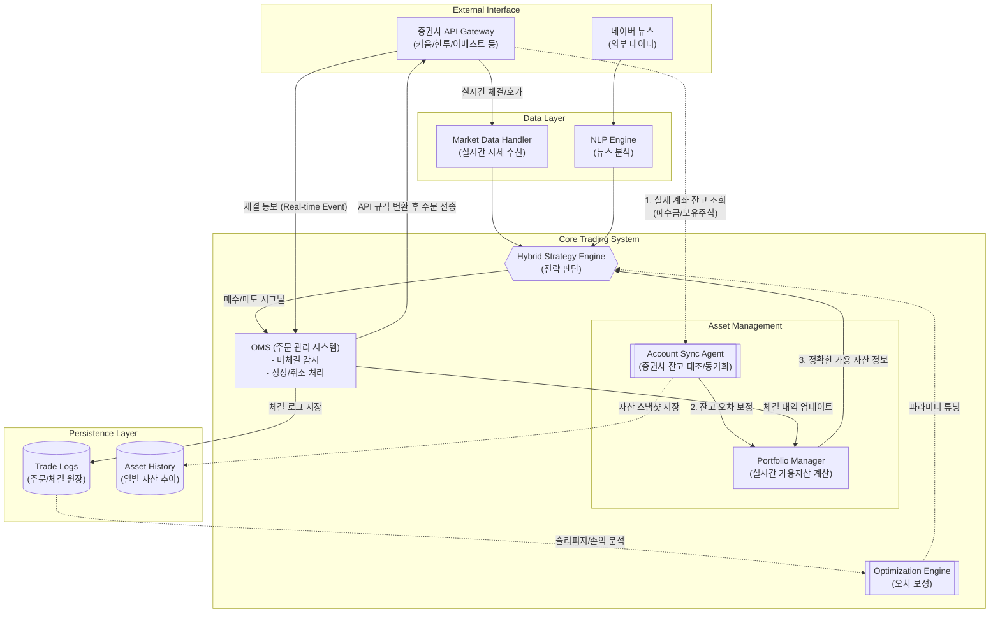

# 주식 트레이딩 시스템 아키텍처

```mermaid
graph TD
    %% 1. 외부 인터페이스 (증권사 & 데이터)
    subgraph "External Interface"
        API["증권사 API Gateway<br/>(키움/한투/이베스트 등)"]
        NAVER["네이버 뉴스<br/>(외부 데이터)"]
    end

    %% 2. 데이터 수집 및 처리
    subgraph "Data Layer"
        MDH["Market Data Handler<br/>(실시간 시세 수신)"]
        NLP["NLP Engine<br/>(뉴스 분석)"]
    end

    %% 3. 전략 및 실행 코어
    subgraph "Core Trading System"
        %% 자산 관리
        subgraph "Asset Management"
            PM["Portfolio Manager<br/>(실시간 가용자산 계산)"]
            SYNC[["Account Sync Agent<br/>(증권사 잔고 대조/동기화)"]]
        end

        STR{{"Hybrid Strategy Engine<br/>(전략 판단)"}}
        OPT[["Optimization Engine<br/>(오차 보정)"]]
        
        %% 주문 처리
        OMS["OMS (주문 관리 시스템)<br/>- 미체결 감시<br/>- 정정/취소 처리"]
    end
    
    %% 4. 영구 저장소
    subgraph "Persistence Layer"
        DB_LOG[("Trade Logs<br/>(주문/체결 원장)")]
        DB_ASSET[("Asset History<br/>(일별 자산 추이)")]
    end

    %% --- [데이터 흐름 정의] ---

    %% 1. 시세 및 뉴스 흐름
    API -- "실시간 체결/호가" --> MDH
    NAVER --> NLP
    MDH --> STR
    NLP --> STR

    %% 2. 자산 동기화 흐름
    API -.-> |"1. 실제 계좌 잔고 조회<br/>(예수금/보유주식)"| SYNC
    SYNC -- "2. 잔고 오차 보정" --> PM
    PM -- "3. 정확한 가용 자산 정보" --> STR
    SYNC -.-> |"자산 스냅샷 저장"| DB_ASSET

    %% 3. 매매 실행 흐름
    STR -- "매수/매도 시그널" --> OMS
    OMS -- "API 규격 변환 후 주문 전송" --> API
    
    %% 4. 체결 응답 및 처리
    API -- "체결 통보 (Real-time Event)" --> OMS
    OMS -- "체결 내역 업데이트" --> PM
    OMS -- "체결 로그 저장" --> DB_LOG

    %% 5. 피드백 및 최적화
    DB_LOG -.-> |"슬리피지/손익 분석"| OPT
    OPT -.-> |"파라미터 튜닝"| STR
```

