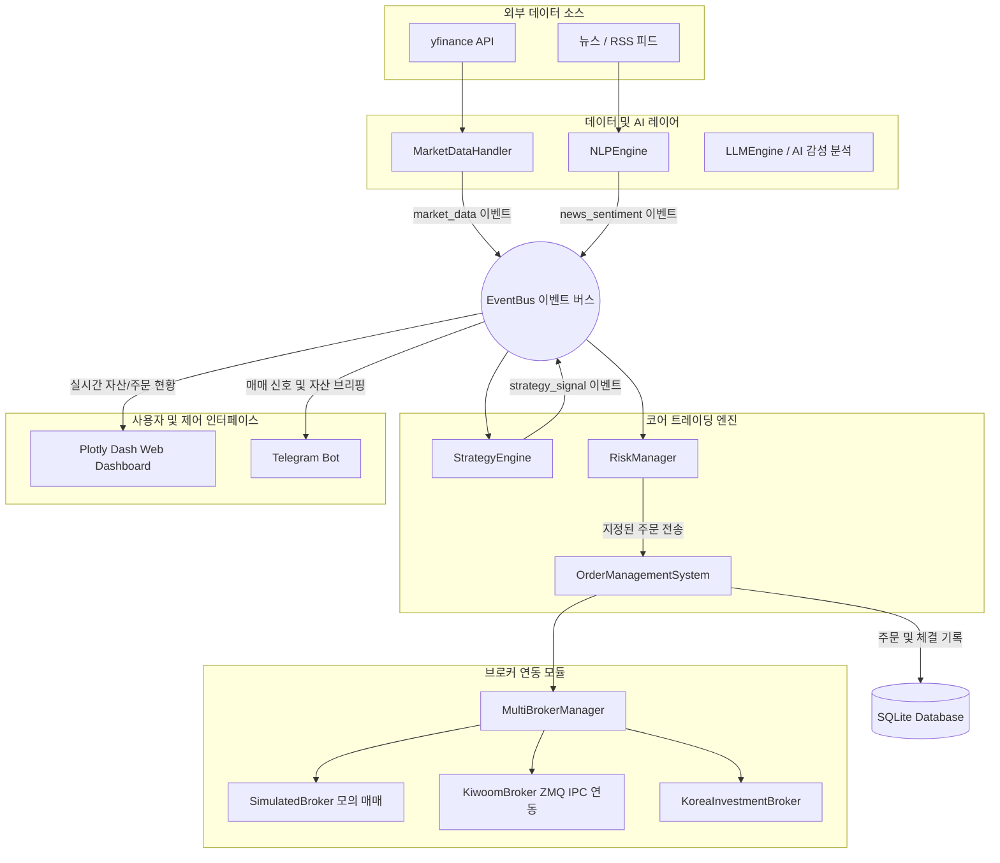

# 🏗️ 주식 자동매매 시스템 아키텍처 설계서 (System Architecture)

본 문서는 이벤트 기반 비동기 아키텍처로 구현된 주식 자동매매 플랫폼의 아키텍처 구조, 흐름 설계, 데이터 모델 및 각 핵심 모듈 간의 협력 구조를 명세합니다.

---

## 1. 전체 시스템 구조 및 데이터 흐름

시스템은 의존성 결합을 최소화하기 위해 **이벤트 버스(EventBus)**를 중심에 둔 느슨한 결합(Loose Coupling)의 **이벤트 구동형 아키텍처(Event-Driven Architecture)**를 취하고 있습니다.



---

## 2. 이벤트 버스 (EventBus) 및 Pub/Sub 흐름

시스템의 동맥 역할을 하는 `EventBus`는 멀티스레드 환경에서도 안전하게 작동(Thread-safe)하도록 `threading.Lock` 및 비동기 큐 구조를 포함하고 있습니다.

### 2.1 핵심 이벤트 정의
* **`market_data`**: 실시간 가격, 시가/고가/저가/종가(OHLCV), 보조지표 연산 결과가 포함된 이벤트 데이터. `MarketDataHandler`에서 발행.
* **`news_sentiment`**: 수집된 뉴스 및 금융 텍스트를 `NLPEngine`에서 AI 감정 평정 결과(Very Bullish ~ Very Bearish)로 가공하여 발행.
* **`strategy_signal`**: 대가들의 투자 모델과 ML 앙상블 점수가 결합되어 매수(BUY)/매도(SELL) 판단을 내리는 시점에 `StrategyEngine`에서 발행.
* **`order_status`**: 브로커로부터 주문 집행(주문 접수, 일부 체결, 전량 체결, 취소 등) 피드백이 올 때마다 `OrderManagementSystem`에서 발행.
* **`account_sync`**: 예수금, 총자산, 보유 종목 현황이 변경되거나 주기적으로 잔고를 갱신할 때 발행.

---

## 3. 핵심 구성 요소 (Core Components)

### 3.1 MarketDataHandler (`src/data_layer/`)
- 외부 금융 API(yfinance, 한국투자증권 실시간 웹소켓 등)를 통해 주식 시세를 수집합니다.
- 수집된 데이터를 바탕으로 이동평균선(MA), 상대강도지수(RSI), 볼린저 밴드(BB), 평균실제범위(ATR) 등의 기술적 보조지표를 동적으로 연산하여 `market_data` 이벤트를 발행합니다.

### 3.2 StrategyEngine (`src/core/strategy_engine.py`)
- 등록된 투자 전략들을 보유하고 있으며, 수신되는 `market_data` 및 `news_sentiment` 이벤트를 리스닝하여 매매 조건을 스캔합니다.
- **다중 전략 모델**: 워렌 버핏, 피터 린치, 레이 달리오, 일반 추세 추종 등 유명 투자가의 조건식 모델을 탑재하고 있습니다.
- 분석을 거쳐 투자 의견이 매치되면 `strategy_signal`을 발행합니다.

### 3.3 RiskManager (`src/risk/risk_manager.py`)
- `StrategyEngine`이 생성한 매매 신호가 실제 주문으로 집행되기 전, 시스템 전반의 리스크 한도를 침해하지 않는지 실시간 검증합니다.
- **검증 항목**:
  1. **손절선 (Stop-loss)** 및 **최대 익절선 (Take-profit)** 도달 여부.
  2. **종목 노출 한도**: 단일 종목의 최대 매수 한도가 전체 포트폴리오 자산의 특정 비율(예: 20%)을 넘지 못하게 통제.
  3. **최대 낙폭 관리**: 일일 포트폴리오의 급격한 변동성을 확인하여 비상시 전체 매매를 중단하는 서킷 브레이커 기능.

### 3.4 OrderManagementSystem (OMS) (`src/core/order_management.py`)
- 리스크 매니저를 통과한 주문을 생성하여 고유의 `Order ID`를 부여하고 거래 대기열에 올립니다.
- 주문의 상태(`PENDING`, `FILLED`, `CANCELLED` 등)를 추적하고, 체결 내역을 DB에 영속화하며, `order_status` 이벤트를 전송합니다.

### 3.5 브로커 어댑터 레이어 (Broker Layer) (`src/broker/`)
다중 브로커 인터페이스를 통합적으로 운영합니다.
* **SimulatedBroker (`simulated_broker.py`)**: 
  - 외부 연동 없이 메모리 상에서 주문을 체결시키는 로컬 모의 매매 엔진입니다.
  - 슬리피지(Slippage) 시뮬레이션 및 호가 잔량 대기 시간 모델을 탑재하여 현실적인 백테스트를 보장합니다.
* **KiwoomBroker (`kiwoom.py`, `kiwoom_server.py`)**: 
  - 32비트 Windows 환경(ActiveX 컨트롤 환경)의 키움 OpenAPI와 64비트 메인 시스템 간의 충돌을 방지하기 위해 **ZeroMQ(ZMQ) IPC 통신 브릿지** 구조를 채택했습니다. 
  - 32비트 프로세스인 `kiwoom_server.py`가 키움증권 서버와의 통신을 독점하고, 메인 64비트 시스템은 ZMQ 소켓을 통해 명령을 송수신합니다.
* **KoreaInvestmentBroker (`korea_investment.py`)**:
  - 한국투자증권 Open API와 연동하며, OAuth2 기반 액세스 토큰 자동 갱신 메커니즘을 지원합니다.

### 3.6 데이터베이스 영속성 레이어 (`src/persistence/`)
- SQLite 데이터베이스(`database.py`)를 통해 거래 이력, 체결 데이터, 포트폴리오 상태, 머신러닝 예측 히스토리를 저장합니다.
- 비동기 처리 중 발생하는 DB 락(Database Lock)을 방지하기 위해 단일 커넥션 및 동기화 래퍼를 제공합니다.

### 3.7 웹 대시보드 (`src/web/`) & 텔레그램 (`src/telegram_bot/`)
* **웹 대시보드**: Plotly Dash 프레임워크와 Flask 서버를 탑재하여 멀티 탭 구조(Strategy Performance, Real-time P&L, Backtest Viewer, Global Macro)로 제공됩니다. 3초 주기의 `dcc.Interval` 풀링 및 Dash 콜백(`@app.callback`)을 활용해 포지션 정보, 자산 추이, 매크로 상관관계 열지도, 백테스트 최적화 캐시 정보를 실시간 동기화합니다.
* **텔레그램 봇**: `python-telegram-bot` 모듈 기반으로 양방향 통신을 구현하여, 사용자가 언제든 모바일 환경에서 시스템 상태 조회가 가능하며 수동 주문 인터럽트를 전송할 수 있습니다.

---

## 4. 의존성 주입 및 객체 팩토리 (`src/core/factory.py`)

객체 간의 복잡한 연결 관계를 정리하고 단일 지점에서 결합성을 주입하기 위해 `factory.py`에서 코어 엔진 생성을 주도합니다.

```python
# factory.py 구현 구조 예시
def create_trading_system(config: TradingConfig) -> StockTradingSystem:
    # 1. persistence & event bus 초기화
    db = Database()
    event_bus = EventBus()
    
    # 2. 브로커 구성 및 OMS 초기화
    broker_manager = MultiBrokerManager()
    broker_manager.register_broker("simulated", SimulatedBroker())
    
    oms = OrderManagementSystem(event_bus, broker_manager, db)
    
    # 3. 리스크 매니저 및 전략 엔진 조립
    risk_manager = RiskManager(config, event_bus)
    strategy_engine = StrategyEngine(event_bus, config)
    
    # 4. 결합 시스템 구성 반환
    return StockTradingSystem(
        event_bus=event_bus,
        oms=oms,
        strategy_engine=strategy_engine,
        risk_manager=risk_manager,
        db=db
    )
```
이 팩토리 패턴을 통해 테스트 환경 구성 시 Mock 객체나 SimulatedBroker를 즉시 변경 주입할 수 있어 테스트 용이성(Testability)이 극대화됩니다.
